## ⟶ E-BOOK


# **UI Toolkit for advanced Unity developers**  (Unity 6 edition)

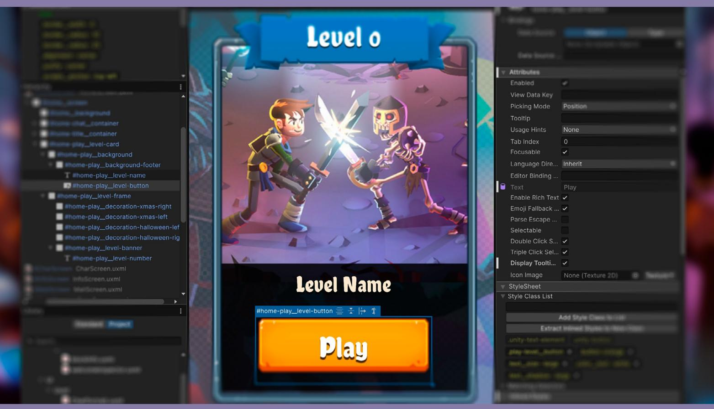


## **Contents**

| Introduction 9                            |
|-------------------------------------------|
| Contributors 10                           |
| Install UI Toolkit and sample projects 11 |
| The official UI Toolkit samples 12        |
| UI Toolkit Sample – Dragon Crashers 12    |
| QuizU 13                                  |
| Introduction to UI Toolkit 14             |
| UI Assets 15                              |
| UI Builder 16                             |
| Graphic and font assets preparation 17    |
| Bitmap images 17                          |
| Sprites 18                                |
| Render Texture asset 19                   |
| 2D PSD Importer 20                        |
| Vector images 22                          |
| Fonts 23                                  |
| Texture packers 23                        |
| Sprite atlas 23                           |
| Dynamic atlas 24                          |
| UI Builder 26                             |
| Canvas background 27                      |
| Viewport settings 28                      |
| Layouts 29                                |
| Core runtime components 31                |
| Responsive layouts: Flexbox 31            |

| Visual elements 33                                |
|---------------------------------------------------|
| Positioning visual elements 33                    |
| Size settings 35                                  |
| Flex settings 36                                  |
| Align settings 38                                 |
| Margin and Padding 39                             |
| Background and images 40                          |
| Variable or fixed measuring units 41              |
| Overridden properties in UI Builder 42            |
| UXML as templates 43                              |
| More resources 43                                 |
| Styling 44                                        |
| USS selectors 45                                  |
| Converting existing inline styles to selectors 45 |
| Creating new selectors 47                         |
| Selectors assigned to elements 49                 |
| Editing selectors 50                              |
| Overriding styles 51                              |
| USS variables 52                                  |
| USS transitions animations 53                     |
| Swapping styles on demand 55                      |
| Themes 56                                         |
| Naming conventions 59                             |
| Text 62                                           |
| Source font file 62                               |
| Font asset settings 63                            |
| Font asset variant 65                             |

| Rich text 65                              |
|-------------------------------------------|
| Gradients 66                              |
| Sprite asset and emojis 67                |
| Text Style Sheets 70                      |
| Data binding 72                           |
| UI that reflects your game data 72        |
| Enter runtime data binding 74             |
| Data binding concepts 75                  |
| Preparing a data source 75                |
| Using the CreateProperty attribute 75     |
| Data sources and paths 76                 |
| Inheriting data sources 78                |
| Binding modes 79                          |
| Example: Data binding a health bar 80     |
| Preparing the data source 81              |
| Data binding in UI Builder/UXML 82        |
| Set up data binding in C# 84              |
| Unresolved data bindings workflow 86      |
| Type converters 88                        |
| Example: Converting a value to a color 88 |
| HealthDataConverter setup 88              |
| Using the HeathBarWithConverter 90        |
| Applying DataConverters in UI Builder 91  |
| Best practices 92                         |
| Example: Binding a list to a ListView 93  |
| Setting up the list and templates 94      |
| Completing the binding at runtime 95      |

| Optimizing data binding 96                     |
|------------------------------------------------|
| Managing value types 96                        |
| Minimizing overhead 96                         |
| Using update triggers 97                       |
| Versioning and change tracking 97              |
| Localization 98                                |
| How it works 99                                |
| Localization setup 100                         |
| Using the Localization API 104                 |
| Selecting a Locale 104                         |
| Using SetBinding 105                           |
| Listening for Locale changes 106               |
| Working with String Tables 107                 |
| Importing and exporting string data 107        |
| CSV files 107                                  |
| Google Sheets synchronization 108              |
| Using Smart Strings 110                        |
| Setting up a Smart String in your script 110   |
| Understanding placeholders 111                 |
| String pre-processing 113                      |
| GetLocalizedString 113                         |
| Using the StringChanged event 114              |
| Dynamic UI controls 114                        |
| Localizing assets 117                          |
| Setting up asset localization 117              |
| Asset Tables versus String Tables 119          |
| Common localized assets in UI Toolkit 119      |
| Localization in the Dragon Crashers sample 120 |

| Custom controls 122                               |  |
|---------------------------------------------------|--|
| The UxmlElement attribute 122                     |  |
| The UxmlAttribute attribute 124                   |  |
| Example: A custom slide toggle control 126        |  |
| Defining the custom control 126                   |  |
| Using the slide toggle 129                        |  |
| Creating more custom controls 131                 |  |
| Optimizing performance 132                        |  |
| Update mechanisms 133                             |  |
| Batching elements 134                             |  |
| Vertex buffers 134                                |  |
| Uber shader and eight-texture limit 136           |  |
| Dynamic texture atlases 138                       |  |
| Masking 140                                       |  |
| Animations and transitions 141                    |  |
| Runtime data binding 143                          |  |
| Property bags and source generation 143           |  |
| Change Tracking 143                               |  |
| Showing and hiding elements 145                   |  |
| Overdraw 145                                      |  |
| Memory management 146                             |  |
| Profiling tools 147                               |  |
| Unity 6 performance enhancements 148              |  |
| Resources for advanced developers and artists 149 |  |

## <span id="page-6-0"></span>Introduction

The best user interface is the one you don't notice.

User interface (UI) is a critical part of any game. Done well, it's invisible and carefully woven into your application. If done poorly, however, it can frustrate users and detract from the gameplay experience.

A solid UI is an extension of a game's visual identity. Modern audiences crave refined, intuitive UI that seamlessly integrate with your application. Whether it's displaying a character's vital statistics or the game world's economy, the interface is your players' gateway to key information.

As UIs become more sophisticated, so does the artistry behind them. UI design mainly depends on two types of specialists:

**UI artists:** They master the fundamentals of design, color, shape, typography, and layout. UI artists design for the target audience of the game world. Their eye for detail motivates them to create "pixel perfect" UI.

**UX designers:** They research user behavior and the broader needs of the end user. UX designers control how someone interacts with a digital product. They build navigation flows with the intent of making the experience as intuitive and delightful as possible.

These roles work closely together, alongside other 2D or 3D artists and designers. It's through this collaboration that stronger, more effective UIs come about.

<span id="page-7-0"></span>

Another key role is that of the **UI programmer**, who will team up closely with the previous roles. They will work with a chosen tech stack, establish a process or pipeline to ingest all of the UI design into functional interfaces, wire gameplay code to UI, and feed data back into the game systems from UI.

In our previous e-book, *[User interface design and implementation in Unity](https://unity.com/resources/user-interface-design-and-implementation-in-unity?isGated=false)*, we demonstrated how UI artists and designers can build interfaces in Unity with its two UI systems: Unity UI, the older GameObject-based system, and the newer UI Toolkit. We also covered how studios design UI from scratch and import art into a game. This guide was based on Unity 2021 LTS.

In this new e-book, we focus on UI Toolkit in Unity 6 that is tailored for maximum performance and reusability, with web-inspired workflows. UI designers with web experience will find it intuitive, while UI programmers can gain a clear understanding of UI Toolkit's capabilities for game creation. This guide's modular structure allows sections to be read in any order, making it a useful reference for learning UI Toolkit.

Let's begin.

### Main author and contributors

The main author and creator of this guide and the two UI Toolkit samples is Wilmer Lin, a veteran 3D and visual effects artist, developer, and educator.

Major contributions to this guide and the sample UI Toolkit Sample – Dragon Crashers were also provided by Eduardo Oriz, a senior content marketing manager at Unity and graphic designer.

Another key contributor to this guide and the sample QuizU is Thomas Krogh-Jacobsen, a senior manager in content marketing management at Unity.

#### **Other Unity contributors**

Camil Bouzidi, software developer Martin Côté, senior graphic developer Hugo Bourret-Desmarais, senior software developer Benoit Dupuis, senior technical product manager Karl Jones, senior software engineer Antoine Lassauzay, staff software developer Martin Paradis, staff software developer Stefania Valoroso, manager, product designer

## <span id="page-8-0"></span>Install UI Toolkit and sample projects

UI Toolkit is integrated into the core Unity 6 platform, which means that you don't need to install a separate package to use it with version Unity 6 and later. Starting a new project from one of the templates available will be sufficient to be able to follow the content of this guide.

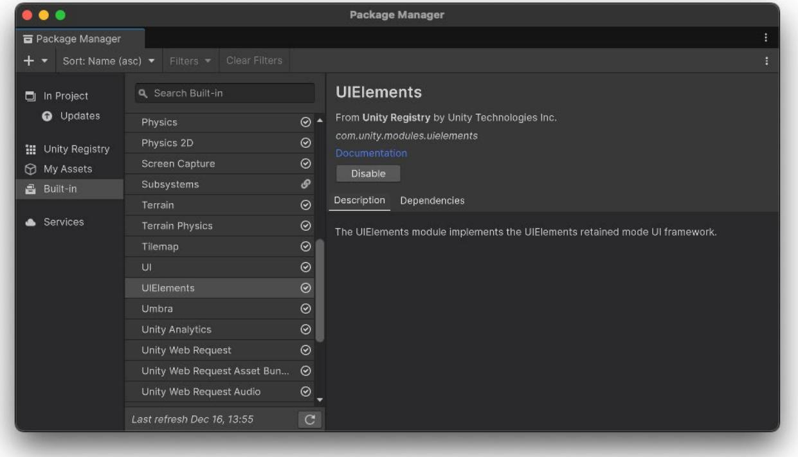

UIElements is the namespace for UI Toolkit, UI Builder and their features, all of which are now included in Unity 6.

## <span id="page-9-0"></span>The official UI Toolkit samples

This e-book primarily uses the following samples to show and explain UI Toolkit capabilities in Unity projects. Each sample is available to download for free from the Unity Asset Store.

#### **UI Toolkit Sample – Dragon Crashers**

[This demo](https://assetstore.unity.com/packages/essentials/tutorial-projects/dragon-crashers-ui-toolkit-sample-project-231178) uses the latest UI Toolkit workflow at runtime for a full-featured interface, including a front-end menu system, over a slice of the 2D project *[Dragon Crashers](https://assetstore.unity.com/packages/essentials/tutorial-projects/dragon-crashers-urp-2d-sample-project-190721)*, a mini-RPG.

**This demo is not meant for beginners.** It was created for experienced Unity developers who have the capabilities to look at the UI structure and navigate the demo to observe specific implementations. This demo was originally released for Unity 2021 LTS and has since been [updated to Unity 6.](https://www.youtube.com/watch?v=RVp3-D2nEEg) Here are some of the topics you can learn more about in the demo:

- Project structure and naming conventions
- Use of themes to create UI variations and add support for both portrait and landscape orientations
- Complex elements like tabbed menus, inventories, messages, or custom controls
- Use of the **SafeAreaAPI** to ensure content on mobile screens is displayed within the safe area
- Use of Localization for multiple language support
- Data binding for simplifying the synchronization of data with UI components
- Examples of how to implement common casual game interfaces

You can find a [video walkthrough](https://www.youtube.com/watch?v=XtQist-I3Xo) of the sample and [download](https://assetstore.unity.com/packages/essentials/tutorial-projects/dragon-crashers-ui-toolkit-sample-project-231178) it from the Asset Store.

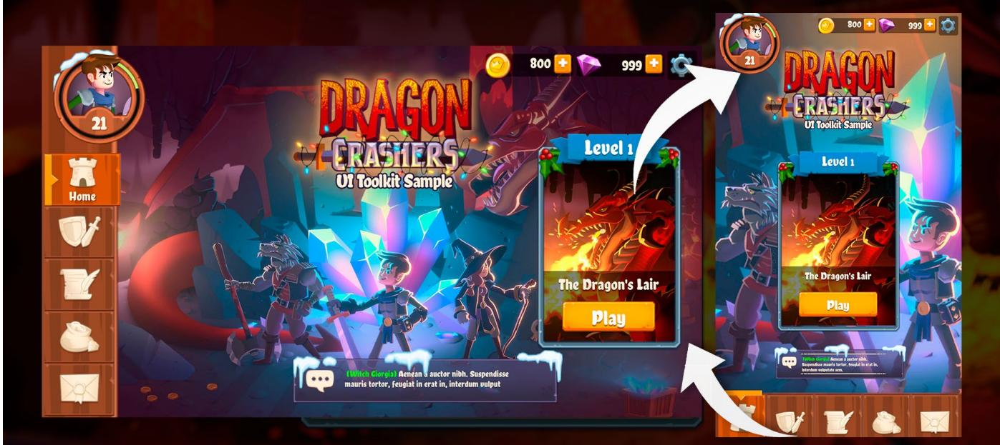

The home screen can be displayed in landscape and portrait

#### <span id="page-10-0"></span>**QuizU**

The [QuizU demo](https://assetstore.unity.com/packages/essentials/tutorial-projects/quizu-a-ui-toolkit-sample-268492) showcases an interactive quiz game built with Unity's UI Toolkit. Aimed at UI developers, this project highlights UI Toolkit workflows, event-driven architecture, and reusable design patterns for building modern game user interfaces. This demo shows how to:

- Structure UI elements efficiently using UXML files and nested visual trees.
- Apply styling rules using USS selectors and pseudo-classes to make your interactive elements react to user input.
- Use the FlexBox feature for flex-based layouts for responsive UI behavior.
- Query and modify UI elements dynamically using selectors.
- Encapsulate event handling in reusable classes, enabling custom interactions like dragging or multi-touch gestures.
- Use Event Dispatch to process events in phases and how to manage propagation.
- Use USS Transitions to add smooth animations and effects to UI elements with properties like duration and easing.

| UQuery                                                                                                                                                                                                                                                                                                                                                                                                                                                                                                                                                                                                                                      | container-1<br>container-2<br>slider-1<br>button-3                                                                                                                                                   |  |
|---------------------------------------------------------------------------------------------------------------------------------------------------------------------------------------------------------------------------------------------------------------------------------------------------------------------------------------------------------------------------------------------------------------------------------------------------------------------------------------------------------------------------------------------------------------------------------------------------------------------------------------------|------------------------------------------------------------------------------------------------------------------------------------------------------------------------------------------------------|--|
| UQuery provides a way to find specific visual<br>elements within the visual tree hierarchy based on<br>certain search criteria. This can include:<br>· Name: Each element in the UI hierarchy can be<br>assigned a unique name, serving as its identifier.<br>UQuery allows you to search for these names when<br>you need to reference specific UI elements.<br>· USS class: USS (Unity Style Sheets) classes<br>assign styles to your UI elements. These classes can<br>be used as selectors in a UQuery, letting you find all<br>elements of a specific class. (e.g. applying changes<br>to a group of elements sharing the same class). | button-I<br>container-3<br>button-2                                                                                                                                                                  |  |
| · Element type: You can query for elements based<br>on their type (such as Buttons, Labels, Images, etc.<br>derived from VisualElement). For example, you can<br>retrieve all the Button elements in your UI, and apply<br>a specific interaction or styling to them.<br>Queries can be combined to create more complex<br>search criteria.                                                                                                                                                                                                                                                                                                 | Query Selector Choose a selector<br>None<br>Q<VisualElement>(name: "button-1")<br>Q<VisualElement>(name: "button-2")                                                                                 |  |
| MORE->                                                                                                                                                                                                                                                                                                                                                                                                                                                                                                                                                                                                                                      | Query<VisualElement>(className: "round-outline-button").ToList()<br>Q<VisualElement>(className: "outline-slider")<br>O Jiaual Clamant (classelama; author ) O Jliauall'lamant; (pama; "unity deagan" |  |

A screen shot from the QuizU UI Toolkit demo

Originally released for Unity 2022 LTS, QuizU has been updated with new features in Unity 6. The project now includes how-to demos on creating custom controls, setting up data binding, and implementing localization.

You can [download](https://assetstore.unity.com/packages/essentials/tutorial-projects/quizu-a-ui-toolkit-sample-268492) the project from the Asset Store.

## <span id="page-11-0"></span>Introduction to UI Toolkit

[UI Toolkit](https://docs.unity3d.com/6000.0/Documentation/Manual/UIElements.html) offers significant advantages over the traditional Unity UI (also known as uGUI) and legacy IMGUI (for Editor tools) systems. It provides a more modern, flexible, and performanceoriented alternative that scales better for most projects. It can also support your whole production pipeline, handling both Editor tooling and runtime games or applications.

Some of its benefits compared to the legacy UI systems include:

- **Faster iteration:** Work and iterate more quickly with global style management and live authoring capabilities.
- **Rendering performance:** Gain greater control over the performance of your game using Render Hints and dynamic texture atlases.
- **Better collaboration:** Separate logic (C# code), UI structure (Unity XML, or UXML, documents), and styling (via a Unity Style Sheet or USS) to reduce conflicts and improve teamwork.
- **Reusability:** Share and reuse styles and widgets within or across projects, as well as between the Editor and runtime.

UI Toolkit draws inspiration from web technologies, offering an advantage to developers familiar with web applications. For those new to markup languages like HTML/XML and

<span id="page-12-0"></span>Cascading Style Sheets (CSS), it's a great opportunity to explore a powerful set of industrystandard tools.

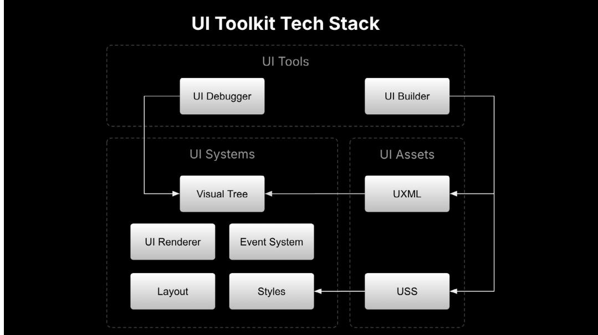

In essence, UI Toolkit interfaces consist of UXML and USS files to create layouts and styling by the UI Toolkit systems.

## UI Assets

UI Assets, the building blocks for creating UI, consist of [UXML](https://docs.unity3d.com/6000.0/Documentation/Manual/UIE-UXML.html) and [USS](https://docs.unity3d.com/6000.0/Documentation/Manual/UIE-USS.html) files. UXML (Unity XML) represents the content and structure of your UI, and is similar to markup languages like HTML and XML.

USS, inspired by Cascading Style Sheets (CSS), is used to define the appearance and styles of your UI content. Both UXML and USS are used throughout this guide.

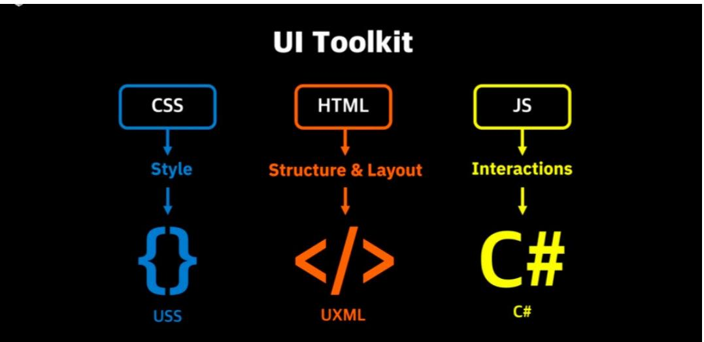

Similarities between UI Toolkit and web technologies

<span id="page-13-0"></span>

## UI Builder

UI Assets can either be authored as code from your IDE of choice, or visually, with the [UI](https://docs.unity3d.com/6000.0/Documentation/Manual/UIBuilder.html)  [Builder](https://docs.unity3d.com/6000.0/Documentation/Manual/UIBuilder.html) which is part of the UI toolkit. The UI Builder interface allows artists and designers to edit and visualize the UI as it's being built.

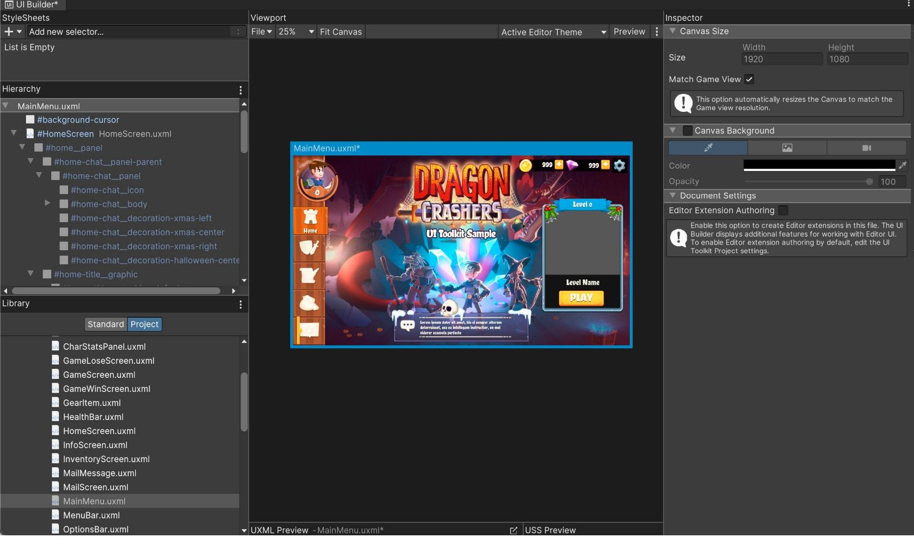

## <span id="page-14-0"></span>Graphic and font assets preparation

A lot of UI design happens outside of Unity in a Digital Content Creation (DCC) application. Depending on the style and preferences of the UI artist, designing the UI can take place in a raster drawing application like Adobe Photoshop or in a vector-based tool. Typically, every piece of UI graphic is exported as a lossless bitmap image with transparency, such as a PNG, and combined into a texture atlas with other UI elements for runtime efficiency.

If you work in a vector-based DCC application, you'll need to export vector graphics into a raster format in order to work with UI Toolkit. For more details, refer to the [Vector images](#page-21-0)  [section](#page-21-0).

## Bitmap images

Unity supports most common image file types, like PNG, BMP, TIF, TGA, JPG, and PSD. When you add files of these formats to your Assets folder, Unity will import them as Texture 2D assets for 3D projects or as Sprites for 2D projects. You can change the type in the Texture Type field within the Inspector once imported. UI Toolkit supports both formats for UI bitmap graphics.

Textures don't contain much more information besides the size and format of the image, but sprites have some additional properties that are used by UI Toolkit.

<span id="page-15-0"></span>

## Sprites

Sprites are textures prepared for 2D game development to be used by the Sprite Renderer component. 2D sprites in Unity can be tiled, rigged and skinned for animation, have custom geometry or include additional maps for 2D lighting. This section solely focuses on settings that are relevant to the UI Toolkit. For a deeper understanding of 2D graphics you can find more in the Unity 6 edition of the 2D art, animation, and lighting e-book that will soon be available at<https://unity.com/resources>.

Most UI graphic assets will be rendered on screen space rather than following Unity's world scale (where one unit represents a cubic meter in 3D space). UI Toolkit manages the scale of these graphics, but the **PPU (Pixels Per Unit)** of sprites affects the size of the sprites in the UI. For example, if your sprite is meant to have 128 pixels of resolution per grid unit, set the PPU to 128.

The Sprite Editor provides tools for modifying your graphics, such as cropping with the blue handles or slicing with the green handles. These tools allow you to make the graphic tileable or use the [9-slice](https://docs.unity3d.com/6000.0/Documentation/Manual/sprite/9-slice/9-slicing.html) technique, a common way to create scalable elements.

Sprites are 2D textures mapped onto flat, rectangular 3D meshes. By default, when imported, they use the setting **Mesh Type**: **Tight**. This setting adjusts the mesh to closely follow the outline of the opaque (non-transparent) pixels of the sprite. This improves performance by reducing overdraw, which happens when the GPU draws the same pixel more than once within a single frame, due to transparent overlapping areas. You can manually adjust and optimize this mesh in the Sprite Editor under the Outline section.

**Sprite Modes** is a useful feature that you can select from the Inspector of a sprite asset. It provides the following modes:

- **Single**: This is the default mode, where the image only contains a single image element.
- **Multiple** Choose this value if the texture source file has several elements in the same image. Then define the location of the elements in the [Sprite Editor](https://docs.unity3d.com/6000.0/Documentation/Manual/sprite/sprite-editor/automatic-slicing.html) so that Unity knows how to split the image into different sub-assets. Once sliced, each graphic becomes an individual sprite that can be used separately in the UI Toolkit.
- **Polygon:** Best for images that are circular or a regular polygon, this mode helps you to set up an outline that closely matches the image shape, resulting in a cleaner outline.

<span id="page-16-0"></span>

## Render Texture asset

Render textures are snapshots of a camera view in a texture, updated every frame. They can be created via **Assets < Create < Rendering** and referenced from a Camera component in the Output menu. You can then use these textures in the UI Toolkit to display elements such as mini-maps, character selection screens, or any other in-game visuals that need to be integrated into the UI.

Examples of render textures in *[UI Toolkit Sample: Dragon Crashers](https://assetstore.unity.com/packages/essentials/tutorial-projects/dragon-crashers-ui-toolkit-sample-project-231178?srsltid=AfmBOopI1_drII69mU9Yvtc9PqO3LfvL5iG8brZ5sMOBD9_6CHfjH7I5)* include the character preview in the level meter and the particle effects rendered over the UI buttons.

The opposite use case is also possible, where you want the UI to be displayed within a game element. For example, imagine a 3D computer model in your application displaying a functional interface made in UI Toolkit. You can render the UI Toolkit interface to a render texture, assign it in the Panel Settings and Camera, and then apply it to a material of the 3D model.

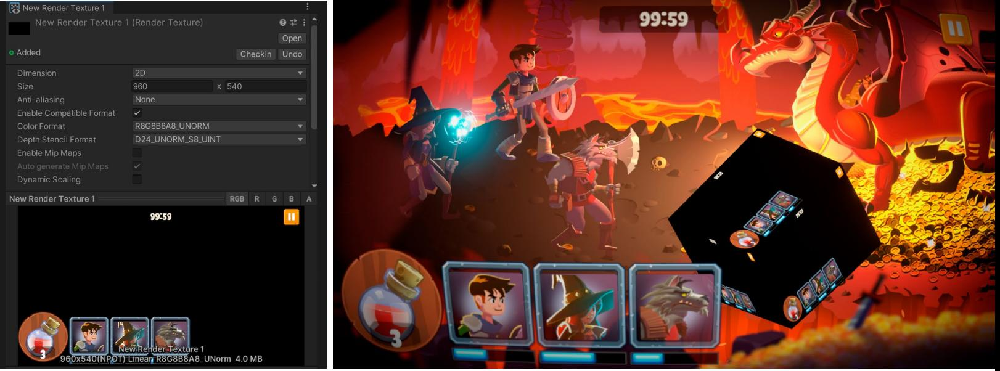

The Render Texture settings and simple tests

Just be aware that render textures are expensive. Use them sparingly and be sure to profile your project to optimize performance. For full screen interfaces without other active gameplay elements, adding extra effects this way is unlikely to pose major performance issues.

## <span id="page-17-0"></span>2D PSD Importer

Unity imports PSD (or Adobe Photoshop files) as flattened textures unless your project has the 2D PSD Importer package installed. PSD files are generally used for storing multiple images in layers in one single file. Most DCC tools support exporting to this format.

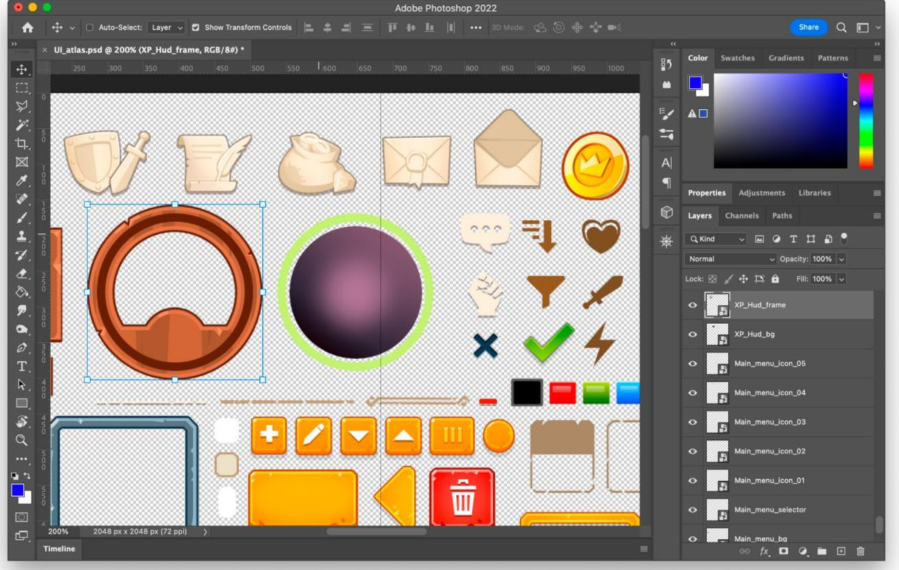

Creating the UI assets in Photoshop: Normally each element has its own layer, group, or is a smart object. Smart objects allow you to work on each element in isolation and preserve the original resolution of the element, even if resized later in the main document.

PSD files simplify workflows by allowing direct import into Unity, avoiding the need for you to export each layer as individual files and repeat the process whenever changes are needed.

After installing the [2D PSD Importer](https://docs.unity3d.com/Packages/com.unity.2d.psdimporter@10.0/manual/index.html) package from the Package manager, ensure the PSD files are imported from the Inspector.

| Inspector                                        |                                            | T   |
|--------------------------------------------------|--------------------------------------------|-----|
|                                                  | Fei_Cel_group (Texture 2D) Import Settings | 3 T |
| Importer √ UnityEditor.TextureImporter (Default) | Open                                       |     |
|                                                  | UnityEditor.U2D.PSD.PSDImporterOverride    |     |
| Texture Type                                     | Sprite (2D and UI)                         |     |

Select the PSD Importer in the Inspector to see options for handling the file.

When working with UI assets, deselect the **Use as Rig** option in the Inspector under **Character Rig**. That setting is only relevant for 2D character skeletal animation and is unnecessary for UI elements. You should also find options for importing layers (e.g., discarding hidden layers, grouping objects by layer, etc.)

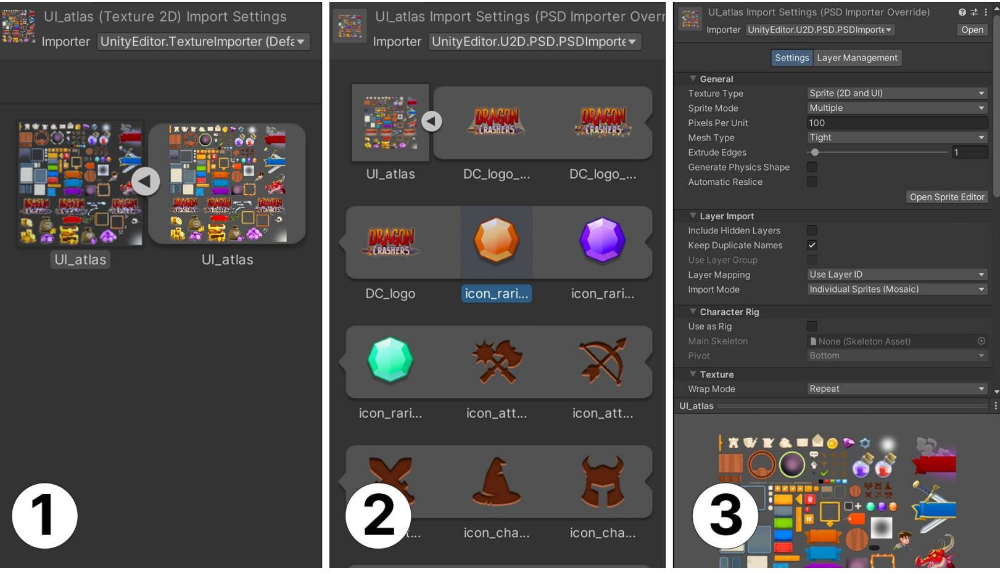

Switch to the PSD Importer to give yourself more import options.

The sprites in the Project view generated from the PSD are usable as normal sprites. You can slice them, change the outline, or modify the Pixels Per Unit (PPU) from the Sprite Editor just as you would with regular Sprite assets.

#### **Tip: Iterative design**

Unity will automatically refresh the sprites included in the PSD file every time you save it. This allows you to make a quick placeholder and iterate on it while viewing changes in the Game view. This can be a great time saver and improve the quality of the work by letting you see it in context without swapping files or needing support from a fellow developer in the team.

## <span id="page-19-0"></span>Vector images

Although the vector format support is still in development at the time of writing, it's available as an option for background images in the UI Builder. However, raster images (sprites and textures) are currently the recommended image format for UI Toolkit.

If you want to test this functionality, you will need the Vector Graphics package which is still in preview and hidden from the Package Manager by default. Follow the steps in the [documentation](https://docs.unity3d.com/Packages/com.unity.vectorgraphics@2.0/manual/index.html) to install it. This package includes a setting for defining the tessellation level when converting vector graphics into polygons. For the **Generated Asset Type** setting, choose **UI Toolkit Vector Image** to be able to use it in UI Toolkit.

| C Inspector                                                                       |                                                                                                    | ಗ    |
|-----------------------------------------------------------------------------------|----------------------------------------------------------------------------------------------------|------|
| Car (Vector Image) Import Settings (SVG Importer)                                 |                                                                                                    | Open |
| Gradient Resolution                                                               | 64                                                                                                 |      |
| Pivot                                                                             | Center                                                                                             | >    |
| Generate Physics Shape                                                            |                                                                                                    |      |
| Viewport Options                                                                  | Don't Preserve Viewport                                                                            | >    |
| Tessellation Settings<br>Target Resolution<br>Zoom Factor<br>Generated Asset Type | Basic<br>Vector Sprite<br>Textured Sprite<br>Texture2D<br>V UI Toolkit Vector Image<br>UI SVGlmage | D    |
| Asset PostProcessors<br>2                                                         |                                                                                                    |      |
| ► UnityEditor.U2D.PSD.PSDImporterAssetPostProcessor                               |                                                                                                    |      |
| UnityEditor.ShaderGraph.ShaderGraphAssetPostProcessor<br>A                        |                                                                                                    |      |
| > UnityEditor.U2D.Animation.SpritePostProcess                                     |                                                                                                    |      |
|                                                                                   |                                                                                                    |      |

With the Vector Graphics package you can test using SVG images for your game or UI in a limited capacity.

Currently, SVG files are tessellated into polygons when rendering, which limits the benefits of vector images. You may notice polygonal edges when scaling up, rather than the smooth curved edges typical of vector images. At the time of writing, anti-aliasing is not yet enabled for UI Toolkit.

The finalized version of vector support is expected to be able to support real vector shapes natively, eliminating the need for a separate Vector Graphics package.

<span id="page-20-0"></span>

## Fonts

UI Toolkit supports both Font and FontAsset:

- **Font:** Standard font formats, such as TTF or OTF, are supported for backwards compatibility. However, they are automatically converted into FontAssets in the background.
- **[FontAsset](https://docs.unity3d.com/6000.0/Documentation/Manual/UIE-font-asset.html)**: This is the recommended format, and allows you to fine-tune aspects like kerning or baseline without modifying the original font asset. This is useful for the highly stylized fonts commonly found in games.
	- Font Asset also provides precise control on how atlases are created, including the character set, resolution, and [atlas population options](https://docs.unity3d.com/6000.0/Documentation/Manual/UIE-font-asset.html). These settings can help reduce the memory footprint, especially when working with Unicode fonts that support languages with large amounts of characters.

## Texture packers

Combining 2D graphics into the same texture is a common optimization technique to reduce draw calls and improve memory usage. UI Toolkit supports two current atlasing systems.

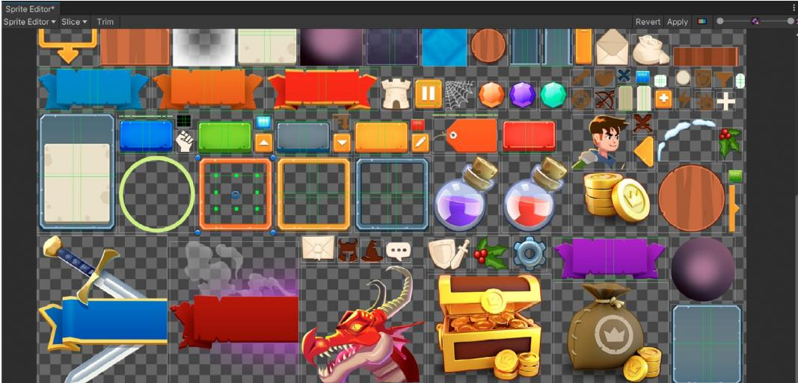

#### **Sprite atlas**

A typical game UI atlas from the *UI Toolkit Sample – Dragon Crashers*

[Sprite Atlas](https://docs.unity3d.com/6000.0/Documentation/Manual/sprite/atlas/atlas-landing.html) is Unity's atlasing tool for 2D game development and sprites, but you can also use it for UI graphics. It automatically packs assets in the same project folder, creating an atlas for the sprites, and normal and mask maps. It also supports platform-specific variants and has an [API](https://docs.unity3d.com/6000.0/Documentation/ScriptReference/U2D.SpriteAtlas.html) for advanced control. Sprite Atlas is commonly used in the Editor to pack assets but not at runtime.

<span id="page-21-0"></span>

#### **Dynamic atlas**

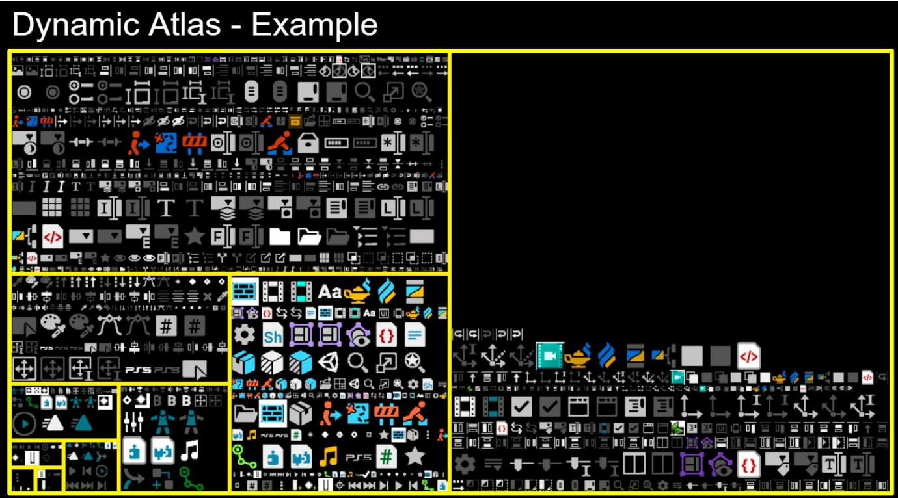

Dynamic atlas generated from the Unity Editor and shown in the Texture Atlas Viewer; the atlas grows horizontally and vertically in multiples of 2 fitting in the max allowed texture size

When UI graphics are not packed with Sprite Atlas, they are automatically packed with the [dynamic atlas](https://docs.unity3d.com/Manual/UIE-control-textures-of-the-dynamic-atlas.html) feature in UI Toolkit during a pre-pass.

The referenced images within a visual element will be atlased according to the criteria defined in the Panel Settings of the UI Document. For example, you can define the minimum or maximum texture sizes to be packed or filter images based on other properties. You can preview generated atlases in the Texture Atlas Viewer within the UI Toolkit Debugger.

The dynamic atlas tool works both at runtime and in the Editor, making it useful for UI elements that are dynamically generated, like a player's inventory.

Common good practices for your graphics include:

- Once you start creating mockup screens, make sure to set the highest target resolution in your drawing software to avoid having to redo work later. If you plan to support up to 4K graphics, for instance, make that your minimum working resolution.
- Avoid scaling raster images up after they're created. This can result in pixelation and blurriness, thereby lowering visual quality. Instead, begin from the highest resolution supported, then scale down when exporting from a graphics application.


- If you design with vector graphics, resizing assets later is less of an issue. But try to work with a Reference Resolution, so that each asset has the correct relative scale - for example, keeping the outline thickness of the element consistent.
- If you are in the situation where the graphic assets have a lower resolution than needed, try [2D Enhancers](https://muse.unity.com/en-us/explore), and the AI-powered upscale feature within the Sprite Editor.
- Make the most out of the [2D PSD Importer](https://docs.unity3d.com/Packages/com.unity.2d.psdimporter@10.0/manual/index.html) by importing PSDs directly into Unity. Any changes to a layer will be reflected in Unity once you save the PSD file. If you have the PSD file in Unity, it can also benefit from [Version Control](https://docs.unity.com/ugs/en-us/manual/devops/manual/unity-version-control).
- Automate your import process. Avoid manually changing the asset settings every time you add a graphic asset. The [Preset](https://docs.unity3d.com/Manual/Presets.html) feature allows you to save settings applied to one asset and automatically apply them to all assets of the same kind in a given folder.
- If you need to automate the process even further, such as running checks on assets, or mass-changing settings for multiple assets, you can use the [Asset PostProcessor](https://docs.unity3d.com/6000.0/Documentation/ScriptReference/AssetPostprocessor.html) API.

## <span id="page-23-0"></span>UI Builder

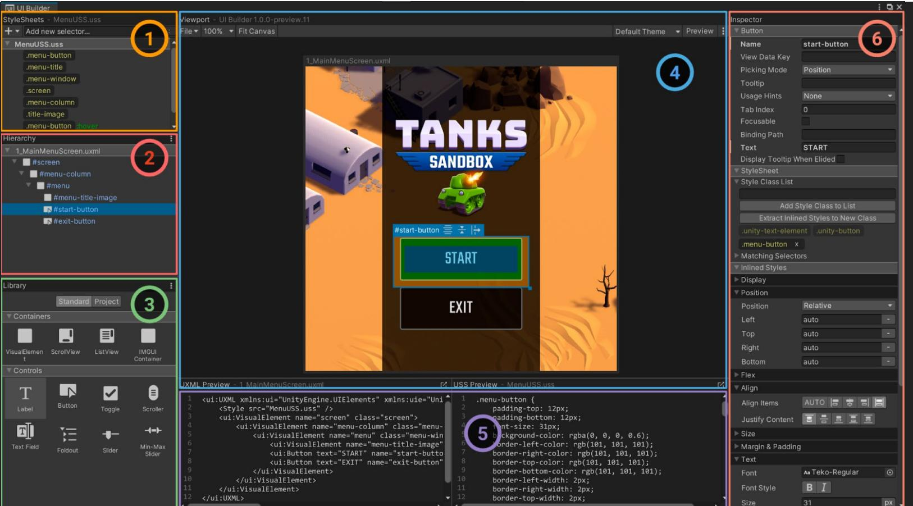

UI Builder is accessible from the Window/UI Toolkit/UI Builder menu.

<span id="page-24-0"></span>

UI Builder enables you to create, visualize and modify UXML and USS files in a visual interface that's integrated into the main Editor. Let's look at the key features of UI Builder:

- **1. StyleSheets:** This is where you can manage layout and styling formatting rules (also known as USS selectors) to share styles across UXML Documents and UI elements.
- **2. Hierarchy:** Similar to the Scene view, it displays the hierarchy of visual elements in your UXML document.
- **3. Library:** This contains predefined or custom controls ready to be added to your hierarchy, like buttons, labels, and sliders. From here you can also add other UXML (templates) into your current UXML.
- **4. Viewport:** This shows how your interface looks; you can edit elements directly in the Canvas using gizmos.
- **5. Code Previews:** This shows the code that the UI Builder is creating behind the scenes for both the UI Document (UXML) and the StyleSheets (USS). You may have to resize the window in order to see it properly.
- **6. Inspector:** Use it to change the attributes and style properties of the selected element or USS selector.

#### **Tip: Saving UI assets**

In UI Builder, save your changes from the **Viewport** menu (**File > Save**). This saves all open UXML and USS files.

Unlike Unity UI, the game can run in the Editor while you actively make changes in UI Toolkit. Look for the asterisk **\*** next to the file name in the UI Builder's Canvas header; this indicates unsaved changes.

### Canvas background

Enabling the Canvas background can help you visualize your element styling over a color or background image. Select the UXML file in the Hierarchy pane and then choose a Canvas background that approximates the final UI interface to judge style changes in context.

The Canvas background provides a few different options:

- **Background Color**: Represents a specific shade or hue of the game environment
- **Image**: For choosing a sprite or texture as the background (useful for replicating mockup screens or reference art)
- **Camera**: Displays the current gameplay in the background, enabling you to see the UI in context of the actual game

<span id="page-25-0"></span>

| Viewport |             |   |            |                      |                     |   |         | Inspector                    |                     |               |     |
|----------|-------------|---|------------|----------------------|---------------------|---|---------|------------------------------|---------------------|---------------|-----|
|          | File ▼ 100% | V | Fit Canvas |                      | Active Editor Theme | > | Preview | <br>V Canvas Size            |                     |               |     |
|          |             |   |            | NewUXMLTemplate.uxml |                     |   |         | Size<br>Match Game View      | Width<br>350        | Height<br>450 |     |
|          |             |   |            |                      |                     |   |         | Canvas Background<br>7       |                     |               |     |
|          |             |   |            |                      |                     |   |         |                              |                     |               |     |
|          |             |   |            |                      |                     |   |         | N                            | R                   | 00            |     |
|          |             |   |            |                      |                     |   |         | B None (Texture 2D)<br>Image |                     |               |     |
|          |             |   |            |                      |                     |   |         | Opacity                      |                     |               | 100 |
|          |             |   |            |                      |                     |   |         | Scale Mode                   | 대 리 대               |               |     |
|          |             |   |            |                      |                     |   |         |                              | Fit Canvas to Image |               |     |
|          |             |   |            |                      |                     |   |         | Document Settings            |                     |               |     |
|          |             |   |            |                      |                     |   |         |                              |                     |               |     |
|          |             |   |            |                      |                     |   |         |                              |                     |               |     |
|          |             |   |            |                      |                     |   |         |                              |                     |               |     |
|          |             |   |            |                      |                     |   |         |                              |                     |               |     |
|          |             |   |            |                      |                     |   |         |                              |                     |               |     |

The Canvas of a new UXML document: Use the Color and Image options to adjust its appearance.

## Viewport settings

To navigate the work area, adjust the zoom level (between 25%–500%), or choose the **Fit Canvas** option which automatically adjusts the zoom according to the current screen real estate.

Use **Preview** to visualize the UI without accidentally editing the selected elements. When active, the Viewport can also show styles applied for specific mouse events (e.g., hovering, focusing).

| Tip: Match Game view and themes |  |  |  |  |  |  |  |  |  |
|---------------------------------|--|--|--|--|--|--|--|--|--|
|                                 |  |  |  |  |  |  |  |  |  |
|                                 |  |  |  |  |  |  |  |  |  |
|                                 |  |  |  |  |  |  |  |  |  |
|                                 |  |  |  |  |  |  |  |  |  |
|                                 |  |  |  |  |  |  |  |  |  |
|                                 |  |  |  |  |  |  |  |  |  |
|                                 |  |  |  |  |  |  |  |  |  |
|                                 |  |  |  |  |  |  |  |  |  |
|                                 |  |  |  |  |  |  |  |  |  |
|                                 |  |  |  |  |  |  |  |  |  |
|                                 |  |  |  |  |  |  |  |  |  |
|                                 |  |  |  |  |  |  |  |  |  |
|                                 |  |  |  |  |  |  |  |  |  |
|                                 |  |  |  |  |  |  |  |  |  |
|                                 |  |  |  |  |  |  |  |  |  |

To approximate a runtime UI, select the currently loaded UI Document (UXML) in the Hierarchy and check **Match Game View**. This sizes the Viewport to your project Reference Resolution. Remember that modifying this parameter does not affect the UI files themselves, only the visualization. From UI Builder you can also previsualize different themes used in your project, a feature that's covered later in the guide.

## <span id="page-26-0"></span>Layouts

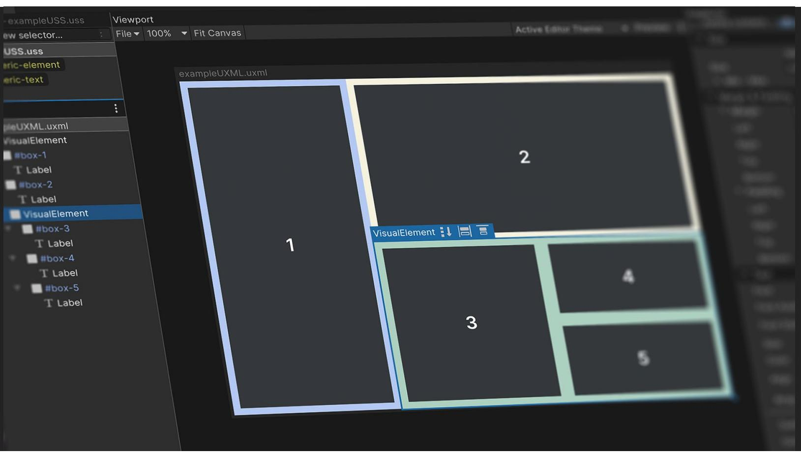

The UI Builder gives you all the tools you need to design a responsive layout.


This section covers the essential steps to creating layouts in UI Builder.

[UI Builder](https://docs.unity3d.com/6000.0/Documentation/Manual/UIBuilder.html) is a WYSIWYG, designer-friendly tool to help create UXML and USS files efficiently and without writing code. While some teams may prefer creating UI directly in code, UI Builder empowers artists with creative control, enabling significant workflow improvements. When you make changes in the UI Builder, it generates the code for you, and everything you create in UI Builder can be implemented as code directly in UXML and USS.

The efficient set up of responsive layouts is a major benefit of using UI Toolkit and UI Builder. Such layouts are a necessary feature for any game that is targeting multiple platforms with different screen resolutions and ratios. This section covers the essential steps to creating layouts in UI Builder.

Below is a UXML file with its code displayed in the UXML Preview panel in UI Builder. In UI Builder, create the asset via *File > New* and then *Save As*.

| # Scene | Game | O Ul Builder                   |                        |         |                                                                                                                |                    | O Inspector                       |                             | a :          |
|---------|------|--------------------------------|------------------------|---------|----------------------------------------------------------------------------------------------------------------|--------------------|-----------------------------------|-----------------------------|--------------|
|         |      | Game - Display 1 - Free Aspect | · Scale ● ● Scale ● 1x |         | Play Focused ▼ ¥                                                                                               | 小   Stats Gizmos ▼ | B<br>V UIDocument                 |                             | Static ▼     |
|         |      |                                |                        |         |                                                                                                                |                    |                                   | Tag Untagged ▼ ▼ Layer Ul   |              |
|         |      | ANNENO                         |                        |         |                                                                                                                |                    | J. Transform<br>Position          | × 0<br>Y O                  | � 花 :<br>Z 0 |
|         |      |                                |                        |         |                                                                                                                |                    | Rotation                          | × 0<br>Y O                  | Z O          |
|         |      |                                |                        | START   |                                                                                                                |                    | Scale                             | QX 1<br>Y 1                 | Z 1          |
|         |      |                                |                        | CREDITS |                                                                                                                |                    | U √ Ul Document<br>Panel Settings | 3 PanelSettings (Panel Se O | 0 ± :        |
|         |      |                                |                        |         |                                                                                                                |                    | Source Asset                      | @ MainMenu (Visual Tree ⊙   |              |
|         |      |                                |                        | BUTTON  |                                                                                                                |                    | Sort Order                        | 0                           |              |
|         |      |                                |                        |         |                                                                                                                |                    |                                   | Add Component               |              |
|         |      |                                |                        |         |                                                                                                                |                    |                                   |                             |              |
|         |      |                                |                        |         |                                                                                                                |                    |                                   |                             |              |
|         |      |                                |                        |         |                                                                                                                |                    |                                   |                             |              |
|         |      |                                |                        |         |                                                                                                                |                    |                                   |                             |              |
|         |      |                                |                        |         |                                                                                                                |                    |                                   |                             |              |
|         |      |                                |                        |         |                                                                                                                |                    |                                   |                             |              |
|         |      |                                |                        |         |                                                                                                                |                    |                                   |                             |              |
|         |      |                                |                        |         |                                                                                                                |                    |                                   |                             |              |
|         |      |                                |                        |         |                                                                                                                |                    |                                   |                             |              |
|         |      |                                |                        |         |                                                                                                                |                    |                                   |                             |              |
|         |      |                                |                        |         |                                                                                                                |                    |                                   |                             |              |
|         |      | UXML Preview - MainMenu.uxml   |                        |         |                                                                                                                |                    |                                   |                             | G            |
| 1       |      |                                |                        |         | <engine UXML xmlns:xs="http://www.w3.org/201/XMLSchema-instance" xmlns:engine="UnityEngine.uIIElements" xmIns: |                    |                                   |                             |              |
| C       |      |                                |                        |         | - приведения морт пристирания пространия продавности в Поликовского собствования (дал                          |                    |                                   |                             |              |

- 
- 
- 

By clicking the icon in the upper right corner of the Code Preview window you it will open it in your IDE.

<span id="page-28-0"></span>

In this example UXML code, you can see [visual elements](https://docs.unity3d.com/6000.0/Documentation/Manual/UIB-structuring-ui-elements.html) are represented as markup language that resembles HTML, such as starting with an open and ending bracket. For example, this is the syntax for a start button:

```
<engine:Button text="START" name="start-game__button" />
```
## Core runtime components

UI Toolkit elements won't appear in the Scene view. You can see the interface as you make it in UI Builder, but the Game view provides a more accurate preview at the target resolution. To render the UI in Game view, a GameObject must have a **UI Document** component with a **Panel Settings** asset and a **Visual Tree** asset (UXML), as seen in this screenshot:

| UI ✓ Ul Document |                                        | 3 F |   |
|------------------|----------------------------------------|-----|---|
| Panel Settings   | MainMenuPanelSettings (Panel Settings) |     | 0 |
| Source Asset     | MainMenu (Visual Tree Asset)           |     | 0 |
| Sort Order       | O                                      |     |   |

A [UI Document Component](https://www.google.com/url?q=https://docs.unity3d.com/6000.1/Documentation/Manual/UIE-create-ui-document-component.html&sa=D&source=editors&ust=1743518467818802&usg=AOvVaw231dEBJn8vmZcaA4cx3cN5) defines what UXML will be displayed, and comes with a default Panel Settings asset. The Sort Order field determines how this document shows up in relation to other UI Documents using the same Panel Settings.

Add this component to a GameObject using the **Add Component** menu in the Inspector, or right-click in the Hierarchy and select **UI Toolkit > UI Document**, which will automatically assign the Panel Settings asset.

The Panel Settings asset defines how the UI Document component will be instantiated and visualized at runtime. It's possible to have multiple Panel Settings assets to enable different styles for the UIs. If your game includes HUD or a minimap, for instance, these special UIs could each have their own Panel Settings.

Create the asset via **Assets > Create > UI Toolkit > Panel Settings Asset**. It will be added to your root project folder, which can then be applied to a UI Document component on a GameObject.

## Responsive layouts: Flexbox

UI Toolkit positions visual elements based on [Yoga](https://yogalayout.com/), an HTML/CSS layout engine that implements a subset of [Flexbox](https://css-tricks.com/snippets/css/a-guide-to-flexbox/). If you're unfamiliar with Yoga and Flexbox, this chapter will get you up to speed on the principles behind UI Toolkit's layout engine.


- **Responsive UI**: Flexbox organizes everything into a network of boxes or containers. You can nest these elements as parents and children and arrange them spatially onscreen using simple rules. Children respond automatically to changes in their parent containers. A responsive layout adapts to different screen resolutions and sizes, allowing you to target multiple platforms more easily.
- **Organized complexity**: Styles define simple rules that control the aesthetic values of a visual element. One style can be applied to hundreds of elements at once, with changes immediately reflected on the entire UI. This centers UI design around consistent reusable styles rather than working on the appearance of individual elements.
- **Decoupled logic and design**: UI layouts and styles are decoupled from the code. This helps designers and developers work in parallel without breaking dependencies. Each user can then focus on what they do best.

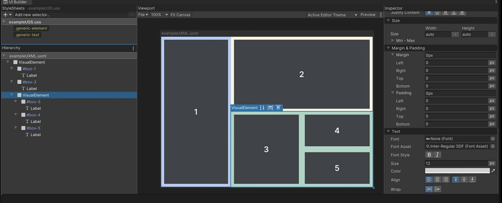

Decoupling logic and design: Programmers can connect the visual elements to the actual game logic while designers focus on defining the styles for them.

## <span id="page-30-0"></span>Visual elements

In UI Toolkit, the fundamental building blocks of each interface are their visual elements. A visual element is the base class of every UI Toolkit element (buttons, images, text, etc.) Think of them as UI Toolkit equivalents of GameObjects.

A **UI Hierarchy** of one or more visual elements is called a **[Visual Tree](https://docs.unity3d.com/Manual/UIE-VisualTree.html)**.

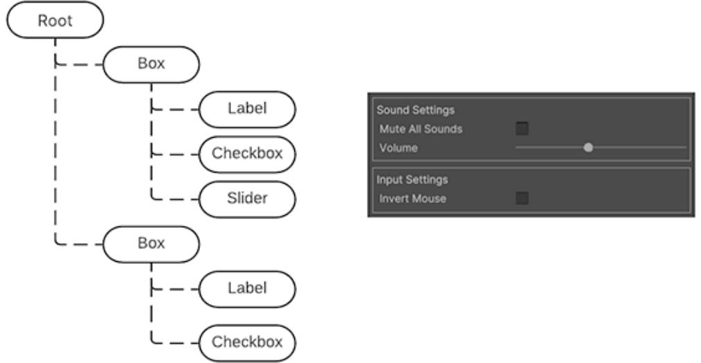

A simplified UI Hierarchy of a visual tree and how it looks on the right side

Combinations of multiple visual elements are stored in [UXML](https://docs.unity3d.com/Manual/UIE-UXML.html?utm_source=demand-gen&utm_medium=pdf&utm_campaign=authoring-optimizing-ui&utm_content=ui-design-ebook) files, which contains information related to the hierarchy, as well as its styling (if not using a StyleSheet or USS) and the layout of visual elements.

Before we dive deeper into UI Toolkit, you'll need to understand the fundamentals of **Flexbox Layout**, which can be demonstrated with basic visual elements in the UI Builder.

## Positioning visual elements

When mocking up a UI, approach each screen as a separate group of visual elements. Think about how to break the screens down into boxes that stack up horizontally or vertically and if they need child boxes to keep organizing the information.

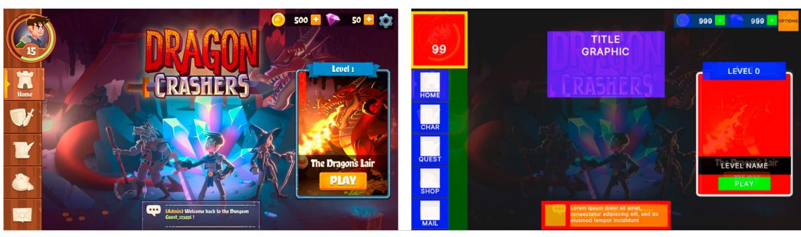

In the below example, one large visual element could be a container, the menu bar and its elements on the left. Separate child visual elements to represent each of the buttons.

A good practice is to have a detailed mockup or wireframe (left) and identify and block out the elements to recreate the design in UI Toolkit (right).

UI Builder offers two position options for visual elements:

- **Relative positioning**: This is the default setting for new visual elements. Child elements follow the Flexbox rules of the parent container. For example, if the parent element's **Direction** is set to **Row**, child visual elements arrange themselves from left to right. Relative positioning resizes and moves elements dynamically based on:
	- **The parent element's size or style rules**: If you modify a parent element's settings via **Padding or Align > Justify Content**, its children adjust themselves according to those changes.
	- **The child element's own size and style rules**: If the child visual element has its own minimum or maximum size settings, the layout engine tries to respect those as well.

UI Toolkit handles any conflicts between the parent and child element (so a child element with a minimum width that is wider than its container, for instance, results in an overflow).

| V Position        |                |
|-------------------|----------------|
| <br>Position Mode | Relative       |
| Offsets<br>D      | ✓ Relative     |
|                   | Absolute       |
|                   | auto<br>-      |
|                   |                |
| Left              | Right          |
| auto              | auto<br>-<br>- |
|                   | 0              |
|                   |                |

Position modes available for any visual element

<span id="page-32-0"></span>— **Absolute positioning**: Here, the position of the visual element anchors to the parent container, similar to how Unity UI works with Canvases. Size rules or rules that affect the children elements still apply, but the element itself will overlay on top of the parent container ignoring flex settings like **Grow**, **Shrink**, or **Margins**.

Absolutely positioned elements can use the **Left**, **Top**, **Right**, and **Bottom** settings as anchors. For example, zero values for the Right and Bottom pin a Button to the bottomright of the parent container.

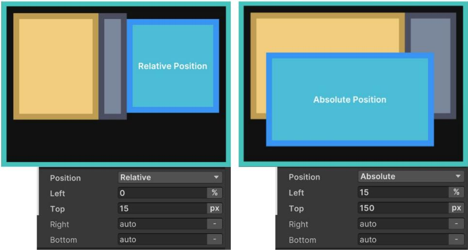

On the left, the blue visual element has a Relative position, with the parent element using **Direction: Row** as the Flex setting. On the right, the blue visual element uses Absolute position and ignores the parent element's Flexbox rules.

You'll probably want to use Relative positioning for elements that are permanently visible, have complex grouping, or contain a number of elements.

Absolute positioning can be useful for temporary UIs (like pop-up windows), decorative elements that don't interfere with the layout composition, or elements that follow the position of other in-game elements (like a character's health bar).

## Size settings

Remember that visual elements are simply containers. In Unity 6, their default Grow setting is set to 1, which means they will take all the available space in the container. Otherwise they don't take up any space unless they are filled with other child elements that already have a specific size, or you set them to a particular **Width** and **Height**.

<span id="page-33-0"></span>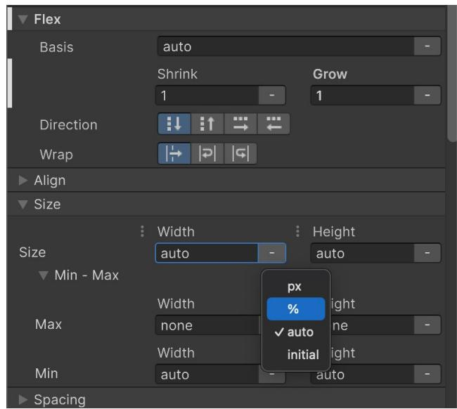

Size settings for a visual element

The Width and Height fields define the size of the element. The **Max Width** and **Max Height** limit how much it can expand. Likewise, the **Min Width** and **Min Height** limit how much it can contract. You can define the sizes in pixel units or percentages overriding the default auto. These impact how the Flex settings (below) can resize the elements based on available space.

## Flex settings

The Flex settings can affect your element's size when using Relative positioning. It's recommended that you experiment with elements to understand their behavior firsthand.

**Basis** refers to the default Width and Height of the item before any Grow or Shrink ratio operation occurs:

- If Grow is set to 1, this element will take all the available vertical or horizontal space in the parent element. If it was set to 0.5 it would take half of all the available space.
- If Grow is set to 0, the element does not grow beyond its current Basis (or size).
- If Shrink is set to 1, the element will shrink as much as required to fit in the parent element's available space.
- If Shrink is set to 0, the element will not shrink and will overflow if necessary.

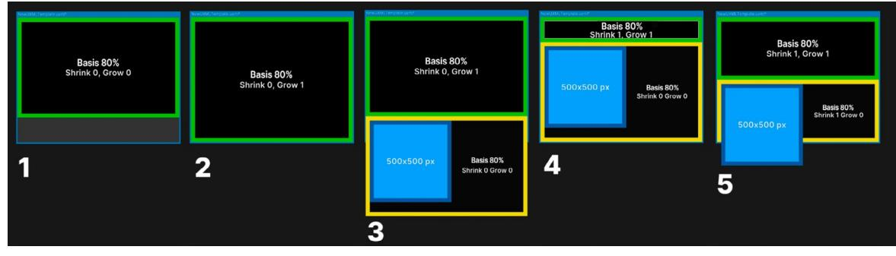

Basis, Grow, and Shrink settings

The above example shows how Basis works with the Grow and Shrink options:

- 1. The green element with a Basis of 80% occupies 80 percent of the available space.
- 2. Setting the Grow to 1 allows the green element to expand to the entire space.
- 3. With a yellow element added, the elements overflow the space. The green element returns to occupying 80 percent of the space.
- 4. A Shrink setting of 1 makes the green element shrink to fit the yellow element.
- 5. Here, both elements have a Shrink value of 1. They shrink equally to fit in the available space.

As you can see, elements that have a fixed size expressed in pixels (the blue box in 3–5) don't react to the Basis, Grow, or Shrink settings.

#### **Tip: Calculating visual element size**

The layout engine combines the Size and Flexbox settings to determine how large each element appears when using Relative positioning. Calculating a visual element's size entails the following steps:

- 1. The layout system computes the element size based on the Width and Height properties.
- 2. The layout engine checks if there is additional space available in the parent container, or if its children are already overflowing the available space.
- 3. If there is additional space available, the layout system looks for elements that have non-zero values in the Flex/Grow setting. It distributes the additional space according to that factor, expanding the child elements.
- 4. If the child elements overflow the available space, elements that have non-zero Flex/ Shrink values will reduce in size accordingly.
- 5. Any other properties that affect the resulting size of an element (Min-Width, Flex-Basis, etc.) are then taken into consideration.
- 6. The layout engine applies the final, resolved size.

<span id="page-35-0"></span>The **Direction** setting defines how child elements are arranged inside the parent. Child elements higher in the Hierarchy menu appear first. Elements at the end of the Hierarchy appear last.

The **Wrap** setting tells the layout system whether elements should try to fit into one column or row (No Wrap). Otherwise, they appear in the next row or column (Wrap or Wrap reverse).

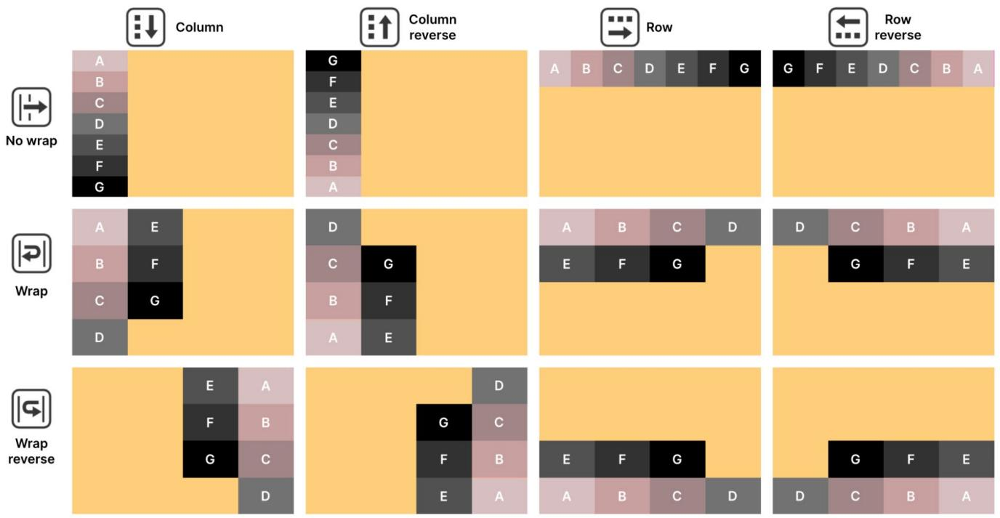

Parent and child visual elements in UI Builder, using Relative positioning and different Direction and Wrap combinations

## Align settings

The Align settings determine how child elements line up to their parent element. Set the **Align > Align Items** in the parent to line up child elements to the start, center, or end. These options affect the cross-axis (perpendicular to the row or column in the **Flex > Direction**).

The **Stretch** option also works along the cross-axis, but the Min or Max values from the size can limit the effect (this is the default). Meanwhile, the **Auto** option indicates that the layout engine can automatically choose one of the other options based on other parameters. It's recommended that you select one of the options for more control over the layout, and mainly use the Auto option for special use cases.

Go to **Align > Justify Content** to define how the layout engine spaces child elements within the parent. These elements can line up, adjacent to one another, or spread out using the available space. The **Flex > Grow** and **Flex > Shrink** settings influence the resulting layout.

<span id="page-36-0"></span>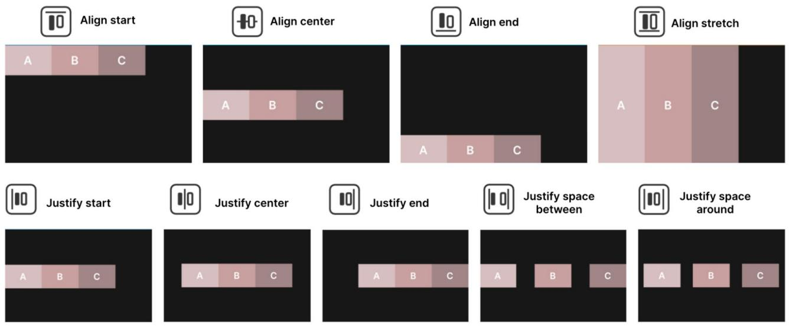

Align and Justify settings applied to a parent element with a Direction set to Row; note that other position and sizing options can affect the final output

The Align Self option allows the container to align itself to the center, end, or start position of the flex layout

## Margin and Padding

Use the Margin and Padding settings to define empty spaces around your visual elements and their content. Unity uses a variation of the standard CSS box model, similar to the diagram below.

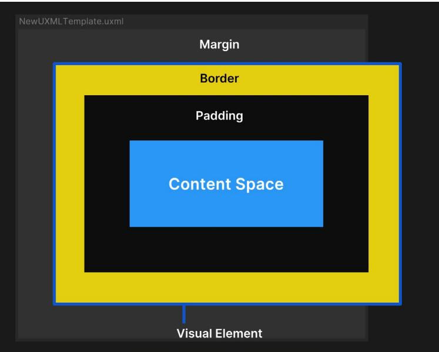

A visual element in UI Builder with defined Size, Margin, Border, and Padding settings; elements with a fixed Width or Height can overflow the space

<span id="page-37-0"></span>

- The **Content Space** holds your key visual elements (text, images, controls, etc.)
- **Padding** defines an empty area around the Content Space, but inside the Border.
- The **Border** defines a boundary between the Padding and the Margin. This can be colored and rounded. If given a thickness, the Border expands inward.
- **Margin** is similar to Padding but defines an area outside the Border. For elements with Absolute position, the margin settings won't have any effect but you can use the Position settings to add outside space in relation to the anchor point.

## Background and images

In UI Toolkit, any visual element can be used to display an onscreen image. Simply set the background property to show a texture or sprite.

You can fill in a color or image to change the element's appearance. This is helpful for wireframing. Bright colors with contrast can show how different elements look next to one another and respond to changes in their containers.

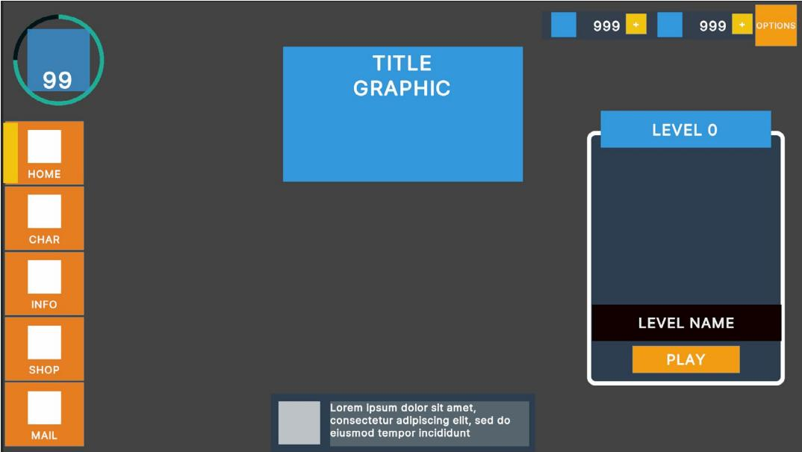

Use contrasting colors during wireframing.

## <span id="page-38-0"></span>Variable or fixed measuring units

In UI Builder, you'll encounter four parameters that define the distance and size of elements:

- **Auto**: This is the default option for size and position. The layout system calculates the elements' values based on both the parent and child elements' information.
- **Percentage**: The unit equals a percentage of an element's container and changes dynamically with the parent's Width and Height. Working with percentages can provide scalability when dealing with multiple format sizes.
- **Pixels**: This option is useful when you want your element to have a fixed size, for example, when you want small elements to have a minimum size in pixels that will allow them to remain readable at all times.
- **Initial**: This sets the property back to its default state (Unity's own default styling rules), ignoring the current styling values.


Examples of the default Size settings and Sizes defined in pixels and percentages

If you want to apply a scaling rule to the entire UI at the same time, you can do so in the [Panel](https://docs.unity3d.com/6000.0/Documentation/Manual/UIE-Runtime-Panel-Settings.html)  [Settings](https://docs.unity3d.com/6000.0/Documentation/Manual/UIE-Runtime-Panel-Settings.html) under the **Scale Mode** parameters:

- **Constant Pixel Size:** This scale mode keeps elements at a fixed pixel size, unaffected by screen size. A Scale Factor can be applied to multiply element sizes.
- **Constant Physical Size:** This mode maintains elements at the same physical size across screens. The system scales the UI based on a Reference DPI, adjusting the size if the actual screen DPI differs.

<span id="page-39-0"></span>— **Scale with Screen Size:** This option resizes elements dynamically based on resolution. **Screen Match Mode** determines whether scaling prioritizes width, height, or a blend of both. The **Reference Resolution** sets the UI's base size. When Screen Match Mode is set to **Match Width or Height**, the **Match** value controls whether the UI system scales the UI to match the screen width, the screen height, or a mix of the two.

| Inspector                        |                                              | ਹੈ   |
|----------------------------------|----------------------------------------------|------|
| Panel Settings (Panel Settings)  |                                              | 8 T  |
|                                  |                                              | Open |
| Theme Style Sheet                | UnityDefaultRuntimeTheme (Theme Style Sheet) | 0    |
| Text Settings                    | None (Panel Text Settings)                   | O    |
| Binding Console Logs             | No logs                                      | >    |
| Target Texture                   | None (Render Texture)                        | O    |
| Target Display                   | Display 1                                    | >    |
| Force Gamma Rendering            |                                              |      |
| Sort Order                       | 0                                            |      |
| Scale Mode                       | Constant Pixel Size                          |      |
| T Scale Mode Parameters          | V Constant Pixel Size                        |      |
| Scale                            | Constant Physical Size                       |      |
| Reference Sprite Pixels per Unit | Scale With Screen Size                       |      |
| Dynamic Atlas Settings<br>A      |                                              |      |
| Clear Settings<br>>              |                                              |      |
| > Buffer Management              |                                              |      |

In the Panel Settings of UI Toolkit, you can find similar scaling options to the ones found in Unity UI.

## Overridden properties in UI Builder

Modified properties will be highlighted in the Inspector with a bold font and white line next to them as shown in the screenshot below. This indicates that they are overriding default values or values in the selector in the style sheet or USS of the selected UXML file. This behavior is also referred to as "inline styling". If a value doesn't need to be modified, it's best to leave it in its default state to make changes easier to find and manage. To reset a property to its default value, you can use the option available in the dots (⁝) menu next to the property section.

| Background                             |   |        |           |
|----------------------------------------|---|--------|-----------|
| <br>Color                              |   |        |           |
| Add binding                            |   | 0      | Texture ▼ |
| Extract Inlined Style to Selector      | > |        |           |
| Extract All Inlined Styles to Selector | > | Height |           |
| Set as inline value                    |   | 100    | %         |
| Unset                                  |   |        | OX        |
| Unset all                              |   |        |           |
| 1 VOIVIN                               |   |        | px        |
| Scale Mode                             |   |        |           |

From this menu you can restore the modified values to the default ones or the ones originally in the selector.

<span id="page-40-0"></span>

## UXML as templates

UXML files can be used similar to prefabs. For example, you could have a project with a UXML layout that contains an item icon and count number that you need to spawn many times inside an inventory. If you right click on any UXML you get the option to create a Template, which can later be added to any other visual element in the Hierarchy pane or instantiated from code. Once created you can find it in your Library and Project view.

| Hierarchy                   |                                                                                   |                                                                                                                                                              |   |      |
|-----------------------------|-----------------------------------------------------------------------------------|--------------------------------------------------------------------------------------------------------------------------------------------------------------|---|------|
| test.uxml                   |                                                                                   | Library                                                                                                                                                      |   |      |
| #button-accept              | Copy<br>Paste<br>Rename<br>Duplicate<br>Delete<br>Create Template<br>Add selector | Standard   Project<br>Q. Search<br>Ul Documents (UXML)<br>V Assets<br>button-accept.uxml<br>< test.uxml<br>Custom Controls (C#)<br># TabbedView<br>TabButton | U | 01:4 |
| Library<br>Standard Project |                                                                                   |                                                                                                                                                              |   |      |

Templates are reusable UXML and are available in the Library pane in the Project tab.

## More resources

Learn more about the Flexbox layout engine with the following resources. As Flexbox and Yoga are existing standards in web and app development, there will be a variety of resources available online.

- [UI Toolkit at runtime: Get the breakdown](https://blog.unity.com/technology/ui-toolkit-at-runtime-get-the-breakdown)
- [Yoga official documentation](https://yogalayout.com/)
- [CSS-Tricks guide to Flexbox](https://css-tricks.com/snippets/css/a-guide-to-flexbox/)

# <span id="page-41-0"></span>Styling

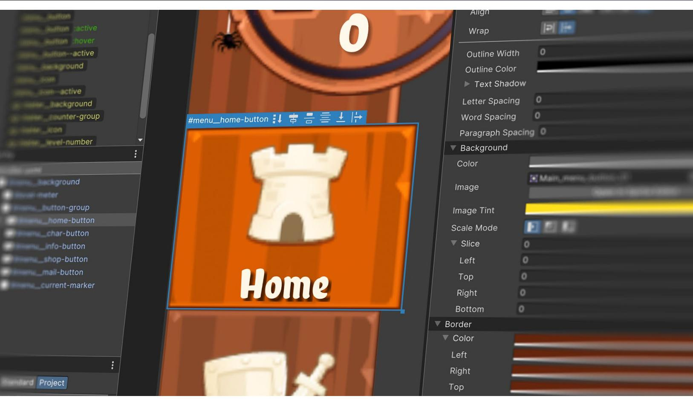

Changing style properties directly in UI Builder

<span id="page-42-0"></span>

Once you've mocked up some wireframe layouts with visual elements, you can begin styling them or saving the formatting properties into reusable styles. Styling is where UI Toolkit exhibits its full power.

Adding style to visual elements is preferably done via [Unity style sheet \(USS\)](https://docs.unity3d.com/Manual/UIE-USS-Selectors.html) files (**Assets > Create > UI Toolkit > StyleSheet**). They are the Unity equivalent to web CSS files, and use a similar rule-based format. They also add flexibility to the design process making it easy to reuse and styles consistent across the project at scale.

USS files define the size, color, font, spacing, borders, or location of elements.

### USS selectors

If you haven't created a USS file yet, all the styling changes you make will be embedded directly in the UXML asset as inline styles. While these inline styles affect the appearance of the specific visual element they are attached to, they cannot be reused across your project.

For example, if your project has hundreds of buttons, updating the style of each individual button would be time-consuming and inefficient. Instead, you can define a selector in a USS. [USS selectors](https://docs.unity3d.com/Manual/UIB-styling-ui-using-uss-selectors.html) make it possible for style sheets in UI Builder to share and apply styles across many elements in UXML assets.

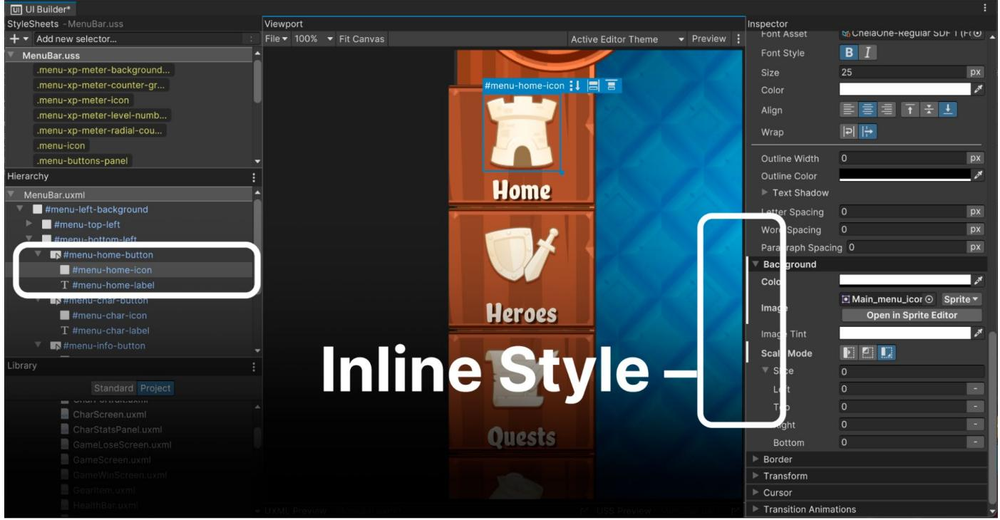

#### **Converting existing inline styles to selectors**

Inline styles are overrides.


Use the **Add Style Class to List** button to type and convert all the inline styles of an element to a selector (starting with "**.**" in yellow). This selector now centralizes the styling properties, allowing you to apply consistent styles to other buttons (or other elements) throughout the project. Any updates made to the selector will automatically reflect on all associated elements, making the process scalable and maintainable.

| StyleSheet                          |  |  |  |
|-------------------------------------|--|--|--|
| V Style Class List                  |  |  |  |
| button-glossy-green                 |  |  |  |
| Add Style Class to List             |  |  |  |
| Extract Inlined Styles to New Class |  |  |  |
| .unity-text-element .unity-button   |  |  |  |
| > Matching Selectors                |  |  |  |

Extracting all Inline Style properties to a selector

To extract specific inline styles to a new selector, click on the vertical ellipsis **(**⁝**)** next to the property, and select **Extract Inlined Style to Selector / Add Class**, which turns that property into a selector.

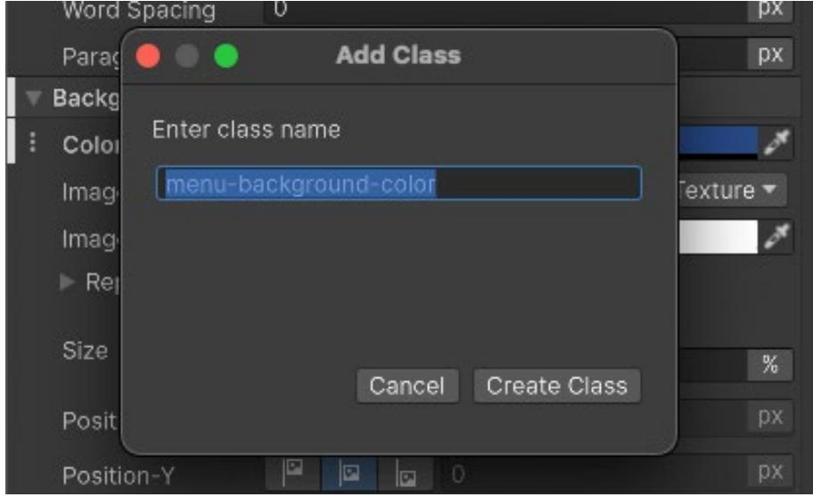

Extracting property's Inline Style to a selector

<span id="page-44-0"></span>

### **Creating new selectors**

Selectors query the visual tree for any elements that match a given search criteria. UI Toolkit then applies style changes to all matching elements. You can add a new selector by clicking on the field **Add new selector…** in the top left side of UI Builder:

| Ul Builder*                                  |                                                                                                                               |                                                               |                                          |  |  |
|----------------------------------------------|-------------------------------------------------------------------------------------------------------------------------------|---------------------------------------------------------------|------------------------------------------|--|--|
| StyleSheets                                  |                                                                                                                               | Viewport                                                      |                                          |  |  |
| +▼<br>11-1                                   |                                                                                                                               | File ▼ 25%<br>Fit viewport<br>)                               |                                          |  |  |
|                                              |                                                                                                                               | Selector Type                                                 | Example                                  |  |  |
| Click the + icon to create a new StyleSheet. |                                                                                                                               | Element C# type                                               | Button                                   |  |  |
|                                              |                                                                                                                               | Name or ID                                                    | #exampleID                               |  |  |
|                                              |                                                                                                                               | Style class                                                   | .styleClassName                          |  |  |
|                                              |                                                                                                                               | Direct child                                                  | .parentClassName > .directChildClassName |  |  |
| Hierarchy                                    |                                                                                                                               | Child at any depth                                            | .parentClassName .childClassName         |  |  |
| test.uxml*<br>VisualElement                  | ▲                                                                                                                             | Mouse over only                                               | .styleClassName :hover                   |  |  |
| T Label                                      |                                                                                                                               | Focus only                                                    | .styleClassName :focus                   |  |  |
| VisualElement<br>VisualElement               |                                                                                                                               | Selector types listed from least to most specific. Learn more |                                          |  |  |
| ScrollView                                   | V                                                                                                                             | Example                                                       |                                          |  |  |
| Library                                      |                                                                                                                               | Button.yellow:hover Label#foo                                 |                                          |  |  |
| Standard<br>Project                          | Match on all Labels named #foo inside any Buttons that have the<br>.yellow style class and have the mouse currently :hovering |                                                               |                                          |  |  |
| Q- Search                                    |                                                                                                                               | over them.                                                    |                                          |  |  |
| Containers                                   |                                                                                                                               |                                                               |                                          |  |  |
| D<br>T                                       |                                                                                                                               |                                                               |                                          |  |  |

USS selector reference when creating a new selector

USS selectors can match visual elements by:

- **Element C# type**: These selectors work by Type (Button, Label, ListView, etc.) The selector matches the available default Type names in the Library panel. They don't have any special characters in front of the name. Class selectors appear in white. For example, **Button** will apply the style to all the elements of the type **Button**
- **Name or ID**: These selectors can apply styling to all the elements of the same name. Name selectors have a preceding hash "**#**" symbol and appear in blue. For example, **#title** would apply the style to all the elements in the Hierarchy with the name **title***.*

**Note**: UXML name attributes (unlike HTML IDs) don't need to be unique because UI Toolkit supports UXML templates and reusable components, allowing multiple elements to share the same name and style.

— **Style class**: A Style Class selector is a reusable style that can be applied to any visual element by adding the corresponding class name to the element's Class List property. Style Class selectors have a preceding dot "**.**" character and appear in yellow. For example, **.smallFont** could be used to apply a specific style to any element by adding smallFont to its Class List.

- **Direct child:** If you add a **>** after the matching criteria, only the direct child elements matching the second criteria after the symbol > will be affected. For example, the selector **#title > Label**, would apply the style to any **Label** type inside the elements of the name **#title***.* Any Label outside that parent or deeper in the hierarchy won't be affected.
- **Child at any depth:** This is the same as the previous selector, but in this case the second matching criteria will apply to any child regardless of its depth in the parent hierarchy.

**Note**: Avoid overly broad selectors when possible (especially those ending in **\*** or targeting generic Unity classes like .unity-button). Deep child selectors can potentially slow down performance if they evaluate a large portion of the visual tree.

— **Pseudo-class:** Pseudo-classes allow you to define distinct styles for visual elements when they change state, such as when the mouse hovers over them or when they are focused. Pseudo-classes are denoted by a colon "**:**" and modify existing selectors.

For example, the selector Button **:focus** would apply specific styles to all Button elements when they are focused. This makes pseudo-classes useful for adding visual feedback, such as hover effects or focus indicators. Additionally, combining pseudoclasses with USS animations enables you to introduce smooth motion and dynamic transitions, enhancing the user experience.

You can read about the pseudo-classes [available here](https://docs.unity3d.com/Manual/UIE-USS-Selectors-Pseudo-Classes.html).

If a visual element matches multiple selectors, the selector with the highest [specificity](https://docs.unity3d.com/Manual/UIE-USS-Selectors.html#selector-specificity) takes precedence.

The specificity hierarchy in USS is as follows:

- **1. Inline Styles**: Styles applied directly to an element (e.g., in UXML or through code) take the highest precedence and override all USS selectors.
- **2. ID selectors** (#id): These are the most specific USS selectors and apply to elements with a unique name property.
- **3. Class selectors** (.className): These apply to elements with the corresponding class added to their **Class List**.
- **4. C# Type selectors** (e.g., Button, Label): These apply to all elements of the specified type.

For example, if an element has both an inline style and matches a #title ID selector, the inline style will override the ID selector. Similarly, if the element matches both a Class selector and a Type selector, the Class selector will take precedence.

In the case of a tie, where several selectors are trying to override the same property and all have the same level of specificity, the tie breaker will be the order in the USS style sheet, selectors lower in the list will take precedence.

You can learn more about selector precedence in the [documentation](https://docs.unity3d.com/Manual/UIE-USS-Selectors.html#determining-selector-precedence).

#### <span id="page-46-0"></span>**Tip: Additional information on Hierarchy**

Click the vertical ellipsis (⁝) in the Hierarchy header to further visualize the UI elements.

| Hierarchy                                                  |                                                  |
|------------------------------------------------------------|--------------------------------------------------|
| OptionsBar.uxml<br>VisualElement #options-bar .options-bar | · Type<br>< Class List<br>√ Attached StyleSheets |

Filter for different selectors in the Hierarchy.

In the Hierarchy pane, additional information appears next to the element Type. The **#options-bar** Name selector and **.options-bar** Style Class selector appear when checked.

You might notice that some selectors begin with the **.unity-** prefix. These are default styles that apply to all elements. Any defined selectors will override these values.

#### **Selectors assigned to elements**

In the Inspector, you can visualize the matching selectors of a selected element in the Hierarchy. The selector at the bottom of the list has precedence. Unfold the details to see which style parameters are changing.

| Style Class List                                                                                                                          |                                     |   |
|-------------------------------------------------------------------------------------------------------------------------------------------|-------------------------------------|---|
|                                                                                                                                           |                                     |   |
|                                                                                                                                           | Add Style Class to List             |   |
|                                                                                                                                           | Extract Inlined Styles to New Class |   |
| unity-text-element unity-button green-button                                                                                              |                                     | X |
| Matching Selectors<br>A<br>.unity-button<br>.unity-button<br>2<br>.unity-button<br>D<br>Button<br>.green-button<br>A<br>#button-play<br>> |                                     |   |
| background-color rgb(255, 139, 59)                                                                                                        |                                     |   |

A selected visual element shows its matching selectors in the Inspector.

<span id="page-47-0"></span>

### **Editing selectors**

When modifying a Style selector, be sure to select the **Style Class** in the **Style Sheet** panel – not the visual element from the Hierarchy. Otherwise, you will change the inline style for a specific element and not the Style Class itself.

|            |             |                                                                                                                                                                                                              |                                                                           |           | UI Builder                                                                                                                                                                                                            |   |          |             |   |    |
|------------|-------------|--------------------------------------------------------------------------------------------------------------------------------------------------------------------------------------------------------------|---------------------------------------------------------------------------|-----------|-----------------------------------------------------------------------------------------------------------------------------------------------------------------------------------------------------------------------|---|----------|-------------|---|----|
|            |             | Inspector                                                                                                                                                                                                    |                                                                           |           | StyleSheets - MenuBar.uss                                                                                                                                                                                             |   | Viewport |             |   |    |
| itor Theme | - Preview : | Button                                                                                                                                                                                                       |                                                                           |           | - - Add new selector                                                                                                                                                                                                  |   |          | File ▼ 175% | > | Fi |
|            |             | Name<br>View Data Key<br>Picking Mode<br>Tooltip<br>Usage Hints<br>Tab Index<br>Focusable<br>Binding Path<br>Text<br>Enable Rich Text ✔<br>Display Tooltip When Elided ✔<br>StyleSheet<br>V Style Class List | menu_home-button<br>Position<br>None<br>0<br>><br>Add Style Class to List |           | .menu_current-marker<br>.menu_button<br>.menu_button :active<br>.menu_button :hover<br>.menu_button--active<br>.menu_background<br>.menu_icon<br>.menu_icon-active<br>.xp-meter_background<br>.xp-meter_counter-group | ▲ |          |             |   |    |
|            |             |                                                                                                                                                                                                              | Extract Inlined Styles to New Class                                       |           | .xp-meter_icon                                                                                                                                                                                                        |   |          |             |   |    |
|            |             |                                                                                                                                                                                                              | .unity-text-element .unity-button .menu_button--active x                  |           | .xp-meter_level-number                                                                                                                                                                                                | V |          |             |   |    |
| D          |             | .cursor-b x<br>V Matching Selectors<br>> .unity-button<br>Lunity-button<br>> .unity-button<br>Button<br>> .menu_button -- active<br>> . cursor-b                                                             | Double-click to select and edit USS selector.                             | Hierarchy | MenuBar.uxml<br>T #menu_background<br>#level-meter<br>#menu_button-group<br>> #menu home-button                                                                                                                       |   |          |             |   |    |

Double-click the Style Class in the Inspector to ensure it's active.

You can double-click a Style Class in the Inspector to deselect an element and select the Style selector instead.

Just like when you were modifying parameters as inline styles directly in the UXML, you can edit parameters in the selectors, by selecting them in the StyleSheets pane, and modifying with overrides. The changes will also show as bold with a white line next to them. To unset a value you can do it from the vertical ellipsis (⁝) menu next to the property.

| StyleSheets -usstest.uss                         | : Viewport                                         | Inspector            |                            |
|--------------------------------------------------|----------------------------------------------------|----------------------|----------------------------|
| + ▼   Add new selector                           | File ▼ 25% ▼ Fit viewport Unity Default Runtime Th | Selector             |                            |
| T usstest.uss*                                   | test.uxml                                          | ()                   | #VisualElementTest > Label |
| #VisualElementTest<br>#VisualElementTest > Label |                                                    | Left                 | 0                          |
|                                                  |                                                    |                      | 0                          |
|                                                  | Label                                              | Top                  |                            |
|                                                  |                                                    | Right                | 0                          |
|                                                  |                                                    | Bottom               | 0                          |
|                                                  |                                                    | Slice Scale          | . 1<br>px                  |
| Hierarchy                                        |                                                    | Border               |                            |
| test.uxml*                                       |                                                    | px -<br>0<br>40<br>0 | 0<br>40<br>40<br>40<br>0   |
| Library<br>Standard Project                      |                                                    |                      |                            |
| Q. Search                                        |                                                    | > Color              |                            |
| Containers                                       |                                                    | ► Width              | 40px                       |
| =I                                               |                                                    | ► Radius             | Opx                        |

Editing a USS selector

<span id="page-48-0"></span>

With numerous formatting options available, you can modify the basic appearance of elements and fonts. UI Toolkit offers advanced styling that can reduce the need for custom-made sprites.

UI Builder can facilitate adding outlines, rounded corners, image adjustments, and border colors to your elements. Styling can also include bevel effects and the ability to change the cursor image.

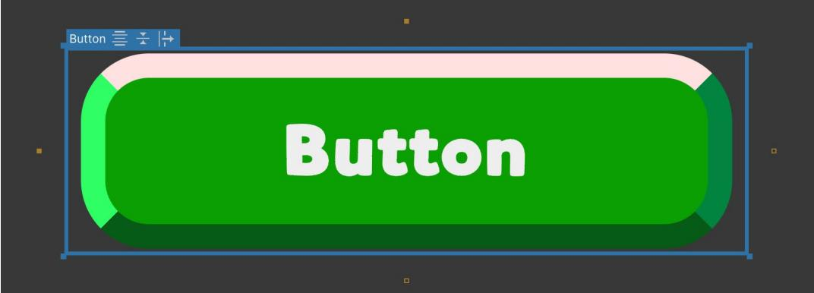

UI Toolkit offers several styling effects that do not require additional textures.

#### **Overriding styles**

Rules were meant to be broken. Whenever you define a style class for UI elements, there will always be exceptions.

For example, if you have hundreds of Button elements, but each one has a different icon you don't need to create a new selector for each one. This would defeat the purpose (convenience) of making styles reusable.

In lieu of this, you'd apply the same style to all of the buttons and then override the specific parts of each one that are unique (e.g., each Button element could override the **Background > Image** to use its own icon). These Overrides are the **Inline style** properties.

#### **Tip: Inline styles take precedence over selectors**

Inline styles always take precedence over selectors. So if you're unsure as to why a style is not updating when a selector is applied, it could be helpful to check the element to see if there are any Overrides.

<span id="page-49-0"></span>

#### **USS variables**

You can create [USS variables](https://docs.unity3d.com/6000.0/Documentation/Manual/UIE-USS-CustomProperties.html) to save time manually setting up the same values in different properties. When you update a USS variable, all of the USS properties that use that variable update. In Unity 6.1 these variables can also be set up from the UI Builder Editor.

| Ul Builder*                        |       |                                |    |             |                |                       |          |              |
|------------------------------------|-------|--------------------------------|----|-------------|----------------|-----------------------|----------|--------------|
| StyleSheets -Buttons.uss           |       | Viewport                       |    | Inspector   |                |                       |          |              |
| - - - Add new selector             |       | File ▼ 75%<br>▼   Fit viewport | Bu |             |                |                       |          |              |
| Buttons.uss*                       |       |                                |    |             | Selector       |                       |          |              |
| Button                             |       |                                |    |             | .button-accept |                       |          |              |
| .button-accept                     |       |                                |    | Styles      |                |                       |          |              |
| .label-normal :hover               |       |                                |    | V Variables |                |                       |          |              |
| .label-normal                      |       |                                |    |             | margins-size   | 10                    |          | Float        |
| .label-normal<br>:disabled         |       |                                |    | -           |                | 450                   |          | Dimension ▼  |
| .unity-disabled :disabled          |       |                                |    |             | square-size    |                       | X        |              |
| .unity-tab                         | V     |                                |    |             | sprite         | の<br>C cog            | Sprite ▼ | AssetRefere® |
| Hierarchy                          | ಿ ಕೆಡ |                                |    |             |                | Open in Sprite Editor |          |              |
| test.uxml*                         |       |                                |    |             |                |                       |          | +            |
| ▼ #button-accept button-accept.uxm |       |                                |    | ▼ Display   |                |                       |          |              |
| #button-accept                     |       |                                |    |             |                |                       |          |              |

Variables in the USS selectors are available for creating and editing in UI Builder in Unity 6.1

|   |                                                   | Width          | -- Height   |             |  |  |  |  |
|---|---------------------------------------------------|----------------|-------------|-------------|--|--|--|--|
| S | --unity-font-button-padding-top                   |                |             | Editor Only |  |  |  |  |
|   | -- unity-font-button-padding-bottom               |                |             | Editor Only |  |  |  |  |
|   | -- unity-metrics-default-font_normal_size         | Editor Only    |             |             |  |  |  |  |
|   | -- unity-metrics-default-font_semi_small_size     | Editor Only    |             |             |  |  |  |  |
|   | -- unity-metrics-default-font_tiny_size           | Editor Only    |             |             |  |  |  |  |
|   | -- unity-metrics-default-font_small_size          | Editor Only    |             |             |  |  |  |  |
|   | -- unity - metrics - default - font_big_size      | Editor Only    |             |             |  |  |  |  |
|   | -- unity - metrics - default - font_very_big_size |                |             | Editor Only |  |  |  |  |
|   | -- unity-metrics-default-border_radius            |                |             | Editor Only |  |  |  |  |
|   | -- margins-size                                   | Editor Only    |             |             |  |  |  |  |
|   | -- square-size                                    |                | Editor Only |             |  |  |  |  |
|   | 11 found                                          |                |             |             |  |  |  |  |
|   | Name:                                             | -- square-size |             |             |  |  |  |  |
|   | Value:<br>450px                                   |                |             |             |  |  |  |  |
|   | Stylesheet:                                       | Buttons.uss    |             |             |  |  |  |  |
|   | Top                                               | 0              |             | DX          |  |  |  |  |
|   |                                                   | 12             |             | DX          |  |  |  |  |
|   | Set variable                                      | 12             |             | px          |  |  |  |  |
|   | Set as value                                      |                |             |             |  |  |  |  |
|   | Unset                                             |                | px          |             |  |  |  |  |
|   | Unset all                                         | Opx            |             |             |  |  |  |  |
|   |                                                   |                |             |             |  |  |  |  |

You can create variables of the type: float, color, string, asset reference (for background images), dimensions (like pixels, degrees, percentage, etc) and enums. Variables have a selector level scope; you can't use variables present in other selectors, but selectors themselves can be applied to as many elements as needed.

Setting a variable in a property instead of introducing the value directly

## <span id="page-50-0"></span>USS transitions animations

Adding transitions to your menu screens can significantly enhance visual polish and user experience. UI Toolkit makes this relatively easy with the [Transition Animations](https://docs.unity3d.com/6000.0/Documentation/Manual/UIE-Transitions.html?utm_source=demand-gen&utm_medium=pdf&utm_campaign=authoring-optimizing-ui&utm_content=ui-design-ebook) property in the Inspector.

You can configure the Property, Duration, Easing, and Delay to set up the animation. Once configured, the transition is automatically applied when the relevant styles change during runtime.

Think of the transition between pseudo-classes of a Button – the **:hover** pseudo-class over the **.green-button** Class selector. Each style has its own size and color.

To define a transition in the mouse hover state, the **.green-button:hover** selector has Transition Animations, located at the bottom of the Inspector. The result is a Button that animates with your pointer movements.

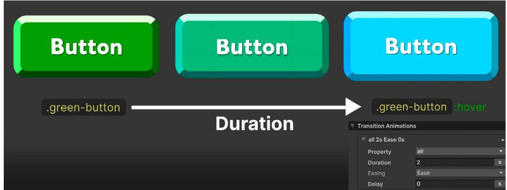

You can interpolate between styles with Transition Animations.

The Transition Animation interpolates between styles with the following options:

- **Property**: This determines what to interpolate. The default setting is **all**, but you can select a specific property in the drop-down list. In the above example, **:hover** state is only modifying the **Color** and **Transform properties***.* See [this complete list](https://docs.unity3d.com/6000.0/Documentation/Manual/UIE-USS-Properties-Reference.html?utm_source=demand-gen&utm_medium=pdf&utm_campaign=authoring-optimizing-ui&utm_content=ui-design-ebook) of animatable properties.
- **Duration**: This is the length of the transition, expressed in either seconds or milliseconds. For it to be visible, Duration must be set higher than 0.
- **Easing Function**: An easing function determines how an animation progresses over time, allowing you to simulate natural motion, such as acceleration, deceleration, or elasticity. By using an easing function, the animation transitions appear smoother and more organic compared to a basic linear interpolation, which moves at a constant speed.

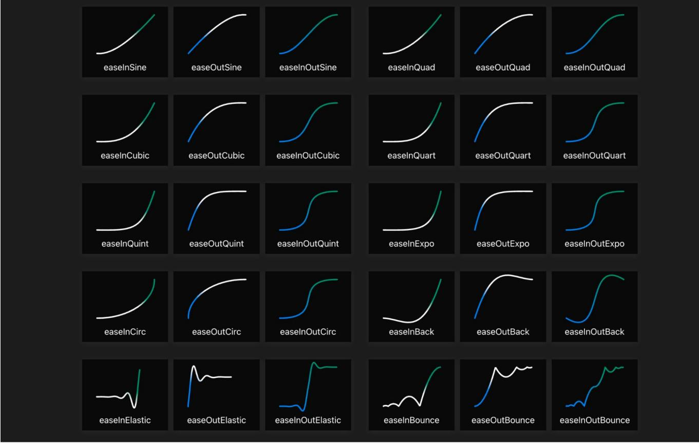

Use [this cheat sheet](https://easings.net/) to help you visualize the available functions (visualization courtesy of [https://easings.net/\)](https://easings.net/).

- **Delay:** Defined in seconds or milliseconds, this specifies how long to wait before starting the transition.
- **Add Transition:** Each property of the new state can be animated individually, with different durations, delays, and easing effects.

Click the Add Transition button to chain another transition animation. This makes it possible to trigger several overlapping transitions at once, making them more natural and less mechanical.

#### <span id="page-52-0"></span>**Tip: Transition events**

Callbacks for [transition events](https://docs.unity3d.com/6000.0/Documentation/Manual/UIE-Transition-Events.html) can be added to the visual elements being animated. They serve to support more advanced workflows, such as sequencing or looping.

Here are some common transition events with explanations for when they are sent:

- [TransitionRunEvent](https://docs.unity3d.com/6000.0/Documentation/ScriptReference/UIElements.TransitionRunEvent.html): Sent when a transition is created
- [TransitionStartEvent](https://docs.unity3d.com/6000.0/Documentation/ScriptReference/UIElements.TransitionStartEvent.html): Sent when a transition's delay phase ends and the transition begins
- [TransitionEndEvent](https://docs.unity3d.com/6000.0/Documentation/ScriptReference/UIElements.TransitionEndEvent.html): Sent when a transition ends
- [TransitionCancelEvent](https://docs.unity3d.com/6000.0/Documentation/ScriptReference/UIElements.TransitionCancelEvent.html): Sent when a transition is canceled

Learn more about USS transitions in the [documentation](https://docs.unity3d.com/6000.0/Documentation/Manual/UIE-Transitions.html).

For visual elements, animations don't require additional code because pseudo-classes (:active, :inactive, :hover, etc.) can have their own selectors. Whenever a pseudoclass triggers a style change, any defined transitions will automatically animate the change. For example: A button can grow or shrink when hovered (:hover), clicked (:active), or elements can fade out or become invisible based on user interaction or other events.

Pseudo-classes are predefined and you can't make your own.

### Swapping styles on demand

For any other events in your game you can also change styling in code using methods from the [UI Element APIs](https://docs.unity3d.com/6000.0/Documentation/ScriptReference/UIElements.VisualElement.html). For example, for changing to a different styling based on a character rarity, you can use the RemoveFromClassList and AddToClassList methods.

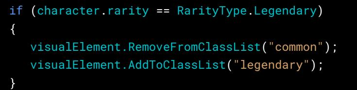

You can additionally trigger the pseudo-class :active or :inactive, which is based on the enabled state of the visual element, to have USS transitions when changing state. This way, they can represent the before and after states.

<span id="page-53-0"></span>

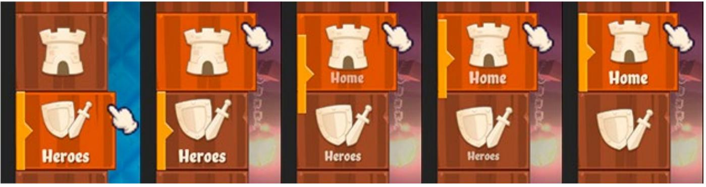

The menu bar buttons in *UI Toolkit Sample – Dragon Crashers* uses a PointerEventClick to trigger some manual transitions.

#### **Tip: Overriding Unity default selectors**

More complex visual elements, for example, a Tab view, are made of a parent element with children that are predefined by the system. They behave in a particular way when you add content to these elements and the styles used appear to be disabled and Unitymade. You can override any of these default selectors by double-clicking on the selector in use and make a copy to edit in your style sheet or USS.

|            | StyleSheet<br>11                            |
|------------|---------------------------------------------|
|            | T Style Class List                          |
|            |                                             |
|            | Add Style Class to List                     |
|            | Extract Inlined Styles to New Class         |
|            | .unity-tab                                  |
|            |                                             |
| .unity-tab | ab                                          |
|            | Double-click to create new USS selector. ab |
|            | > .unity-tab-view .unity-tab:checked        |
|            | > .unity-tab-view .unity-tab:checked        |

### Themes

If you want to make a seasonal version of the UI or offer different color styles, [Theme Style](https://docs.unity3d.com/6000.0/Documentation/Manual/UIE-tss.html)  [Sheets \(TSS\)](https://docs.unity3d.com/6000.0/Documentation/Manual/UIE-tss.html) can simplify this process. Create a TSS via **Create > UI Toolkit > TSS theme file.**

TSS files are Asset files that operate like regular USS files. They provide a starting point for defining your own custom theme, made of USS selectors as well as Property and Variable settings.

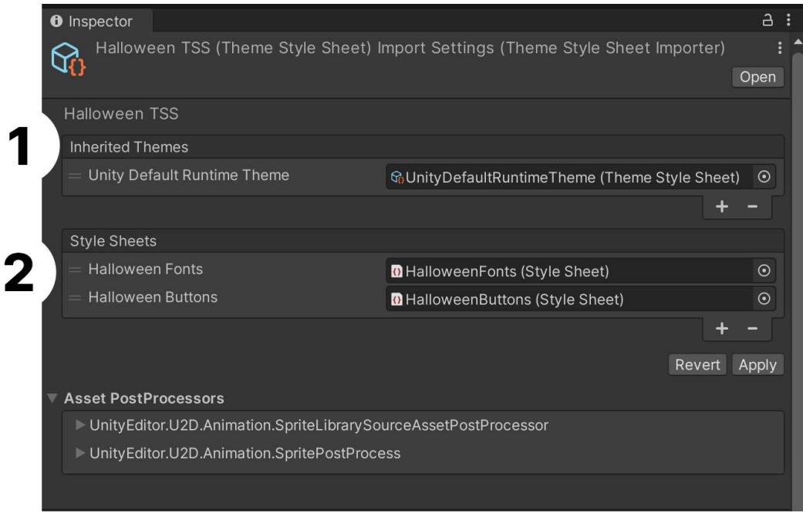

In this example of Halloween-themed UI elements, the Halloween TSS first inherits from the Unity Default Runtime TSS, then it adds themespecific style sheets for Fonts and Buttons.

Inherited themes mean that if there are style sheets with selectors missing in the new theme, compared to the original one, then the latter's styling will be applied. This makes customization easier. For example, you could create a new theme that only modifies fonts, while leaving the rest of the UI (such as colors, padding, or borders) styled according to the original theme. This approach is useful for scenarios like implementing light/dark mode, per-character UI customization, or creating game-specific event themes.

|                               | பி Builder              |          |  |               |              |                   |         |  |  |
|-------------------------------|-------------------------|----------|--|---------------|--------------|-------------------|---------|--|--|
| StyleSheets - Buttons.uss<br> |                         | Viewport |  |               |              |                   |         |  |  |
| +<br>▼                        | Add new selector        | : .      |  | File ▼ 134% ▼ | Fit viewport | Halloween-theme ▼ | Preview |  |  |
|                               | Buttons.uss             |          |  | test.uxml     |              |                   |         |  |  |
|                               | Button                  |          |  |               |              |                   |         |  |  |
|                               | .button-accept          |          |  |               |              |                   |         |  |  |
|                               | T Halloween-buttons.uss |          |  |               |              |                   |         |  |  |
|                               | VisualElement           |          |  |               | 0 .          |                   |         |  |  |
| Hierarchy                     |                         |          |  |               |              |                   |         |  |  |
| 2                             | test.uxml               |          |  |               |              |                   |         |  |  |
|                               | #button-accept          |          |  |               |              |                   |         |  |  |

The TSS for the Halloween theme represented in this screenshot uses the **Halloween-buttons.uss** but there's no matching selector for the button's in-use selector **.button-accept**, so it uses the one applied in the original theme.


A workflow to create new themes based on existing ones could be:

- 1. Create a new TSS, and add the theme to inherit from and the new USS file to be used by this new TSS.
- 2. In **UI Builder > StyleSheets**, click **Add Existing USS** and select the one that the new theme will use.
- 3. Copy the selector that the new theme will override.
- 4. Paste it in the USS that the new theme uses, then right-click and choose **Set as Active USS**.
- 5. Edit the selector in the new USS.
- 6. You can see the style used by one theme or another from the drop list in UI Builder.

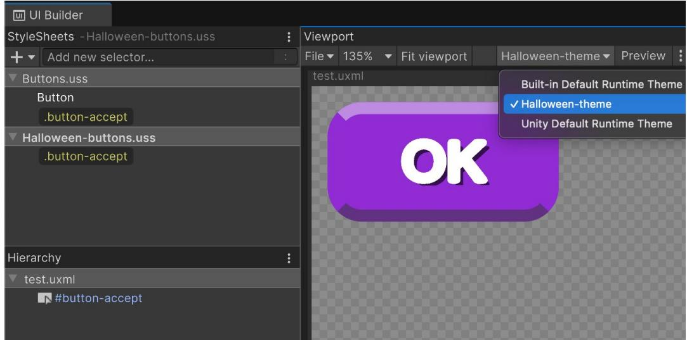

Choose which theme you want to apply in the UI Builder viewport.

For runtime, reference your new theme in the **Theme Style Sheet** field of the **Panel Settings Inspector**.

## <span id="page-56-0"></span>Naming conventions

With UI Toolkit you'll need to query the [visual elements](https://docs.unity3d.com/Manual/UIE-VisualTree.html) and USS using a string identifier, so using a defined set of standards will lead, overall, to fewer errors and more readable code.

As dev teams will refer to the same UXML and USS assets that make up your interface, it's important to standardize naming conventions for both visual elements and style sheets. Naming conventions help keep your hierarchy organized in UI Builder. It will also take out the guesswork of coding conventions and formatting conventions and help you have a consistent codebase.

The name of visual elements is used to store references to them in the code.

There is no one-size-fits-all style guide. Pick and choose what works best for your team and project. However, it's generally recommended to stick as close to industry standards as possible. For that reason, we recommend the **Block Element Modifier (BEM)** naming convention for your visual elements and style sheets. BEM is widely used in the context of CSS and modern web development, from which UI Toolkit takes its inspiration.


At a glance, an element's BEM-style name can tell you what it does, where it appears, and how it relates to other elements around it. BEM uses three main components in the following convention:

block-name\_\_element-name--modifier-name

Here's an example:

navbar-menu\_\_shop-button--small

Each name part may consist of Latin letters, digits, and dashes. Also note that each name part is joined together with either a double underscore \_\_ or a double dash --. Let's look at the three components in detail:

- The block name (block-name) represents a high level-component, like a navbar-menu, character stats – any distinct and meaningful UI component in your layout. In the case of a generic button that is not specific to any particular block, that can simply be left out, e.g., button--small.
- The element (element-name) is a child or part of a block and therefore semantically tied to its block. In other words elements rely on the block for their context and can't exist without it. So, the example of shop-button indicates that this is styled differently from other buttons belonging to the navbar-menu block (e.g., shop-button in navbarmenu\_\_shop-button).

If your new element instantiates child elements in its constructor, assign the relevant classes to the children. For example, my-block\_\_first-child, my-block\_\_otherchild.

— Finally, the modifier indicates a variation or state of a block or element. That could be when a button is pressed, a textbox item is selected and highlighted, or in our example, when it's a small variant of the shop button. This makes it easy to adapt to different scenarios without duplicating code.

Here are some more examples of BEM naming:

- menu\_\_button-home
- menu\_\_button-shop
- navbar-menu\_\_shop-button--small
- navbar-menu\_\_shop-button--large

BEM class names are self-descriptive, making it easier for developers to understand the structure and purpose of components and therefore, helping to maintain a clear hierarchy for managing and updating styles as projects grow. As a general rule of thumb, favor readability over brevity. Clarity is more important than any time saved from omitting a few vowels.


These examples use hyphen delimiting (aka Kebab case), which is common for CSS naming. Your team should decide early on in a project which naming scheme works best for them and stick to it throughout development.

Read more about CSS naming conventions in [this article,](https://www.freecodecamp.org/news/css-naming-conventions-that-will-save-you-hours-of-debugging-35cea737d849/) as well as in the [UI Toolkit](https://docs.unity3d.com/Manual/UIE-USS-WritingStyleSheets.html?utm_source=demand-gen&utm_medium=pdf&utm_campaign=authoring-optimizing-ui&utm_content=ui-design-ebook)  [documentation](https://docs.unity3d.com/Manual/UIE-USS-WritingStyleSheets.html?utm_source=demand-gen&utm_medium=pdf&utm_campaign=authoring-optimizing-ui&utm_content=ui-design-ebook).

#### **Tips: Naming conventions in UI Toolkit**

Here are some guidelines for effective naming:

- Keep names short and clear (unambiguous). Ensure that names are concise yet descriptive enough to convey their purpose and role within the UI.
- Use names to emphasize roles and relationships, such as inventory\_\_slot- equipped instead of inventory\_\_button--equipped. Omit Type names like Button or Label if they don't add clarity.
- Avoid names/modifiers that can change (e.g., use "button–quit" instead of "button– red" when the color scheme is not yet final). Use semantic naming rather than presentational naming, which ensures names remain relevant even if styling details change.
- Extend these conventions to art assets, like sprites and textures associated with the UI Toolkit interface. Consistency in naming between code and assets helps maintain a clear relationship and better organization throughout the project.
- If you use the element in other projects, consider prefixing your classes to avoid conflicts with existing user class names. Namespacing or prefixing can prevent clashes when integrating with other projects or libraries.
- Use AddToClassList() in the constructor to add the relevant USS classes to your element instances. This method ensures that the appropriate styles are applied by adding the necessary classes at the time of element instantiation, maintaining consistency and clarity in your UI code.

#### **Create a C# style guide**

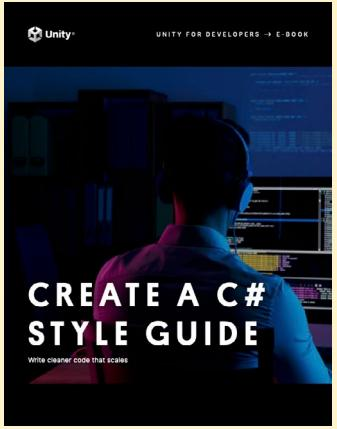

If you or your team wants to refine key coding practices to make your project more scalable, check out our free e-book, *Create a C# style guide: Write cleaner code that scales*. Use this guide as needed to help standardize your code style and naming conventions.

[Download the e-book](https://unity.com/resources/c-sharp-style-guide-unity-6)

## <span id="page-59-0"></span>Text

UI Toolkit uses **TextCore**, a font rendering technology originally based on **[TextMesh](https://docs.unity3d.com/Packages/com.unity.ugui@3.0/manual/TextMeshPro/index.html)  [Pro](https://docs.unity3d.com/Packages/com.unity.ugui@3.0/manual/TextMeshPro/index.html)** (which is used by the legacy UI system, Unity UI). TextCore offers advanced styling capabilities and can render text cleanly at various point sizes and resolutions. It takes advantage of **[Signed Distance Field](https://docs.unity3d.com/6000.0/Documentation/Manual/UIE-font-asset.html)** (SDF) font rendering, which can generate font assets that look crisp even when transformed and magnified. You can get the details of the different rendering modes for TextCore in the [documentation](https://docs.unity3d.com/6000.0/Documentation/Manual/UIE-font-asset.html).

Let's look at the different font asset types and what they are used for.

## Source font file

The most common font formats, **TTF** and **OTF** files, need to be converted into **font assets** before they can be used in your Unity project. A font asset is a Unity-specific resource that contains the data required to render a font including character glyphs, font metrics, and rendering configurations like size, weight, and style. The imported source file shows information on each font family and their rendering options.

<span id="page-60-0"></span>

| Inspector*                                                                                                                                                                           |                      | a :  |  |  |  |  |
|--------------------------------------------------------------------------------------------------------------------------------------------------------------------------------------|----------------------|------|--|--|--|--|
| HVD Fonts Mikado Black (Font) Import Settings *                                                                                                                                      |                      | 11   |  |  |  |  |
|                                                                                                                                                                                      |                      | Open |  |  |  |  |
| Font Size                                                                                                                                                                            | 16                   |      |  |  |  |  |
| Rendering Mode                                                                                                                                                                       | Smooth               | >    |  |  |  |  |
| Character                                                                                                                                                                            | Dynamic              | A    |  |  |  |  |
| Ascent Calculation Mode                                                                                                                                                              | Face ascender metric | A    |  |  |  |  |
| Use Legacy Bounds                                                                                                                                                                    |                      |      |  |  |  |  |
| Should Round Advance Value                                                                                                                                                           | >                    |      |  |  |  |  |
| Include Font Data                                                                                                                                                                    | >                    |      |  |  |  |  |
| Family Name                                                                                                                                                                          | Mikado               |      |  |  |  |  |
| Font Names                                                                                                                                                                           |                      |      |  |  |  |  |
| Size                                                                                                                                                                                 |                      |      |  |  |  |  |
| Element O                                                                                                                                                                            | Mikado               |      |  |  |  |  |
| T References to other fonts in project                                                                                                                                               |                      |      |  |  |  |  |
| These are automatically generated by the inspector if any of the font names you supplied<br>match fonts present in your project, which will then be used as fallbacks for this font. |                      |      |  |  |  |  |
| AaHVD Fonts MikadoRegularItalic                                                                                                                                                      |                      | 0    |  |  |  |  |
| Aa HVD Fonts MikadoReqular                                                                                                                                                           |                      | O    |  |  |  |  |
| AaHVD Fonts MikadoLight                                                                                                                                                              |                      | O    |  |  |  |  |

Many of these import options are remnants of the legacy text system in Unity UI. There are plans to remove them in future releases. Rendering Mode, Character, and Include Font Data are used for generating the Font Asset

To generate corresponding font assets, select the source font file and then right-click on the Assets menu and generate via **Create > Text Core > Font Asset > SDF** (if SDF is your preferred rendering mode).

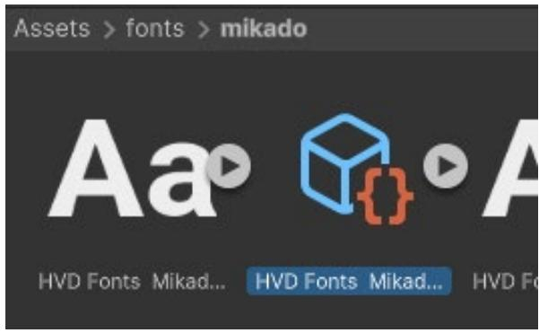

Different UI systems use different font assets.

## Font asset settings

Once you have the source font file converted, select the font asset and you'll find all of the options to give you full control over the font generation. Let's look at some key options here (read more about font assets in the [documentation\)](https://docs.unity3d.com/6000.0/Documentation/Manual/UIE-font-asset.html):

— **Face Info:** Spacing and scaling options for your font to adjust parameters that can better suit your application if the default source font required tweaks


- **Generation Settings**: Essential configuration including the source font, the font face to use for the font asset in case the source font includes several styles, the atlas population mode, as well as the render modes
- **Atlas and Material:** The material and texture generated; whether the atlas is static, dynamic, or has the rendering mode as bitmap or SDF; provides control of the size of atlas generated in the case of supporting languages with large character sets
- **Font Weights:** Simulates different font weights when the source asset doesn't have such variations
- **Fallback Font Asset:** Provides for a fallback font in cases where the current Font asset lacks a character or glyph
- **Character and Glyph Tables:** A detailed list of all the characters and glyphs included in the font asset
- **Ligature table:** For adding a glyph to be used when two characters are together (improves readability and visual flow)

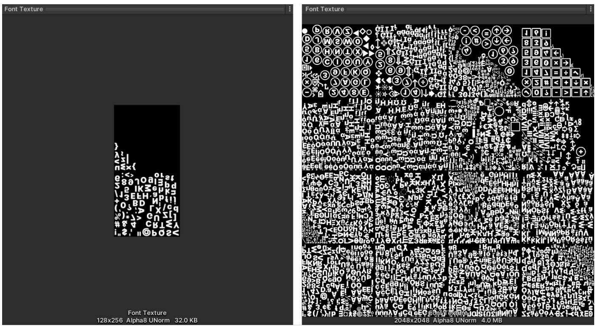

— **Glyph Adjustments:** Defines overrides per character or glyph

Source fonts and atlases can increase the build size: On the left is an atlas with ASCII characters and on the right is an atlas of a complete Unicode character set.

At the top of the Inspector, when selecting a font asset, you'll find the **[Font Asset Creator](https://docs.unity3d.com/6000.0/Documentation/Manual/UIE-font-creator-properties.html)** under the **Update Atlas Texture** button. It gives you all the control to populate and define atlas properties.

<span id="page-62-0"></span>

#### **Tip: Padding and atlas resolution**

Characters in the **Font Texture** need some padding between them (specified in pixels) so they can be rendered separately. Padding also creates room for the SDF gradient. The larger it is, the smoother the transition, which allows for high-quality rendering and effects like thick outlines.

If you are only using **ASCII** characters, an atlas resolution of 512 x 512 with a padding of 5 is sufficient for most fonts. Fonts with more characters might need larger resolutions or multiple atlases. As a general rule, aim for the padding size to be at a 1:10 ratio with the sampling size.

#### **Font asset variant**

To make changes without employing a new font atlas, create a font asset variant via **Create > Text Core > Font Asset Variant.** This variant can hold an alternate version of the font's line metrics.

The variant stores its own [Face Info](https://docs.unity3d.com/Packages/com.unity.textmeshpro@4.0/manual/FontAssetsProperties.html) settings – think line height and subscript position – but still refers to the original atlas. As such, it can have its own styling, distinct from the original Font asset, without consuming extra space for textures.

## Rich text

[Rich text tags](https://docs.unity3d.com/Packages/com.unity.textmeshpro@4.0/manual/RichText.html) alter the appearance and layout of text through the use of supplemental tags in the text field. You can use rich text tags with both visual elements in code UI Builder. The tags enable text to be formatted at runtime, for example, to customize the appearance of a username.

Rich text tags can change the color or alignment of text without modifying its properties or styling. Use them to format the text in a dialogue system or visually reinforce what you want to communicate.

Go to **Extra Settings** to enable the rich text feature in UI Builder. Doing so will format your text (including tags) appropriately. For instance, text between the <b> and closing </b> tags will show up as bold.

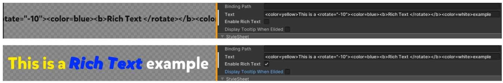

Enable rich text tags in UI Builder to make the tags modify your visual text properties.

Check out [this complete list](https://docs.unity3d.com/6000.0/Documentation/Manual/UIE-rich-text-tags.html) of available rich text tags and parameters.

<span id="page-63-0"></span>

#### **Gradients**

[Gradients](https://docs.unity3d.com/Manual/UIE-color-gradient.html) add stylization throughout the interface; in UI Toolkit you can apply them via the <gradient> tag. Follow these steps to create a simple gradient:

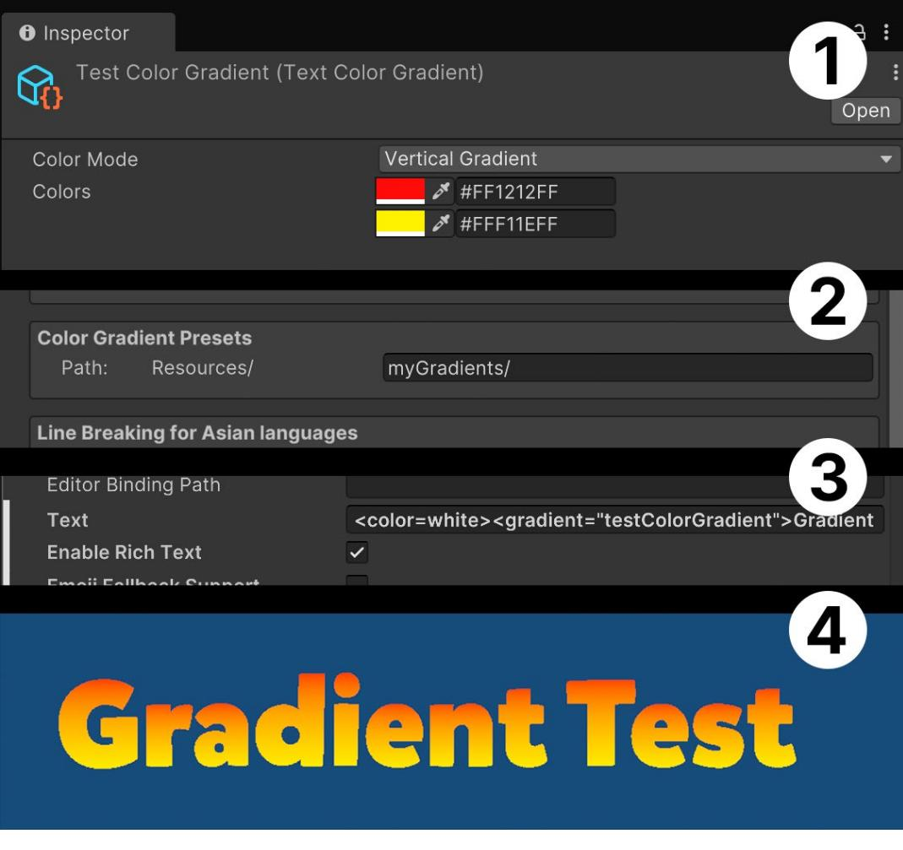

- 1. Create a gradient color asset via **Create > Text Core > Gradient Color**. Make sure to place this file inside **Assets/Resources** or any subfolder under Resources.
- 2. Create a [Text Settings asset](https://docs.unity3d.com/6000.0/Documentation/Manual/UIE-text-setting-asset.html) to refer to from the Panel Settings. In the asset look for Color Gradient Presets, and indicate the folder or subfolder inside Resources where the asset is.
- 3. Add the following rich text tags inside UI Builder: <color=white><gradient="testColorGradient">Gradient Test</gradient></ color>.
- 4. The color tag restores the font color to white so the gradient looks as intended, while the referred gradient has to match the asset name created in step 1. Make sure **Rich Text** is enabled.
- 5. You can see the changes take effect inside UI Builder or in the Game view.

<span id="page-64-0"></span>

#### **Sprite asset and emojis**

You can include sprites like emojis in your text via rich text tags. To use them, you'll need to use a [Sprite asset](https://docs.unity3d.com/6000.0/Documentation/Manual/UIE-sprite.html) similar to the Gradient asset.

When importing multiple sprites, pack them into a single atlas to reduce draw calls. Make sure that the sprite atlas has a suitable resolution for your target platform. Return to the asset preparation section for more on sprite resolutions.

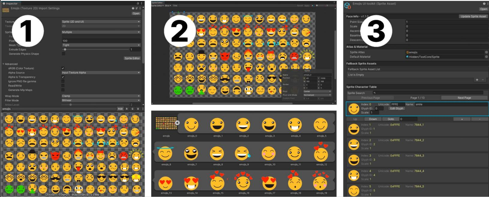

A common use case for sprite assets are emojis or icons integrated into text strings.

Follow these steps to import sprites for this purpose:

- 1. Import the sprite or PSD file that contains the emojis or icons
- 2. Slice the image into multiple sprites; if you use a PSD file as described in the [Graphic and](#page-14-0)  [font assets preparation section](#page-14-0) you won't need to do this slicing. Generate the **Sprite Asset** from the file (select and then use the **Create > Text Core > Sprite Asset** menu). Make sure the asset is placed under Assets/Resources or a subfolder.
- 3. You can adjust the Face Info and customize the appearance/names of each "glyph" in this new Sprite asset. Any changes here will replace the default Face Settings from the Font asset.

**Note**: In this context, **Update Sprite Asset** syncs the Sprite asset to the latest Sprite Editor changes.


To use this asset with UI Toolkit, you must follow the same step as you did with gradients:

- 1. Select the **Panel Settings** from the **UI Document**.
- 2. Open the **Text Settings** asset (or create one, if there's none).
- 3. Link to the **Sprite asset** using the file browser in the Text Settings file. Save and enter Play mode for the updated settings to take effect.
- 4. Use the rich text tag (<sprite index=0> or <sprite name="name">) to add the sprite. The embedded sprite will respect other text tags as well.

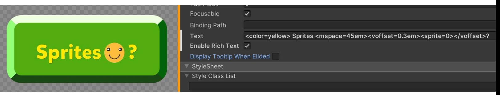

Add a Sprite Asset to a text field in UI Toolkit using [rich text tags](https://docs.unity3d.com/Packages/com.unity.textmeshpro@4.0/manual/RichText.html): Make sure that the **Enable Rich Text** option is checked (top).


#### **Tip: Using emojis from the OS**

If you are targeting a specific runtime platform, such as iOS or Android, you can make use of the system's built-in emoji font instead of including the source font in your project. This can save memory and eliminate the need to package a large collection of emojis with your application. They are also often a great fit for Global Fallbacks in Text Settings.

| Generation Settings                    |                                      |                                                         |  |  |  |  |  |  |
|----------------------------------------|--------------------------------------|---------------------------------------------------------|--|--|--|--|--|--|
| rce Font File                          |                                      | 0<br>Aa Annle Color Fmoii                               |  |  |  |  |  |  |
| Face                                   |                                      | Static                                                  |  |  |  |  |  |  |
| Population Mode                        |                                      | Dynamic                                                 |  |  |  |  |  |  |
| Atlas Render Mode                      |                                      | V Dynamic OS                                            |  |  |  |  |  |  |
| Sampling Point Size                    |                                      | 90                                                      |  |  |  |  |  |  |
| Padding                                |                                      | 9                                                       |  |  |  |  |  |  |
| Atlas Width                            |                                      | 1024                                                    |  |  |  |  |  |  |
| Atlas Height                           |                                      | 1024                                                    |  |  |  |  |  |  |
| i Atlas Textures                       |                                      |                                                         |  |  |  |  |  |  |
| 2 Alla                                 |                                      | 1024                                                    |  |  |  |  |  |  |
| Atlas Height                           |                                      | 1024                                                    |  |  |  |  |  |  |
| Multi Atlas Textures                   |                                      |                                                         |  |  |  |  |  |  |
| Clear Dynamic Data On Build            |                                      |                                                         |  |  |  |  |  |  |
| Get Font Features                      |                                      |                                                         |  |  |  |  |  |  |
|                                        |                                      |                                                         |  |  |  |  |  |  |
| 3                                      | Focusable                            |                                                         |  |  |  |  |  |  |
|                                        | Language Direction                   | Inherit                                                 |  |  |  |  |  |  |
| moji font:                             | Editor Binding Path                  |                                                         |  |  |  |  |  |  |
|                                        | Text<br>Enable Rich Text             | OS Emoji font: \n \U0001F601 \U0001F973 \U0001F64A<br>> |  |  |  |  |  |  |
|                                        | Emoji Fallback Support               | >                                                       |  |  |  |  |  |  |
|                                        | Parse Escape Sequences<br>Selectable | ><br>1                                                  |  |  |  |  |  |  |
|                                        | Double Click Selects Word            | V                                                       |  |  |  |  |  |  |
|                                        |                                      | blank new                                               |  |  |  |  |  |  |
|                                        |                                      |                                                         |  |  |  |  |  |  |
|                                        |                                      |                                                         |  |  |  |  |  |  |
|                                        |                                      |                                                         |  |  |  |  |  |  |
| OS Emoji font:                         |                                      |                                                         |  |  |  |  |  |  |
| 1 - 2 - 6 -                            |                                      |                                                         |  |  |  |  |  |  |
|                                        |                                      |                                                         |  |  |  |  |  |  |
|                                        |                                      |                                                         |  |  |  |  |  |  |
|                                        |                                      |                                                         |  |  |  |  |  |  |
| emojiOS_test Info                      |                                      | Apple Color Emoji.ttc Info                              |  |  |  |  |  |  |
|                                        |                                      | Apple Color Emoji.ttc<br>188,5 MB                       |  |  |  |  |  |  |
| emojiOS_test<br>Modified: Today, 11.53 | 127,7 MB                             | A Modified: Saturday, 7 December 2024 at 09.11          |  |  |  |  |  |  |
|                                        |                                      | Add Tags                                                |  |  |  |  |  |  |
| Add Tags                               |                                      | General:                                                |  |  |  |  |  |  |
| General:                               |                                      | Kind: TrueType® font collection                         |  |  |  |  |  |  |
|                                        |                                      | Size: 188.489.720 bytes (188,5 MB on disk)              |  |  |  |  |  |  |

<span id="page-67-0"></span>

These are the steps to use OS emojis in your project:

- 1. Create a Font asset from the font that your target system uses. On iOS the font is called Apple Emoji (used in this example), and on Android it's called Noto Color Emoji (currently only [COLRv0](https://github.com/googlefonts/noto-emoji/blob/main/fonts/NotoColorEmoji.ttf) is supported). Make sure the Font Asset is of the type **Color**, and then set the atlas population mode to **Dynamic OS** which doesn't require you to include the source font in your asset saving space.
- 2. Ensure **Clean Dynamic Data On Build** is checked on the Font Asset
- 3. Enable **Parse Escape Sequences** on UI Builder and enter the desired emojis using the emoji keyboard from MacOS or Windows or in UTF format, for example, you would introduce a smiley as \U0001F601. You can check the UTF of each emoji in the Character Table of the Font Asset.
- 4. The build running on MacOS displays the emojis according to the OS font.
- 5. We can observe that in our test, the **build size** is smaller than the standalone emoji font proving that it was not included in the project but still being used to render the appropriate emojis.

#### **Text Style Sheets**

If your application deals with a significant amount of text, you might want to consider creating a [text style sheet](https://docs.unity3d.com/Packages/com.unity.textmeshpro@4.0/manual/StyleSheets.html) to manage its formatting. This lets you create custom text styles with the <style> rich text tag. You can do this from the Create menu via **Assets > Text Core > Text Stylesheet**.

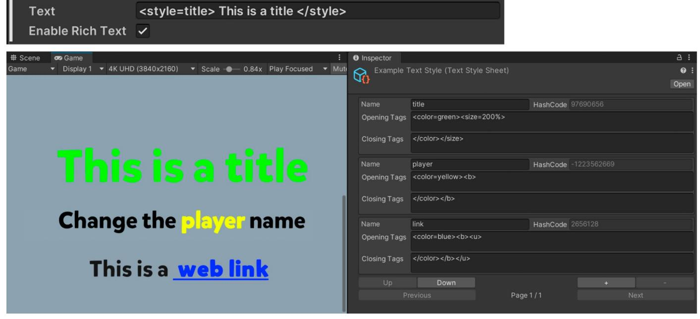

A reusable Text Style Sheet


Consider these benefits of text style sheets:

- A custom style can include opening and closing rich text tags, plus leading and trailing text.
- You can conveniently update a text style sheet, especially when compared to directly changing rich text formatting.
- Custom styles can reduce the amount of rich text tags. You can just use one tag, <style= name>, that applies all the necessary styling.
- This makes it easier to change one rich text tag in a text style sheet, and is less error prone than manually changing multiple <style> tags.

# <span id="page-69-0"></span>Data binding

At its core, the user interface is your players' connection to the data driving your application. It's their primary way of seeing, touching, and engaging with your game's internal state and logic.

Players won't see raw stats; instead, they'll see a health bar. Rather than reading item lists directly, they use a drag-and-drop inventory. This interplay between the UI and its data will impact how you structure your project.

## UI that reflects your game data

Here's the character stats window in *UI Toolkit Sample – Dragon Crashers*. This user interface shows off key attributes from an RPG-like game.

The **view** represents the UI itself – the part players interact with. Tabbed containers neatly organize the character's abilities for easy navigation.

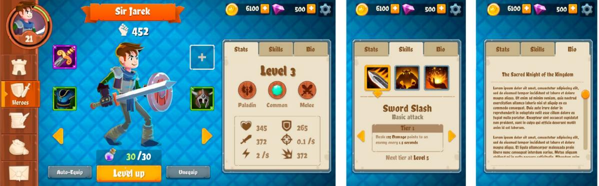

The character stats window represents game data.

Behind the scenes, the data lives in a model, such as a ScriptableObject storing each character's stats.

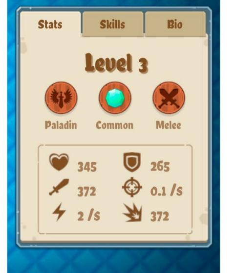

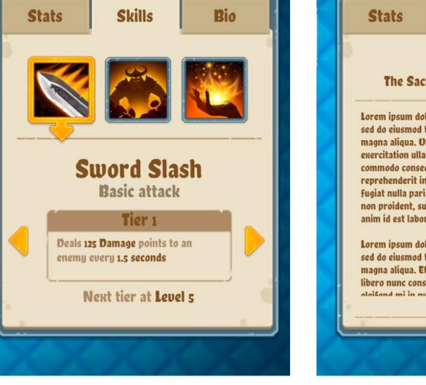

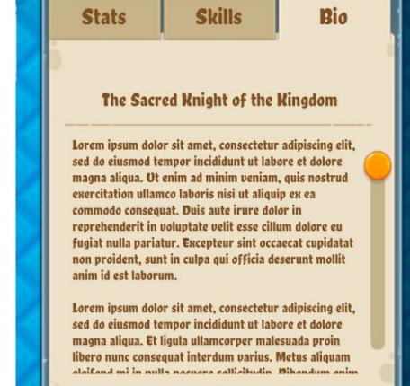

| Sir Jarek (Character Base SO)<br>G                                                                                                                                        |                                                                                                                                                                                                                                                                                                   | 网站<br>Open  | Paladin Skill 1 (Skill SO)                                                 |                                                                    | 8 花<br>Open |
|---------------------------------------------------------------------------------------------------------------------------------------------------------------------------|---------------------------------------------------------------------------------------------------------------------------------------------------------------------------------------------------------------------------------------------------------------------------------------------------|-------------|----------------------------------------------------------------------------|--------------------------------------------------------------------|-------------|
| Script<br>Character Name<br>Character Visuals Prefab<br>Character Class<br>Rarity<br>Attack Type                                                                          | CharacterBaseSO<br>Sir Jarek<br>PV_Character_Knight<br>Paladin<br>Common<br>Melee                                                                                                                                                                                                                 | 0<br>0      | Script<br>Skill Name<br>Category<br>Damage Points<br>Damage Time<br>Sprite | B SkillSO<br>Sword Slash<br>Basic<br>125<br>1.5<br>[ Skill_icon_01 | 6<br>C      |
| Bio Title<br>Bio                                                                                                                                                          | The Sacred Knight of the Kingdom<br>Lorem ipsum dolor sit amet, consectetur adipiscing elit, sed do eiusmod tempor<br>incididunt ut labore et dolore magna aliqua. Ut enim ad minim veniam, quis nostrud<br>exercitation ullamco laboris nisi ut aliquip ex ea commodo consequat. Duis aute irure |             |                                                                            |                                                                    |             |
| Base Points Life<br>Base Points Defense<br>Base Points Attack<br>Base Points Attack Speed<br>Base Points Special Attack<br>Base Points Critical Hit<br>Skill 1<br>Skill 2 | 345<br>265<br>372<br>0.1<br>2<br>525<br>PaladinSkill1 (Skill SO)<br>PaladinSkill2 (Skill SO)                                                                                                                                                                                                      | 0<br>0      |                                                                            |                                                                    |             |
| Skill 3<br>Default Weapon<br>Default Shield And Armor                                                                                                                     | & PaladinSkill3 (Skill SO)<br>S EquipmentSpecialSword+8 (Equipment SO)<br>Ca EquipmentRareArmor (Equipment SO)                                                                                                                                                                                    | 0<br>0<br>0 |                                                                            |                                                                    |             |

The ScriptableObject asset contains the character's data.

<span id="page-71-0"></span>

This [separation of concerns](https://en.wikipedia.org/wiki/Separation_of_concerns) between the view and the model is a core principle in UI architecture. Decoupling the visual interface from the underlying data makes your code more flexible, reusable, and easier to manage.

However, once separated, connecting the model to the view requires some synchronization. Traditionally, this involves direct updates or event-driven systems, where observers update the UI when the data changes. While effective, these sync operations can introduce repetitive, boilerplate code.

As your project grows, these systems can become difficult to manage. Adding new elements or dependencies often requires additional update logic or event handlers. This can clutter your scripts, making them harder to read and maintain.

### Enter runtime data binding

Runtime data binding in Unity 6 offers a streamlined solution to this problem. It links your application's data directly to UI elements, ensuring that changes in one are automatically reflected in the other.

This [Model-view-viewmodel \(MVVM\)](https://en.wikipedia.org/wiki/Model%E2%80%93view%E2%80%93viewmodel) architecture adds a layer of presentation logic between the view and model. The viewmodel acts as a mediator, exposing data from the model formatted for the view.

Learn more about MVVM along with more design patterns in the Unity e-book *[Level up your](https://unity.com/resources/design-patterns-solid-ebook)  [code with design patterns and SOLID](https://unity.com/resources/design-patterns-solid-ebook)*.

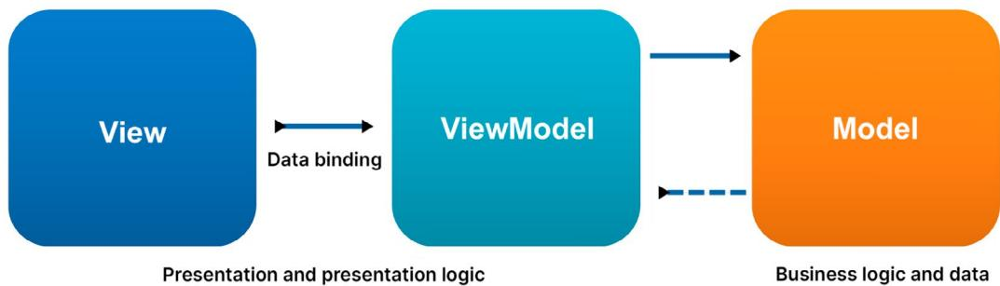

The MVVM architecture (Source: Wikipedia)

For instance, a health bar can automatically display a player's health, or a score label can update in real-time without requiring extra script logic or manual event handling. With less sync logic to manage, your project can scale more effectively.

Let's explore examples of UI Toolkit's runtime data binding to see how you can use it in your project.

## <span id="page-72-0"></span>Data binding concepts

Unity 6 introduces a runtime data binding system that provides a structured way to connect UI elements with application data. To bind a property of a visual element to a data source, you will create an instance of [DataBinding](https://docs.unity3d.com/6000.0/Documentation/ScriptReference/UIElements.DataBinding.html).

Here are a few important concepts:

- [Data source](https://docs.unity3d.com/6000.0/Documentation/ScriptReference/UIElements.DataBinding-dataSource.html): This is the object that holds the data for UI bindings.
- [Data source path](https://docs.unity3d.com/6000.0/Documentation/ScriptReference/UIElements.DataBinding-dataSourcePath.html): This property or field in the data source is what the UI element connects to.
- [Binding mode](https://docs.unity3d.com/6000.0/Documentation/Manual/UIE-runtime-binding-mode-update.html): This controls how data flows between the source and the UI and can be either one-way or two-way.

These parts work together to create the data bindings. Let's explore them in more detail.

### Preparing a data source

A [data source](https://docs.unity3d.com/6000.0/Documentation/ScriptReference/UIElements.DataBinding-dataSource.html) is the object that holds the data for UI bindings. Any C# object can serve as a data source, including ScriptableObjects, MonoBehaviours, or custom C# objects. Using structs as data sources can improve performance through lightweight memory allocations and reduced garbage collection. Data binding can be set up both through code and through the Inspector.

This demo project uses ScriptableObjects as data sources for their convenient ability to serialize data within the Unity Inspector.

#### **Using the CreateProperty attribute**

To expose properties for binding, UI Toolkit relies on [property bags](https://docs.unity3d.com/6000.0/Documentation/Manual/property-bags.html) generated by the [Unity](https://docs.unity3d.com/6000.0/Documentation/Manual/properties.html)  [Properties](https://docs.unity3d.com/6000.0/Documentation/Manual/properties.html) module. These define which properties in your data source are accessible to UI bindings.

To make properties bindable, use the [CreateProperty](https://docs.unity3d.com/6000.0/Documentation/ScriptReference/Unity.Properties.CreatePropertyAttribute.html) attribute. This explicitly marks properties for the binding system. Here's a common setup pattern:

```
[SerializeField, DontCreateProperty]
int m_Value;
[CreateProperty]
public int Value
{
 get => m_Value;
 set => m_Value = value;
}
```
<span id="page-73-0"></span>

In this example, m\_Value is marked with the SerializeField attribute for serialization but excluded from binding by the DontCreateProperty attribute.

The Value property, on the other hand, is marked with CreateProperty, making it accessible to the binding system. This clear separation helps manage data flow between the model and the UI.

Runtime data bindings use [property bags](https://docs.unity3d.com/6000.0/Documentation/Manual/property-bags.html) to traverse and manipulate a type's data efficiently. By default, Unity generates property bags using reflection the first time a type is accessed, which adds a small runtime overhead.

To avoid this, use the [CreateProperty](http://createproperty) attribute when defining properties. This generates binding code at compile time, eliminating the need for runtime reflection and reducing performance overhead.

#### **Data sources and paths**

Once your data source is ready, it can be bound to the UI. A [data source path](https://docs.unity3d.com/6000.0/Documentation/ScriptReference/UIElements.DataBinding-dataSourcePath.html) specifies the property or field within that data source that you want to connect to a UI element. For example, if your data source has a "health" property, the path would point directly to the property using it in UXML or via a binding setup in C#. Let's look at how this looks in practice.

**In the UI Builder:** Select a Hierarchy element, go to the Inspector, and use the **Add Binding** option from the options **(**⁝**)** menu.

|                   |                          | Unity Default Runtime Theme > Preview | Label                                                    |                                     |      |   |
|-------------------|--------------------------|---------------------------------------|----------------------------------------------------------|-------------------------------------|------|---|
|                   |                          |                                       | health-bar_footer-label                                  |                                     |      |   |
|                   |                          |                                       | T Bindings                                               |                                     |      |   |
|                   |                          |                                       | Data Source                                              | Object                              | Type |   |
|                   |                          |                                       | Data Source Path                                         | None (Scriptable Object)            |      | 0 |
|                   |                          |                                       | Attributes                                               |                                     |      |   |
| .                 | Add Binding              |                                       | Enabled                                                  | >                                   |      |   |
| Property          | text                     | string                                | View Data Key                                            |                                     |      |   |
| Type              | Default                  |                                       | Picking Mode                                             | Position                            |      |   |
|                   |                          |                                       | Tooltip                                                  |                                     |      |   |
| Data Source       | Object                   | Type                                  | Usage Hints                                              | None                                |      |   |
|                   | None (Scriptable Object) | 0                                     | Tab Index                                                | -1                                  |      |   |
| Data Source Path  |                          |                                       | Focusable                                                | I                                   |      |   |
| Binding Mode      | To Target                |                                       | Language Direction                                       | Inherit                             |      |   |
| Advanced Settings |                          |                                       | Editor Binding Path                                      |                                     |      |   |
|                   | Add a data               |                                       | Text                                                     | Placeholder label                   |      |   |
|                   |                          |                                       | ×1<br>Add binding                                        | >                                   |      |   |
|                   | binding in the           |                                       | Support                                                  | >                                   |      |   |
|                   | Inspector                |                                       | Unset<br>iequences<br>Unset all                          | 1001                                |      |   |
|                   |                          |                                       |                                                          | 1                                   |      |   |
|                   |                          |                                       | Double Click Selects Word                                | ><br>>                              |      |   |
|                   |                          |                                       | Triple Click Selects Line<br>Display Tooltip When Elided | V                                   |      |   |
|                   |                          |                                       | StyleSheet                                               |                                     |      |   |
|                   |                          |                                       | Style Class List                                         |                                     |      |   |
|                   |                          |                                       |                                                          |                                     |      |   |
|                   |                          |                                       |                                                          | Add Style Class to List             |      |   |
|                   | Cancel                   | Add Binding                           |                                                          | Extract Inlined Styles to New Class |      |   |
|                   |                          |                                       | .unity-text-element .unity-label                         |                                     |      |   |
|                   |                          |                                       | Matabina Colontoro                                       |                                     |      |   |

Add a binding from the Inspector.

Then, assign your **Data Source**, like a PlayerDataSO ScriptableObject, and specify the **Data Source Path**, such as CurrentHealth.

|                                                 | Edit Binding                                                                    |             |                                              |
|-------------------------------------------------|---------------------------------------------------------------------------------|-------------|----------------------------------------------|
| Property<br>Type                                | text<br>Default                                                                 | string<br>V | health-bar.uxml*                             |
| Data Source<br>Data Source Path<br>Binding Mode | Object<br>Type<br>ு Player1_Data (Player Data SO)<br>CurrentHealth<br>To Target | 0           | #health-bar_current-health = + + 1<br>00/000 |
| Advanced Settings                               | Set the Data Source,<br>Data Source Path, and<br>Binding Mode                   |             |                                              |
|                                                 |                                                                                 |             | Placeholder label                            |
|                                                 |                                                                                 |             |                                              |
|                                                 |                                                                                 | Close       |                                              |

Set the Data Source and Data Source Path in the UI Builder.

**In UXML:** When you set up data binding in UI Builder, it generates the corresponding UXML. You can also add or edit the data source path manually in a text editor. This is the code block that creates the binding:

### <Bindings> <ui:DataBinding property="text" data-source-path="Health"/> </Bindings>

**Using C#:** Instantiate or reference a data source object in your script, such as a ScriptableObject. Assign it to the dataSource property of the root element. Use the dataSourcePath to specify the exact property to bind.

Here's a snippet that shows how to set the dataSource and dataSourcePath properties in script. We discuss this in more detail in the section below on setting up [data binding in C#](#page-81-0).

```
var label = new Label();
var parentData = ScriptableObject.CreateInstance<PlayerDataSO>();
playerData.Health = 100;
label.SetBinding("text", new DataBinding()
{
 dataSource = playerData,
 dataSourcePath = new PropertyPath(nameof(PlayerDataSO.Health)),
});
```
<span id="page-75-0"></span>

Note: It's possible to create a conflict if you're defining data bindings for the same UI element. To avoid confusion:

- **Use UI Builder/UXML bindings** for static or default data configurations that don't need runtime adjustments.
- **Use C# bindings** for dynamic updates or cases where the data source needs to change during gameplay.

You can also set up part of the binding in UI Builder/UXML and complete the binding at runtime. See the section on "[Unresolved data bindings workflow](#page-83-0)" below for additional context.

#### **Inheriting data sources**

Visual elements automatically inherit the data source of their parent unless explicitly assigned a new one. For example, if the root element has a data source, all child elements use it by default. This diagram illustrates this behavior:

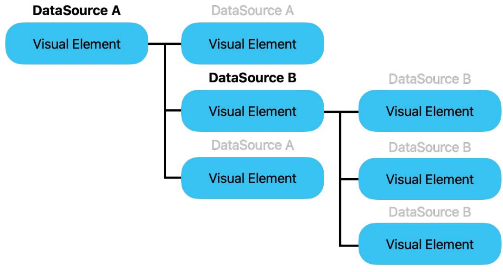

A child element can override a parent data source.

When a parent element has a data source, its child elements automatically inherit it. In UI Builder, the Data Source field for a child is pre-filled with the parent's data source but can be overridden as needed.

<span id="page-76-0"></span>

The same inheritance logic applies when working with C#, as demonstrated in the following example:

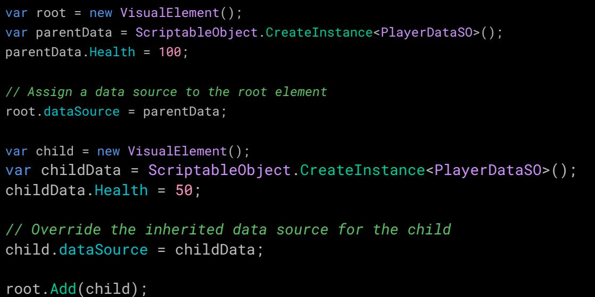

Here, the child overrides the parent, giving it an independent data source.

## Binding modes

**[Binding modes](https://docs.unity3d.com/6000.0/Documentation/Manual/UIE-runtime-binding-mode-update.html)** control the flow of data between the data source and the UI.

| 9 @ @             | Edit Binding             |        |
|-------------------|--------------------------|--------|
| Property          | text                     | string |
| Type              | Default                  | P      |
| Data Source       | Object                   | Type   |
|                   | None (Scriptable Object) | 0      |
| Data Source Path  | Description              |        |
| Binding Mode      | To Target                | D      |
| Advanced Settings | Two Way                  |        |
|                   | To Source                |        |
|                   | V To Target              |        |
|                   | To Target Once           |        |

Binding modes in the UI Builder allows you to control the flow of data between data source and the UI.

<span id="page-77-0"></span>

These options appear in the UI Builder and C# API:

- **TwoWay (Default):** Changes propagate both from the data source to the UI and from the UI to the data source. Use this for interactive elements like sliders or text fields where the user can change the data.
- **ToTarget:** Data flows only from the data source to the UI. Use this for read-only UI elements.
- **ToSource:** Data flows only from the UI to the data source. This is useful for inputs where you don't need to display the current value initially.
- **ToTargetOnce:** Data flows from the data source to the UI only once and doesn't track further changes in the data source.

#### **Example: Data binding a health bar**

Let's look at a practical example to see how to create some basic data bindings in UI Toolkit. Here's an example from the demo scene – a simple health bar that dynamically updates based on a player's health.

#### **Demo scene**

You can find the following examples in the **Data Binding** how-to demo included in the *[QuizU](https://assetstore.unity.com/packages/essentials/tutorial-projects/quizu-a-ui-toolkit-sample-268492#description)* [sample project](https://assetstore.unity.com/packages/essentials/tutorial-projects/quizu-a-ui-toolkit-sample-268492#description).

To access it at runtime, navigate to Main Menu and select **Demos** > **Data Binding**, or load the **DataBindingDemo** scene directly after disabling the bootloader (**Quiz > Don't Load Bootstrap Scene on Play**).

The demo scene includes two health bars, one with bindings created in UXML with UI Builder and another with bindings created in C#.

| 100 / 100                  | Player One |
|----------------------------|------------|
|                            |            |
| Binding in UI Builder/UXML | - SELECT + |
| 200 / 200                  | Player Two |
|                            |            |
| Binding in C#              | SELECT +   |

The health bar represents player data.

<span id="page-78-0"></span>

#### **Preparing the data source**

The sample project includes Player information and stats that are stored in a PlayerDataSO ScriptableObject. Relevant properties in PlayerDataSO are marked with the [CreateProperty](https://docs.unity3d.com/6000.0/Documentation/ScriptReference/Unity.Properties.CreatePropertyAttribute.html) attribute, making them available for binding.

Each health bar represents only a subset of the data in PlayerDataSO, including the player name and health values. A snippet of the class shows some of its properties and related fields:

```
using System;
using Unity.Properties;
using UnityEngine;
using UnityEngine.UIElements;
[CreateAssetMenu(fileName = "PlayerDataSO", menuName = "Demos/Player_Data")]
public class PlayerDataSO : ScriptableObject
{
 [CreateProperty] public string PlayerName => m_PlayerName;
 [CreateProperty] public int CurrentHealth => Mathf.Clamp(m_CurrentHealth, 0, m_MaximumHealth);
 [CreateProperty] public int MaximumHealth => m_MaximumHealth;
 [SerializeField] string m_PlayerName;
 [SerializeField] int m_MaximumHealth = 100;
 [SerializeField] [Range(0, k_MaxHealthRange)]
 int m_CurrentHealth = 100;
 const int k_MaxHealthRange = 200;
```
The UI uses specific data paths, such as PlayerName, CurrentHealth, and MaximumHealth, to display this information visually on the screen.

| @ Inspector                    |                            | a :   |
|--------------------------------|----------------------------|-------|
| Player 1_Data (Player Data SO) |                            | 8 花   |
|                                |                            | Open  |
| Addressable                    |                            |       |
| Script                         | PlayerDataSO               | 0     |
| Player Name                    | Player One                 |       |
| Description                    | Binding in UI Builder/UXML |       |
| Health                         |                            |       |
| Maximum Health                 | 100                        |       |
| Current Health                 |                            | - 100 |
| Team                           |                            |       |
| Title                          | Scout                      |       |
|                                |                            |       |
| Class Icon                     | Classicon_Scout            | 0     |

The data source contains health data from the PlayerDataSO ScriptableObject.

## <span id="page-79-0"></span>Data binding in UI Builder/UXML

UI Builder offers a visual, interactive way to bind UI elements to data. It's ideal for UI artists who prefer a design-centric workflow and developers who benefit from real-time feedback during setup. It also serves as a helpful learning tool for anyone new to data bindings.

In the demo scene, the Player One health bar's data bindings are set up entirely in UI Builder. This involves:

- **Selecting the root element**: Choose the root element in the hierarchy which contains the health bar. In this example, the topmost container is the **demo\_container-uxml** element.
- **Assigning the data source**: In the Data Binding section of the Inspector, set the data source to the ScriptableObject asset. This assigns the data source and propagates it to all child elements.
- **Defining data source paths**: Specify the data source paths to link individual UI elements to their respective properties in the ScriptableObject (e.g., PlayerDataSO. PlayerName).

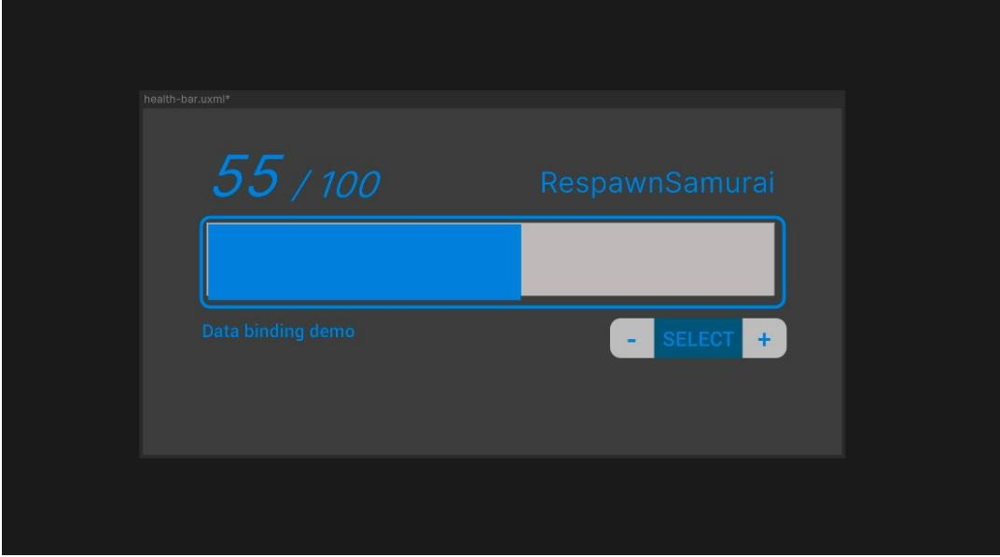

The basic health bar


Once the data source is set on the root, it should appear as the default data source for the child elements. Simply fill in the correct data source path. This table illustrates the data bindings join the UI element properties with the ScriptableObject:

| UI Element                 | UI Element<br>Property | Bound Property | Notes                             |
|----------------------------|------------------------|----------------|-----------------------------------|
| health-bar__player-name    | text                   | PlayerName     | Displays the player's name        |
| health-bar__current-health | text                   | CurrentHealth  | Shows the current health value    |
| health-bar__max-health     | text                   | MaximumHealth  | Displays the maximum health       |
| health-bar__progress       | style.width            | Progress       | Adjusts the bar width dynamically |

When the data binding is complete, the health bar updates in real-time, showing labels and a progress bar for the player's health.

Swapping data sources is simple – just assign a new ScriptableObject asset, and the UI automatically reflects the new values while keeping the same bindings.

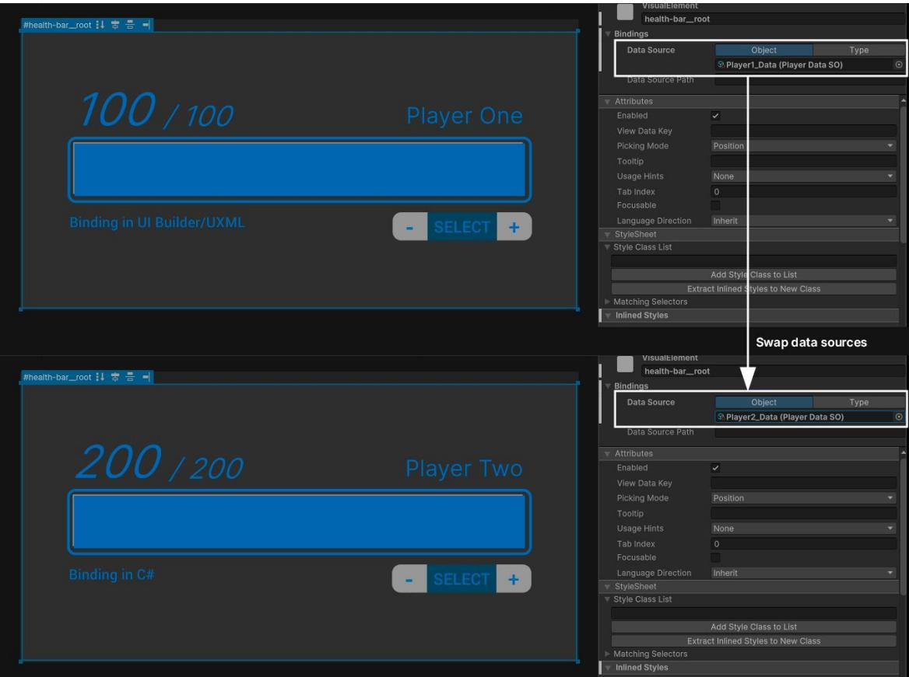

Swapping data sources updates the data bindings.

<span id="page-81-0"></span>

When you set up data bindings in UI Builder, they are added directly to the UXML file, creating a <Bindings> block for each bound element.

Here is a snippet of the resulting UXML when binding the health-bar\_\_player-name element's text property to the PlayerName property (some attributes are omitted for readability):

```
<ui:Label text="Placeholder" name="health-bar__player-name" class="health-bar__player-name">
 <Bindings>
 <ui:DataBinding property="text" data-source-path="PlayerName" binding-mode="ToTarget" 
/>
 </Bindings>
```

```
</ui:Label>
```
Experienced users can also create these bindings directly in UXML. Doing it in code can give precise control and be faster to edit when working with a lot of bindings. Hand-written UXML also offers clearer diffs for version control, making it easier to resolve merge conflicts or track changes.

## Set up data binding in C#

UI Builder is great for prototyping with static data (like pre-defined ScriptableObject assets), but runtime data often requires dynamic handling in C#. This code example shows how Player Two's health bar works in the demo scene:

```
using UnityEngine;
using UnityEngine.UIElements;
using Unity.Properties;
public class HealthBar : MonoBehaviour
{
 [SerializeField] PlayerDataSO m_HealthData;

 public void Initialize(VisualElement root)
 {
 var m_PlayerName = root.Q<Label>("health-bar__player-name");
 root.dataSource = m_HealthData;

 m_PlayerName.SetBinding("text", new DataBinding()
 {
 dataSourcePath = new PropertyPath(nameof(PlayerDataSO.PlayerName)),
 bindingMode = BindingMode.ToTarget
 });
 }
}
```


The HealthBar script handles this in its Initialize method, which is called from the main controller script in OnEnable.

- First, we query for the health-bar\_\_player-name element. Then, we assign the ScriptableObject data as a source.
- The SetBinding method then binds the text property to a new DataBinding instance and sets the dataSourcePath and bindingMode parameters.

All four bindings in the above table are set up similarly. Use the ScriptableObject slider or custom Editor property drawer to adjust the CurrentHealth. The demo includes play test controls (+, -, Select) to increment, decrement, or select the ScriptableObject. The health bar updates dynamically as the changes occur.

| Play Focused ▼ 邊                         | ● Stats Gizmos ▼<br>O Inspector<br>English (en) ▼         | a :<br>8 ± :                                                                           |
|------------------------------------------|-----------------------------------------------------------|----------------------------------------------------------------------------------------|
|                                          | Addressable                                               | Player 1_Data (Player Data SO)<br>Open                                                 |
| Data binding setup                       | Script<br>Player Name<br>Description<br>Health            | PlayerDataSO<br>O<br>Player One<br>Binding in UI Builder/UXML<br>Maximum Health<br>100 |
| 75 / 100<br>Player One                   | Team<br>Title<br>Class Icon<br>Rank Icon                  | Current Health<br>75<br>Scout<br>0<br>@ Classicon_<br>cout<br>0<br>Rankloon            |
| Binding in UI Builder/UXML<br>- SEGEOT + | Decrement,<br>select, or<br>increment<br>ScriptableObject | Drag to update                                                                         |
| 200 / 200<br>Player Two                  |                                                           |                                                                                        |
| Binding in C#<br>- SELECT +              |                                                           |                                                                                        |

The HealthBar syncs to the CurrentHealth value.

## <span id="page-83-0"></span>Unresolved data bindings workflow

Unity 6 also supports a hybrid data binding workflow that blends UI Builder's visual setup with the flexibility of scripting.

Instead of hard-coding data sources in UXML, you can specify a Data Source Type and leave the actual data source unresolved. UI Builder marks these incomplete bindings with a hollow icon. This means that the paths and types are set but the data source is not yet assigned.

|                   |                          |             |             |            | Attributes<br>Enabled       | >        |
|-------------------|--------------------------|-------------|-------------|------------|-----------------------------|----------|
|                   |                          |             |             |            | View Data Key               |          |
| ●●●               | Edit Binding             |             |             |            | Picking Mode                | Position |
|                   | text                     |             |             |            | Tooltip                     |          |
| Property          | Default                  |             | string<br>4 |            | Usage Hints                 | None     |
| Type              |                          |             |             |            | Tab Index                   | -1       |
| Data Source       | Object                   | Type        |             | Icon shows | Focusable                   |          |
|                   | None (Scriptable Object) |             | 0           | unresolved | Language Direction          | Inherit  |
| Data Source Path  | CurrentHealth            |             |             | binding    | Editor Binding Path         |          |
| Binding Mode      | To Target                |             | >           |            | 18<br>Text                  | 000      |
|                   |                          | Data Source |             |            | Enable Rich Text            | >        |
| Advanced Settings |                          | defined at  |             |            | Emoji Fallback Support      | >        |
|                   |                          | runtime     |             |            | Parse Escape Sequences      |          |
|                   |                          | Close       |             |            | Selectable                  | 1        |
|                   |                          |             |             |            | Double Click Selects Word   | >        |
|                   |                          |             |             |            | Triple Click Selects Line   | >        |
|                   |                          |             |             |            | Display Tooltip When Elided | >        |
|                   |                          |             |             |            | StyleSheet                  |          |

At runtime, you can assign the data source with just [one line of code.](https://docs.unity3d.com/6000.0/Documentation/Manual/UIE-runtime-binding-define-data-source.html) For example:

myElement.dataSource = myNewDataSource;

Here, assigning the myNewDataSource to myElement resolves the placeholder bindings defined in UXML, allowing the UI to update automatically. This eliminates repetitive SetBinding calls and keeps the UXML flexible.

The *Dragon Crashers* sample, for example, predefines data paths in UXML while setting the actual data sources at runtime.

Clicking the next and last buttons in the UI sets the currently selected character as the data source. Changing the data source requires no modification to the UXML.

The unresolved bindings show the correct character stats once the new data source is set.

Unresolved data binding shows a hollow icon.

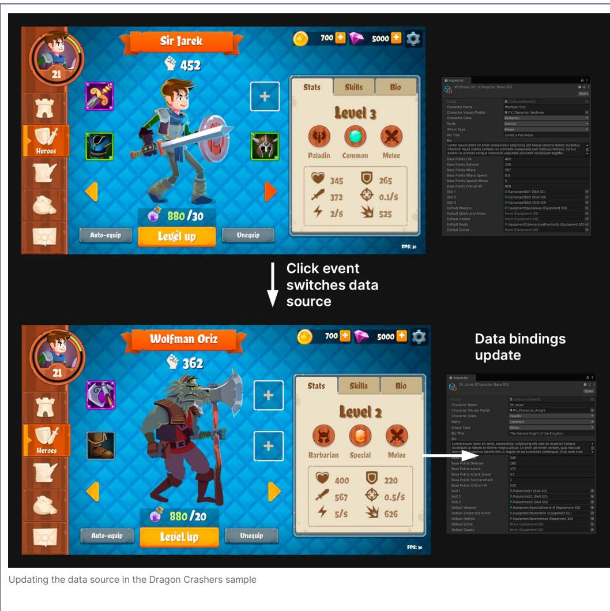

Note: If the UXML file sets a specific data source (e.g., data-source="PlayerDataSO. asset"), the binding becomes fixed and cannot be altered at runtime. To enable runtime changes, leave the data-source attribute empty or use a data-source-type instead.

Se[e Binding a list to a ListView](#page-90-0) for an example of this hybrid data binding workflow.

## <span id="page-85-0"></span>Type converters

Type converters in Unity 6 allow you to transform raw data into more user-friendly formats for display in your UI. They act as intermediaries between your data source and the UI, transforming the data into a more intuitive format for the user.

For example, type converters can convert radians into degrees or raw health values into colors for a health bar. This allows the UI to present information in a format that's clear and easy to understand. Type converters do this without requiring a lot of manual transformation logic.

Unity 6 supports two categories of type of converters:

- **Global converters:** Apply these to any bindings that need a specific type conversion. For example, global converters can turn any float health percentage into a color value or convert Color objects into StyleColor types, ensuring consistent behavior across your UI.
- **Per-binding converters:** Apply these to specific data bindings for more granular control.

#### **Example: Converting a value to a color**

A health bar that changes color based on the player's health illustrates the use of a data binding with a type converter. By mapping the player's current health to a color gradient (e.g. green for high health, yellow for low health, and red for critical health), players can quickly gauge their status during gameplay.

You can see this in action in the **DataBindingDemo** scene within the QuizU project.

#### **HealthDataConverter setup**

In the DataBindingDemo scene, the HealthBarWithConverter class uses some functionality from a static HealthDataConverter to register a few DataConverters:

- The health percentage drives a color gradient for a health bar, transitioning from green (full health) to red (critical health).
- A label can represent the numerical value as a percentage string (e.g., "75%").
- Another label can map the same health percentage to a status label like "Full," "Mid," or "Critical."


Here's a snippet of the HealthDataConverter class:

```
public static class HealthDataConverter
{
 static readonly Color s_FullColor = new Color(0.2f, 1f, 0.2f);
 static readonly Color s_MidColor = Color.yellow;
 static readonly Color s_LowColor = new Color(1f, 0.3f, 0f);
 static readonly Color s_CriticalColor = Color.red;
 public static void Register()
 {
 RegisterHealthColorConverter();
 // …
 }
 static void RegisterHealthColorConverter()
 {
 var colorConverter = new ConverterGroup("HealthColor");
 colorConverter.AddConverter((ref float healthPercentage) =>
 {
 if (healthPercentage > 0.5f)
 {
 return new StyleColor(Color.Lerp(s_MidColor, s_FullColor, (healthPercentage - 0.5f) * 2f));
 }
 else if (healthPercentage > 0.25f)
 {
 return new StyleColor(Color.Lerp(s_LowColor, s_MidColor, (healthPercentage - 0.25f) * 4f));
 }
 else
 {
 return new StyleColor(Color.Lerp(s_CriticalColor, s_LowColor, healthPercentage * 4f));
 }
 });
 ConverterGroups.RegisterConverterGroup(colorConverter);
 }
 // …
}
```
<span id="page-87-0"></span>

The above logic creates a HealthColor ConverterGroup, which transforms a float health percentage (from 0 to 1) into a matching StyleColor value between red (low health) and green (full health).

The HealthDataConverter class also includes converters for the two labels. These can represent the HealthPercentage property of the PlayerDataSO as formatted string values. Although you can bundle multiple converters into a single ConverterGroup, this demo separates them into distinct ConverterGroups for readability.

| Hierarchy                                   |                  |                            |                |
|---------------------------------------------|------------------|----------------------------|----------------|
| health-bar-converted.uxml*                  |                  |                            |                |
| #health-bar_root                            |                  |                            |                |
| w #health-bar_container                     |                  |                            |                |
| T #health-bar_label-group                   |                  |                            |                |
| T #health-bar_player-name                   |                  | health-bar-converted.uxml* |                |
| T #health-bar_value-group                   |                  |                            | HealthColor    |
| T #health-bar_current-health                |                  |                            | data converter |
| I #health-bar_max-health                    |                  | 000/000                    | Placeholder    |
| #health-bar_background                      |                  |                            |                |
| #health-bar_progress                        |                  |                            |                |
| ▼ #status_container                         |                  |                            |                |
| ▼ T #status_state-label                     |                  | 100%<br>Full               |                |
| T #status_percentage-label                  |                  |                            |                |
| v #health-bar_footer                        |                  |                            |                |
| T #health-bar_footer-label                  |                  | Placeholder lab            | SELECT<br>1    |
| > #health-bar_footer-controls player-health | HealthPercentage | HealthStatus               |                |
|                                             | data converter   | data converter             |                |
|                                             |                  |                            |                |
|                                             |                  |                            |                |
|                                             |                  |                            |                |
|                                             |                  |                            |                |
|                                             |                  |                            |                |

Use type converters in the UI Builder.

#### **Using the HeathBarWithConverter**

Note that the HealthDataConverter class contains the actual functionality. The HealthBarWithConverter is simply:

```
public class HealthBarWithConverter : HealthBar
{
#if UNITY_EDITOR
 [UnityEditor.InitializeOnLoadMethod]
      #else
 [RuntimeInitializeOnLoadMethod(RuntimeInitializeLoadType.SubsystemRegistration)]
      #endif
 public static void RegisterConverters()
 {
 HealthDataConverter.Register();
 }
}
```
<span id="page-88-0"></span>

Note the following:

- UnityEditor.InitializeOnLoadMethod ensures the ConverterGroup is registered and available for the UI Builder, allowing you to see and apply it in the Editor.
- RuntimeInitializeOnLoadMethod ensures the ConverterGroup is available during runtime when the game is running.

The #if UNITY\_EDITOR preprocessor directive ensures the appropriate method runs, depending on whether the code executes in the Editor or during gameplay.

#### **Applying DataConverters in UI Builder**

Once registered, this DataConverter can be applied to any binding that needs this conversion. To use it directly in the UI Builder:

- 1. Open your UXML file and select the progress bar element. In the QuizU project, you can open the **RuntimeDataBinding.uxml** file to see how it's set up.
- 2. Set the Data Source to your PlayerDataSO ScriptableObject.
- 3. Bind the progress bar's backgroundColor style property to the HealthPercentage data path.
- 4. Use the HealthColor ConverterGroup to transform the health percentage value into a color background for the progress bar.

|                                 |                                             |                                                   |             |                        | style.backgroundColor                                          |                    |
|---------------------------------|---------------------------------------------|---------------------------------------------------|-------------|------------------------|----------------------------------------------------------------|--------------------|
|                                 | 0                                           | Edit Binding                                      |             | V Background           |                                                                |                    |
|                                 | Property                                    | style.backgroundColor                             | StyleColor  | Color                  |                                                                |                    |
|                                 | Type                                        | Default                                           |             | Image                  | None (Texture O Texture ▼                                      |                    |
|                                 | Data Source                                 | Object                                            | Type        | Image Tint<br>> Repeat |                                                                |                    |
|                                 | Data Source Type<br>Data Source Path        | PlayerDataSO, Assembly-CSharp<br>HealthPercentage | Select Type | Size                   | Width<br>%<br>100                                              | Height<br>%<br>100 |
|                                 | Binding Mode                                | To Target                                         |             | Position-X             | M<br>म्<br>M                                                   | DX                 |
|                                 | Advanced Settings                           |                                                   |             | Position-Y             | 12<br>ា នេះ<br>ាទ<br>10                                        | px                 |
|                                 | Update Trigger                              | On Source Changed                                 |             | Scale Mode             | 18 12 12                                                       |                    |
| Converter Group<br>transforms   | Local converters<br>To target property (UI) | - HealthColor                                     |             |                        | Note: Scale Mode will<br>override some background<br>settings. |                    |
| HealthPercentage<br>property to |                                             | Enter a converter ID                              |             | > Slice                | O                                                              |                    |
|                                 |                                             |                                                   |             | Slice Scale            |                                                                | px                 |

Set up the data binding for the health bar.

5. Dragging the CurrentHealth value of the PlayerDataSO ScriptableObject now updates the health bar color. The gradient smoothly lerps from green (full health) to yellow (medium), orange (low), and red (critical).

<span id="page-89-0"></span>

| 100 / 100                      | Player Three |
|--------------------------------|--------------|
| 100%<br>Full                   |              |
| Data converters for text/color | SELECT +     |
| 75 / 100                       | Player Three |
| Mid<br>75%                     |              |
| Data converters for text/color | SELECT +     |
| 50 / 100                       | Player Three |
| 50%<br>Low                     |              |
| Data converters for text/color | SELECT +     |
| 35 / 100                       | Player Three |
| 35%<br>Low                     |              |
| Data converters for text/color | SELECT +     |
| 15/100                         | Player Three |
| 15% Critical                   |              |
| Data converters for text/color | SELECT +     |

This global DataConverter is now available anywhere in your application where you need to convert a float value to this color gradient.

The HealthColor converter changes the progress bar color.

## Best practices

When working with type converters, keep these tips in mind:

- **Minimize allocations:** Keep conversion delegates lightweight, especially for frequent operations, to avoid unnecessary performance overhead.
- **Keep it simple:** Write simple, focused converters for quick transformations. Avoid embedding complex or resource-intensive logic.
- **Integrate conversion into the data source:** Handle basic conversions in the data source itself (e.g., pre-format health percentages in a ScriptableObject property). Reserve DataConverters for conversions specific to UI bindings.

## <span id="page-90-0"></span>Example: Binding a list to a ListView

Depending on your game UI, your application may need to display different collections of data on-screen – an inventory of collected items, a quest log tracking objectives, a leaderboard ranking players, etc.

A [ListView](https://docs.unity3d.com/Packages/com.unity.ui@1.0/api/UnityEngine.UIElements.ListView.html) offers a clean, scrollable interface that makes it easy to manage and present this information. Unity 6 streamlines this process with runtime data binding, eliminating the need for manual updates or custom scripts to refresh the UI when data changes.

In earlier versions of Unity, setting up a ListView required writing custom code to populate the list and handle updates as data changed. With Unity 6, a ListView can bind directly to a data source, automatically tracking and reflecting changes in the UI.

The demo scene includes a simple ListView that binds to a list of PlayerDataSO ScriptableObjects. This lets us create an interface similar to one found in a multiplayer game lobby or high-score leaderboard.

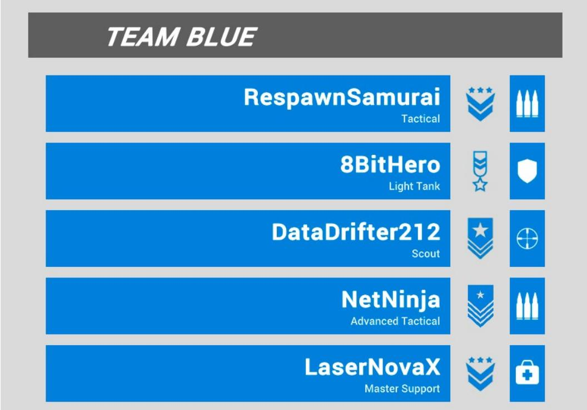

The TeamList binds a list with a ListView.

With runtime data binding, you can link a ListView directly to a data source, such as a ScriptableObject. The ListView automatically tracks changes to the data, streamlining setup and maintenance.

Data binding a ListView to a list involves setting up some unresolved bindings and then completing the data binding at runtime.

#### <span id="page-91-0"></span>**Setting up the list and templates**

Follow these steps to prepare your ListView for data binding:

- 1. **Define a data source**: Your ListView needs a list of data. In this demo, a TeamSO ScriptableObject holds a list of PlayerDataSO objects. Each item in that list corresponds to a row in the ListView.
- 2. **Create a UXML item template**: In the UI Builder, design a UXML template (a VisualTreeAsset) that defines what a single list item looks like. For example, the team-list-item template in the demo includes a player's name and some Texture2D properties. Instead of directly referencing a data source, set a Data Source Type and Data Source Path in UI Builder. This leaves the binding unresolved, ready to be completed later at runtime.

| Hierarchy                                                                                         |                                                         |
|---------------------------------------------------------------------------------------------------|---------------------------------------------------------|
| team-list-item.uxml*<br>▼ #item_container<br>▼ #name_container                                    | #item_container == ■ ■ ■ ■<br>SURNERS SECREES SECTION S |
| I #name_player-username<br>T #name_title<br>▼ #rank_container<br>#rank_icon<br>▼ #class_container | Placeholder                                             |
| #class_icon                                                                                       | TITLE                                                   |

Design a visual tree asset in UI Builder.

3. **Add the ListView to the main user interface**: In another UXML file, add a ListView element that will display the entire list of players. Assign your item template as the ListView's **Item Template**. At this point, the ListView knows how each row should look, but it doesn't know which specific data source to use yet.

| : Viewport<br>Inspector-<br>Unity Default Runtime Theme ▼ Preview :<br>File ▼ 44% ▼ Fit viewport<br>ListView<br>글<br>SlideToggle.uss<br>team_list-view<br>LocalizationDemo.uss<br>Bindings<br>DataBinding.uss<br>Attributes<br>Enabled<br>><br>RuntimeDataBinding.uxml<br>View Data Key<br>▼ #background<br>Picking Mode<br>Ignore<br>> #text-screen_container<br>Tooltip<br>▼ #demo_container<br>Usage Hints<br>None<br>v #demo_page-0-1<br>0<br>Tab Index<br>w #demo_container<br>Focusable<br>><br>I #demo_container-label<br>Inherit<br>Language Direction<br>> #demo_container-uxml<br>> #demo_container-script<br>Editor Binding Path<br>v #demo_page-2<br>22<br>Fixed Item Height<br>Binding a ListView<br>V #demo_container<br>Fixed Height<br>Virtualization Method<br>I #demo_container-label<br>Show Border<br>> #demo_container-converted<br>Selection Type<br>None<br>DI ACCHOLDER<br>v #demo_page-3-4<br>#team_list-view<br>Show Alternating Row Back  None<br>V #demo_list-view-container<br>Reorderable<br>T #demo_container-label<br>F<br>Horizontal Scrolling<br>▼ #team__header<br>0<br>Show Foldout Header<br>I #team_name<br>Header Title<br>Team<br>▼ ■ #team_list-view<br>Show Add Remove Footer<br>MI<br>> ■ ScrollView<br>D<br>Allow Add<br>#back-button<br>ប<br>Allow Remove<br>Simple<br>Reorder Mode<br>Show Bound Collection Size<br>Binding Source Selection M  Auto Assign<br>2 team-list-item (Visual Tree Asset)<br>Item Template<br>Standard Project<br>CASTING THE CHIPLE<br>> Inlined Styles | O UI Builder                  |  |  |  |  |  |
|----------------------------------------------------------------------------------------------------------------------------------------------------------------------------------------------------------------------------------------------------------------------------------------------------------------------------------------------------------------------------------------------------------------------------------------------------------------------------------------------------------------------------------------------------------------------------------------------------------------------------------------------------------------------------------------------------------------------------------------------------------------------------------------------------------------------------------------------------------------------------------------------------------------------------------------------------------------------------------------------------------------------------------------------------------------------------------------------------------------------------------------------------------------------------------------------------------------------------------------------------------------------------------------------------------------------------------------------------------------------------------------------------------------------------------------------------------------------------------------------------------------------------------|-------------------------------|--|--|--|--|--|
|                                                                                                                                                                                                                                                                                                                                                                                                                                                                                                                                                                                                                                                                                                                                                                                                                                                                                                                                                                                                                                                                                                                                                                                                                                                                                                                                                                                                                                                                                                                                  | StyleSheets - SlideToggle.uss |  |  |  |  |  |
|                                                                                                                                                                                                                                                                                                                                                                                                                                                                                                                                                                                                                                                                                                                                                                                                                                                                                                                                                                                                                                                                                                                                                                                                                                                                                                                                                                                                                                                                                                                                  | + + Add new selector          |  |  |  |  |  |
|                                                                                                                                                                                                                                                                                                                                                                                                                                                                                                                                                                                                                                                                                                                                                                                                                                                                                                                                                                                                                                                                                                                                                                                                                                                                                                                                                                                                                                                                                                                                  |                               |  |  |  |  |  |
|                                                                                                                                                                                                                                                                                                                                                                                                                                                                                                                                                                                                                                                                                                                                                                                                                                                                                                                                                                                                                                                                                                                                                                                                                                                                                                                                                                                                                                                                                                                                  |                               |  |  |  |  |  |
|                                                                                                                                                                                                                                                                                                                                                                                                                                                                                                                                                                                                                                                                                                                                                                                                                                                                                                                                                                                                                                                                                                                                                                                                                                                                                                                                                                                                                                                                                                                                  |                               |  |  |  |  |  |
|                                                                                                                                                                                                                                                                                                                                                                                                                                                                                                                                                                                                                                                                                                                                                                                                                                                                                                                                                                                                                                                                                                                                                                                                                                                                                                                                                                                                                                                                                                                                  |                               |  |  |  |  |  |
|                                                                                                                                                                                                                                                                                                                                                                                                                                                                                                                                                                                                                                                                                                                                                                                                                                                                                                                                                                                                                                                                                                                                                                                                                                                                                                                                                                                                                                                                                                                                  | Hierarchy                     |  |  |  |  |  |
|                                                                                                                                                                                                                                                                                                                                                                                                                                                                                                                                                                                                                                                                                                                                                                                                                                                                                                                                                                                                                                                                                                                                                                                                                                                                                                                                                                                                                                                                                                                                  |                               |  |  |  |  |  |
|                                                                                                                                                                                                                                                                                                                                                                                                                                                                                                                                                                                                                                                                                                                                                                                                                                                                                                                                                                                                                                                                                                                                                                                                                                                                                                                                                                                                                                                                                                                                  |                               |  |  |  |  |  |
|                                                                                                                                                                                                                                                                                                                                                                                                                                                                                                                                                                                                                                                                                                                                                                                                                                                                                                                                                                                                                                                                                                                                                                                                                                                                                                                                                                                                                                                                                                                                  |                               |  |  |  |  |  |
|                                                                                                                                                                                                                                                                                                                                                                                                                                                                                                                                                                                                                                                                                                                                                                                                                                                                                                                                                                                                                                                                                                                                                                                                                                                                                                                                                                                                                                                                                                                                  |                               |  |  |  |  |  |
|                                                                                                                                                                                                                                                                                                                                                                                                                                                                                                                                                                                                                                                                                                                                                                                                                                                                                                                                                                                                                                                                                                                                                                                                                                                                                                                                                                                                                                                                                                                                  |                               |  |  |  |  |  |
|                                                                                                                                                                                                                                                                                                                                                                                                                                                                                                                                                                                                                                                                                                                                                                                                                                                                                                                                                                                                                                                                                                                                                                                                                                                                                                                                                                                                                                                                                                                                  |                               |  |  |  |  |  |
|                                                                                                                                                                                                                                                                                                                                                                                                                                                                                                                                                                                                                                                                                                                                                                                                                                                                                                                                                                                                                                                                                                                                                                                                                                                                                                                                                                                                                                                                                                                                  |                               |  |  |  |  |  |
|                                                                                                                                                                                                                                                                                                                                                                                                                                                                                                                                                                                                                                                                                                                                                                                                                                                                                                                                                                                                                                                                                                                                                                                                                                                                                                                                                                                                                                                                                                                                  |                               |  |  |  |  |  |
|                                                                                                                                                                                                                                                                                                                                                                                                                                                                                                                                                                                                                                                                                                                                                                                                                                                                                                                                                                                                                                                                                                                                                                                                                                                                                                                                                                                                                                                                                                                                  |                               |  |  |  |  |  |
|                                                                                                                                                                                                                                                                                                                                                                                                                                                                                                                                                                                                                                                                                                                                                                                                                                                                                                                                                                                                                                                                                                                                                                                                                                                                                                                                                                                                                                                                                                                                  |                               |  |  |  |  |  |
|                                                                                                                                                                                                                                                                                                                                                                                                                                                                                                                                                                                                                                                                                                                                                                                                                                                                                                                                                                                                                                                                                                                                                                                                                                                                                                                                                                                                                                                                                                                                  |                               |  |  |  |  |  |
|                                                                                                                                                                                                                                                                                                                                                                                                                                                                                                                                                                                                                                                                                                                                                                                                                                                                                                                                                                                                                                                                                                                                                                                                                                                                                                                                                                                                                                                                                                                                  |                               |  |  |  |  |  |
|                                                                                                                                                                                                                                                                                                                                                                                                                                                                                                                                                                                                                                                                                                                                                                                                                                                                                                                                                                                                                                                                                                                                                                                                                                                                                                                                                                                                                                                                                                                                  |                               |  |  |  |  |  |
|                                                                                                                                                                                                                                                                                                                                                                                                                                                                                                                                                                                                                                                                                                                                                                                                                                                                                                                                                                                                                                                                                                                                                                                                                                                                                                                                                                                                                                                                                                                                  |                               |  |  |  |  |  |
|                                                                                                                                                                                                                                                                                                                                                                                                                                                                                                                                                                                                                                                                                                                                                                                                                                                                                                                                                                                                                                                                                                                                                                                                                                                                                                                                                                                                                                                                                                                                  |                               |  |  |  |  |  |
|                                                                                                                                                                                                                                                                                                                                                                                                                                                                                                                                                                                                                                                                                                                                                                                                                                                                                                                                                                                                                                                                                                                                                                                                                                                                                                                                                                                                                                                                                                                                  |                               |  |  |  |  |  |
|                                                                                                                                                                                                                                                                                                                                                                                                                                                                                                                                                                                                                                                                                                                                                                                                                                                                                                                                                                                                                                                                                                                                                                                                                                                                                                                                                                                                                                                                                                                                  |                               |  |  |  |  |  |
|                                                                                                                                                                                                                                                                                                                                                                                                                                                                                                                                                                                                                                                                                                                                                                                                                                                                                                                                                                                                                                                                                                                                                                                                                                                                                                                                                                                                                                                                                                                                  |                               |  |  |  |  |  |
|                                                                                                                                                                                                                                                                                                                                                                                                                                                                                                                                                                                                                                                                                                                                                                                                                                                                                                                                                                                                                                                                                                                                                                                                                                                                                                                                                                                                                                                                                                                                  |                               |  |  |  |  |  |
|                                                                                                                                                                                                                                                                                                                                                                                                                                                                                                                                                                                                                                                                                                                                                                                                                                                                                                                                                                                                                                                                                                                                                                                                                                                                                                                                                                                                                                                                                                                                  |                               |  |  |  |  |  |
|                                                                                                                                                                                                                                                                                                                                                                                                                                                                                                                                                                                                                                                                                                                                                                                                                                                                                                                                                                                                                                                                                                                                                                                                                                                                                                                                                                                                                                                                                                                                  |                               |  |  |  |  |  |
|                                                                                                                                                                                                                                                                                                                                                                                                                                                                                                                                                                                                                                                                                                                                                                                                                                                                                                                                                                                                                                                                                                                                                                                                                                                                                                                                                                                                                                                                                                                                  |                               |  |  |  |  |  |
|                                                                                                                                                                                                                                                                                                                                                                                                                                                                                                                                                                                                                                                                                                                                                                                                                                                                                                                                                                                                                                                                                                                                                                                                                                                                                                                                                                                                                                                                                                                                  |                               |  |  |  |  |  |
|                                                                                                                                                                                                                                                                                                                                                                                                                                                                                                                                                                                                                                                                                                                                                                                                                                                                                                                                                                                                                                                                                                                                                                                                                                                                                                                                                                                                                                                                                                                                  |                               |  |  |  |  |  |
|                                                                                                                                                                                                                                                                                                                                                                                                                                                                                                                                                                                                                                                                                                                                                                                                                                                                                                                                                                                                                                                                                                                                                                                                                                                                                                                                                                                                                                                                                                                                  | Library                       |  |  |  |  |  |
|                                                                                                                                                                                                                                                                                                                                                                                                                                                                                                                                                                                                                                                                                                                                                                                                                                                                                                                                                                                                                                                                                                                                                                                                                                                                                                                                                                                                                                                                                                                                  |                               |  |  |  |  |  |
|                                                                                                                                                                                                                                                                                                                                                                                                                                                                                                                                                                                                                                                                                                                                                                                                                                                                                                                                                                                                                                                                                                                                                                                                                                                                                                                                                                                                                                                                                                                                  | a. Search                     |  |  |  |  |  |

Add the template to the ListView.

<span id="page-92-0"></span>

The demo scene's ListView uses only a few basic settings (shown above). For more advanced features, consult the official [ListView](https://docs.unity3d.com/Packages/com.unity.ui@1.0/api/UnityEngine.UIElements.ListView.html) documentation.

#### **Completing the binding at runtime**

At runtime, a simple TeamList script finalizes the binding by providing the actual data source. These lines complete the previously unresolved bindings:

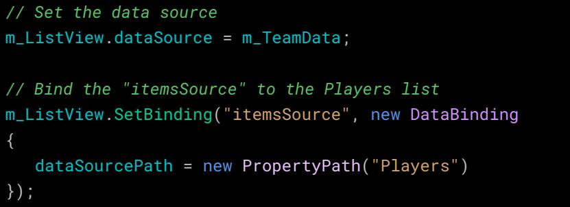

Here, m\_TeamData (an instance of TeamSO) is assigned to the ListView. Calling SetBinding once associates the Players property with the itemsSource. This allows the ListView to populate the rows of the UI.

Because these bindings remain unresolved in the UXML until runtime, you don't need to individually connect each list element. UI Toolkit resolves these bindings on its own and fills in the data for every list item.

Any changes to the list in the data source (e.g., adding, removing, or rearranging players) immediately appear in the UI without requiring further scripting.

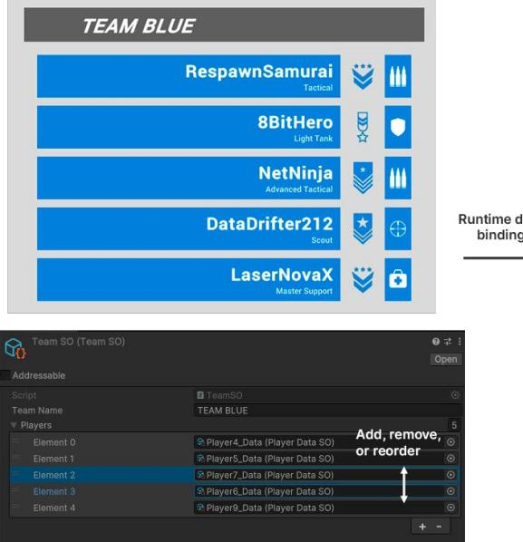

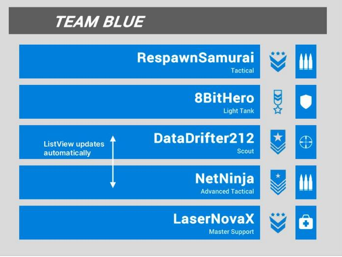

The UI reflects changes to the Player list.

<span id="page-93-0"></span>

Remember that this hybrid approach to data binding can reduce a lot of repetitive boilerplate code. By setting up placeholder data paths in UXML, you can postpone assigning the actual data source until runtime.

If you change the data model, there's no need to rewrite your entire binding logic. A single update at startup can rewire the UI to the new source.

For a comprehensive look at binding a ListView to a list, see this [documentation page](https://docs.unity3d.com/Packages/com.unity.ui@1.0/api/UnityEngine.UIElements.ListView.html).

## Optimizing data binding

Efficient binding can help you maintain a performant UI. Redundant or excessive bindings can overload the system, leading to unnecessary updates and reduced performance. This is especially important if your interface is complex or resource-intensive.

By default, the runtime binding system updates UI elements every frame. This is responsive for a small application but can become a performance bottleneck with more bindings.

This section covers methods to improve data binding efficiency for larger projects.

#### **Managing value types**

If your data source uses value types (e.g., int, float, struct), watch out for boxing costs. Because the dataSource property operates as an object, frequent conversions from value types can add overhead.

To reduce this, minimize unnecessary bindings or redundant updates when working with value-type properties.

#### **Minimizing overhead**

Start by identifying bindings that update the same elements multiple times or track data that rarely changes. Consolidate or remove these bindings to reduce unnecessary work. Use flat, simple data structures instead of complex hierarchies when possible. This can avoid performance bottlenecks caused by frequent data lookups.

Consider precomputing or caching values that require heavy calculations. Binding to these precomputed values reduces the computational load on the binding system and avoids repeated recalculations.

Make sure that your bindings are on elements that need frequent updates. For elements that don't need constant synchronization, remove unnecessary bindings and instead assign values directly or update them only when triggered by events.

<span id="page-94-0"></span>

### **Using update triggers**

Bindings refresh based on [update triggers,](https://docs.unity3d.com/6000.0/Documentation/Manual/UIE-runtime-binding-mode-update.html) which determine how often the UI synchronizes with the data source. This allows you to balance performance with responsiveness. These options determines how often the bindings update:

- **Every frame:** This updates continuously. Use this for elements that require constant updates, like the example health bars.
- **On change detection:** This updates when the data source changes, or every frame if detection isn't possible. For instance, use this for stats panels or inventory lists that depend on observable data.
- **When marked as dirty:** In scenarios where updates are infrequent, explicitly marking bindings as dirty with MarkDirty avoids unnecessary refresh cycles. This update triggers works for elements like settings menus that change only in specific contexts.

By matching update triggers to the needs of each UI element, you can balance responsiveness with efficiency.

#### **Versioning and change tracking**

To reduce unnecessary updates, you can integrate versioning and change tracking into your data sources.

Two interfaces can help make your data binding more efficient:

- [IDataSourceViewHashProvider:](https://docs.unity3d.com/6000.0/Documentation/ScriptReference/UIElements.IDataSourceViewHashProvider.html) This tracks overall changes using a version hash, triggering updates only when the data source changes. This is useful for static or semistatic data, where updates are infrequent.
- [INotifyBindablePropertyChanged:](https://docs.unity3d.com/6000.0/Documentation/ScriptReference/UIElements.INotifyBindablePropertyChanged.html) This tracks changes at the property level, ensuring that affected bindings are refreshed. This offers granular control.

Add these interfaces to the data source. They can be used independently or together for greater control over updates. See this [documentation page](https://docs.unity3d.com/6000.0/Documentation/Manual/UIE-runtime-binding-define-data-source.html) for usage and best practices.

#### **Tip: More UI Toolkit optimization tips**

In this [Unite 2024 talk](https://www.youtube.com/watch?v=bECmaYIvZJg) on UI Toolkit optimizations, you'll learn about topics like the chained draw-calls implementation and the implications of buffer sizes, dynamic atlasing best practices, and dealing with limitations like custom shaders and 3D UI.

## <span id="page-95-0"></span>Localization

Localizing your UI can help your game connect with a global audience, making your application feel intuitive and familiar in any language.

Unity 6 simplifies this process by directly integrating the [Localization](https://docs.unity3d.com/Packages/com.unity.localization@1.5/manual/Locale.html) package with UI Toolkit. This integration lets you provide region-specific content for your players, no matter where they might be.

Key to Unity localization is the [Locale](https://docs.unity3d.com/Packages/com.unity.localization@1.5/api/UnityEngine.Localization.Locale.html) class, which represents a specific language and manages region-specific details, such as currency and number formatting.

Let's explore a simple example of how you can set up localization in UI Toolkit. With this setup, your app can dynamically adjust its content based on a selected Locale.

<span id="page-96-0"></span>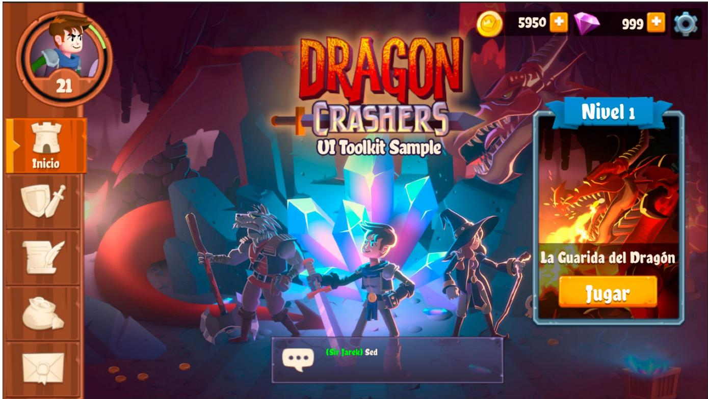

An example of Spanish localization in UI Toolkit Sample - Dragon Crashers

## How it works

Here are a few of its key features of the Localization package:

- **String Localization:** The [LocalizedString](https://docs.unity3d.com/Packages/com.unity.localization@1.5/api/UnityEngine.Localization.LocalizedString.html) class lets you manage strings that automatically update when switching Locales at runtime. With [Smart Strings,](https://docs.unity3d.com/Packages/com.unity.localization@1.5/manual/Smart/SmartStrings.html) you can add placeholders, handle plurals, and adjust for other language-specific nuances.
- **Asset localization:** Swap textures and other assets based on the Locale, allowing you to create region-specific content beyond simple text.
- **Data Binding:** The Localization package integrates with UI Toolkit's runtime data binding, linking UI elements to [String and Asset Tables.](https://docs.unity3d.com/Packages/com.unity.localization@1.5/manual/LocalizationTablesWindow.html) Changes in data, Locale, or load state trigger automatic updates.
- **String and Asset Table management:** String and Asset Tables store key-value pairs for translating text or other assets into Locale-specific equivalents. A centralized UI interface provides a high-level overview of all localized text and assets in your project.
- **Locale Switching:** Switch languages in real-time without restarting the application. At runtime, select a new Locale, and the UI updates immediately to reflect the change.

Remember to take advantage of UI Toolkit's FlexBox containers and auto-sizing elements when adapting to changes in text length and formatting. This can make your UIs more responsive when supporting different languages.

<span id="page-97-0"></span>

## Localization setup

To start using Unity's Localization package with UI Toolkit, follow these basic steps to set up localized content and bind it to UI elements in UI Builder.

| 0                                   |                                         |                  | Package Manager                                                                                                                                                                       |  |
|-------------------------------------|-----------------------------------------|------------------|---------------------------------------------------------------------------------------------------------------------------------------------------------------------------------------|--|
| Package Manager                     |                                         |                  |                                                                                                                                                                                       |  |
| + ▼ Sort: Name (asc) ▼<br>Filters ▼ | Clear Filters                           |                  | 10                                                                                                                                                                                    |  |
| In Project<br>O Updates             | Q Search Unity Registry<br>Leaderboards | 2.1.0            | Localization<br>1.5.3 · October 01, 2024<br>From Unity Registry by Unity Technologies Inc.                                                                                            |  |
| 글 ::<br>Unity Registry              | Live Capture                            | 4.0.1            | com.unity.localization                                                                                                                                                                |  |
| 0<br>My Assets<br>和<br>Built-in     | Lobby<br>Localization                   | 1.2.2<br>1.5.3   | Documentation Changelog Licenses<br>Install                                                                                                                                           |  |
| 4<br>Services                       | Magic Leap XR Plugin                    | 7.0.0            | Description<br>Version History Dependencies                                                                                                                                           |  |
|                                     | Matchmaker<br>Mathematics               | 1.1.5<br>1.3.2 @ | Use the Localization package to easily configure localization settings for your application.                                                                                          |  |
|                                     | Memory Profiler                         | 1.1.3            | Add support for multiple languages and regional variants, including:                                                                                                                  |  |
|                                     | Microsoft GDK API                       | 1.2.3            | · String localization: Set different strings to display based on locale. Use the Smart Strings feature to add logic to                                                                |  |
|                                     | Microsoft GDK Tools                     | 1.2.3            | automatically replace specific strings, such as placeholders and plurals.<br>· Asset localization: Use a different asset (such as a texture, model, or audio file) based on a locale. |  |
|                                     | ML Agents                               | 3.0.0            | · Pseudo-localization: Test how your project will adapt to different localizations at an early stage, before adding<br>your translations.                                             |  |
|                                     | Mobile Notifications                    | 2.3.2            | · Import and export localization data to XLIFF, CSV and Google Sheets.                                                                                                                |  |
|                                     | Moderation                              | 1.0.1            | Add localization to your projects using the Localization package to help make your applications more accessible                                                                       |  |
|                                     | Multiplay                               | 1.2.5            | to a wider audience.                                                                                                                                                                  |  |
|                                     | Multiplayer Center                      | 1.0.0            |                                                                                                                                                                                       |  |
|                                     | Last update Nov 6, 21:50                | C                |                                                                                                                                                                                       |  |

Install the Localization package from the Package Manager.

**1. Set Up Localization Settings:** Install the Localization package from the Package Manager, then go to **Project Settings > Localization** to create and configure your Localization Settings asset, which will manage all localized assets.

| 0                                                                                           |                                                                                                             | Project Settings         |         |
|---------------------------------------------------------------------------------------------|-------------------------------------------------------------------------------------------------------------|--------------------------|---------|
| Project Settings                                                                            |                                                                                                             |                          |         |
|                                                                                             |                                                                                                             | Q                        |         |
| Adaptive Performance<br>Asset Store Tools<br>Audio                                          | Localization                                                                                                |                          |         |
| Burst AOT Settings                                                                          | Available Locales                                                                                           |                          |         |
| Editor                                                                                      | Danish (da)                                                                                                 |                          | da      |
| Graphics<br>Input Manager                                                                   | English (en)                                                                                                |                          | en      |
| Localization                                                                                | French (fr)                                                                                                 |                          | fr      |
| Memory Settings                                                                             | Spanish (es)                                                                                                |                          | es      |
| Package Manager<br>Physics<br>Settings<br>Physics 2D                                        | Add Locale<br>Locale Selectors                                                                              | Add Custom Locale        | Add All |
| Player<br>Preset Manager<br>Quality<br>Scene Template<br>Script Execution Order<br>Services | Command Line Locale Selector<br>Command Line Argument<br>System Locale Selector<br>Specific Locale Selector | -language =              |         |
| ShaderGraph                                                                                 | > Locale Id                                                                                                 | @English (en) (Locale)   | 0       |
| Tags and Layers<br>TextMesh Pro<br>Settings<br>Time                                         | V Asset Database<br>V Default Table Reference                                                               |                          | +       |
| Timeline<br>UI Toolkit<br>Version Control<br>Unity Version Control Settings                 | Table Collection Name<br>Custom Table Provider<br>Custom Table Postprocessor<br>Asynchronous Behaviour      | FlagiconTable<br>Default | >       |
| XR Plugin Management                                                                        | Use Fallback<br>V String Database                                                                           |                          |         |

Create and configure your Localization Settings in the Project Settings.


**2. Create Locales:** Define the languages and regions your project will support using the Locale Generator. This creates assets for each Locale, identified by a unique two-letter code (e.g., "en" for English, "fr" for French, "es" for Spanish, etc.). Set a default Locale to use when the application starts.

| . .<br>0             | Add Locale   |   |
|----------------------|--------------|---|
| 0<br>Add Locale      |              |   |
| a                    |              |   |
| Name                 | Code         |   |
| Arabic               | ar           | 4 |
| Bulgarian            | bg           |   |
| Catalan              | ca           |   |
| Chinese (Simplified) | zh-Hans      |   |
| Czech                | CS           |   |
| Danish               | da           |   |
| German               | de           |   |
| Greek                | el           |   |
| English              | en           |   |
| Spanish              | es           |   |
| Finnish              | fi           |   |
| French               | fr           |   |
| Hebrew               | he           |   |
| Hungarian            | hu           |   |
| Icelandic            | is           |   |
| Italian              | it           |   |
| Japanese             | ja           |   |
| Korean               | Ko           |   |
| Dutch                | nf           |   |
| Norwegian            | no           |   |
| Polish               | pl           |   |
| Portuguese           | pt           |   |
| Romansh              | rm           | V |
| Select All           | Deselect All |   |
|                      | Add Locales  |   |
|                      |              |   |

Add a Locale.

**3. Create String and Asset Tables:** Use String Tables to store text entries for each Locale. Add entries for UI text elements like labels, buttons, and dropdown options.

|                                                                           | New Table Collection                                                                               |  |  |
|---------------------------------------------------------------------------|----------------------------------------------------------------------------------------------------|--|--|
| V<br>Danish (da)<br>1<br>English (en)<br>><br>French (fr)<br>Spanish (es) | Selected Locales                                                                                   |  |  |
| Type<br>Name                                                              | String Table Collection<br>DemoStringTable<br>Create<br>Locale Generator Select None<br>Select All |  |  |

Create String Tables and Asset Tables.

- 4. In the Localization Tables window (**Window > Asset Management > Localization Tables**), add key-value pairs for each text element in the UI. Each key represents a specific text item (like a label or button), and each value is the translated text for that item in each Locale.
- 5. Store region-specific assets like images or GameObjects in Asset Tables. For instance, you might add sprites or textures for icons representing each Locale. For each key, link assets that are specific to each Locale to reflect regional or cultural preferences.

| C<br>Localization Tables<br>O                                                                                                                                                           |                              |                                                  |                     |             |     |              |       |  |
|-----------------------------------------------------------------------------------------------------------------------------------------------------------------------------------------|------------------------------|--------------------------------------------------|---------------------|-------------|-----|--------------|-------|--|
| Calization Tables                                                                                                                                                                       |                              |                                                  |                     |             |     |              |       |  |
| + New Table Collection                                                                                                                                                                  |                              | Q Search in table collection<br>Import ▼ Export▼ |                     |             |     |              |       |  |
| Current table (DemoStringTable)<br>>                                                                                                                                                    |                              |                                                  |                     |             |     |              |       |  |
| Selected collection                                                                                                                                                                     | DemoStringTable(StringTable) |                                                  |                     |             |     |              | >     |  |
| Name                                                                                                                                                                                    | DemoStringTable              |                                                  |                     |             |     |              |       |  |
| Preload                                                                                                                                                                                 | V                            |                                                  |                     |             |     |              |       |  |
| Key                                                                                                                                                                                     | Danish (da)                  | (0)                                              | (0)<br>English (en) | French (fr) | (�) | Spanish (es) | ( {�} |  |
| Languages_Label                                                                                                                                                                         | Sprog                        |                                                  | Languages           | Langues     |     | Idiomas      |       |  |
|                                                                                                                                                                                         |                              | :                                                | :                   |             |     |              |       |  |
| Languages_English                                                                                                                                                                       | Engelsk                      |                                                  | English             | Anglais     |     | Inglés       |       |  |
|                                                                                                                                                                                         |                              |                                                  |                     |             |     |              |       |  |
| Languages_French                                                                                                                                                                        | Fransk                       |                                                  | French              | Français    |     | Francés      |       |  |
|                                                                                                                                                                                         |                              |                                                  |                     |             |     |              |       |  |
| Languages_Spanish                                                                                                                                                                       | Spansk                       |                                                  | Spanish             | Espagnol    |     | Español      |       |  |
|                                                                                                                                                                                         |                              |                                                  |                     |             |     |              |       |  |
| Languages_Danish                                                                                                                                                                        | Dansk                        |                                                  | Danish              | Français    |     | Danés        |       |  |
| 1 /1 /1 /1 /1 /1 /1 /1 /1 /1 /1 /1 /1 /1 /1 /1 /1 /1 /1 /1 /1 /1 /1 /1 /1 /1 /1 /1 /1 /1 /1 /1 /1 /1 /1 /1 /1 /1 /1 /1 /1 /1 /1 /1 /1 /1 /1 /1 /1 /1 /1 /1 /1 /1 /1 /1 /1 /1 /<br>Ha Ha | 50<br>Page Size              |                                                  |                     |             |     |              |       |  |

Key-value pairs represent each element to localize.

**6. Define a UXML interface:** Use UI Builder to create a UXML file with elements such as Buttons, DropdownFields, and Labels. In the demo scene, this UXML shows a few elements ready to be localized. For text fields, use an entry from a String Table. For nontext fields, such as textures, use an Asset Table.

#### **Demo scene**

You can find a sample implementation of Localization in the **LocalizationDemo** scene included in the QuizU project.

To access it, navigate at runtime to the main menu and select **Demos > Localization**, or load the **LocalizationDemo** scene directly after disabling the bootloader (**Quiz > Don't Load Bootstrap Scene on Play**).


| 0 @ @             | Add Binding              |                                        |
|-------------------|--------------------------|----------------------------------------|
| Property          | text                     | string                                 |
| Type              | Default                  | >                                      |
| Data Source       | V Default                | >                                      |
|                   | UnityEngine.Localization | Localized Audio Clip<br>Localized Font |
| Data Source Path  |                          | Localized Game Object                  |
| Binding Mode      | To Target                | Localized Material                     |
| Advanced Settings |                          | Localized Mesh                         |
|                   |                          | Localized Object                       |
|                   |                          | Localized Sprite                       |
|                   |                          | Localized String<br>Localized Texture  |
|                   |                          | Localized Tmp Font                     |
|                   |                          |                                        |
|                   |                          |                                        |
|                   |                          |                                        |
|                   |                          |                                        |
|                   |                          |                                        |
|                   |                          |                                        |
|                   |                          |                                        |
|                   | Cancel                   | Add Binding                            |

Add data bindings in the UI Builder to localized strings and assets.

**7. Bind data to UI Elements in UI Builder:** This is where the power of UI Toolkit's runtime data binding system comes into play. In UI Builder, select the element you want to localize. Open the Inspector panel and select **Add Binding** in the content field (e.g., text for Labels or backgroundImage for images).

Choose **LocalizedString** or other localized asset as the binding type, and link to the corresponding entry in your String or Asset Table. Add more entries to the tables as you need to localize more elements.

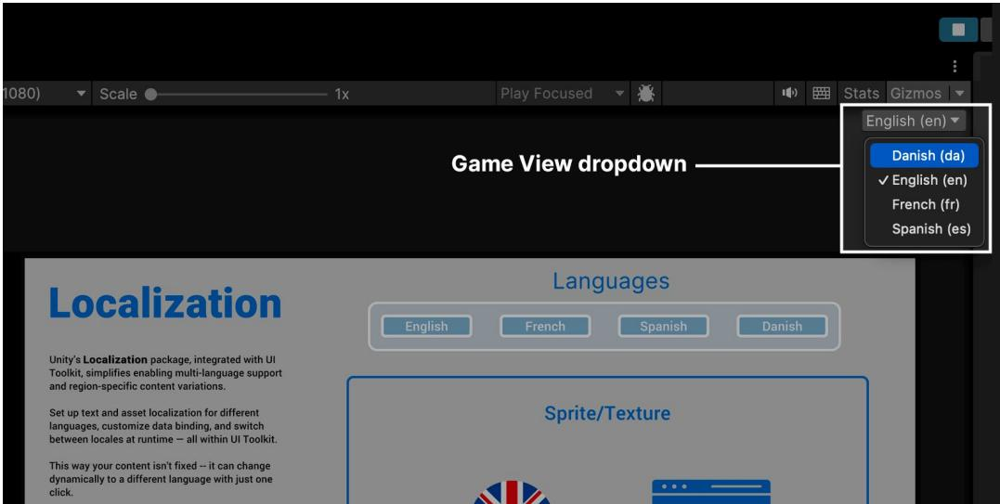

Use the Game View Locale drop-down to preview the localization.

<span id="page-101-0"></span>

8. To test, use the Game View Locale drop-down to preview the UI in different languages, ensuring elements display correctly in each Locale.

And that's the basic setup! In this example, the text properties of the buttons and labels can now switch to any other configured language. To localize the entire UI, make sure every piece of text has its own entry in the String Table.

The Localization package is flexible in how you organize content. Use multiple String Tables to break a larger project into more manageable sections or to categorize different entries. Then, use Asset Tables to help localize your textures and other non-text assets.

After adding localization bindings in UI Builder, your UXML file incorporates the localization directly into the UI elements. This results in a code block like this, where each localized property is tied to a specific entry in your String or Asset Table:

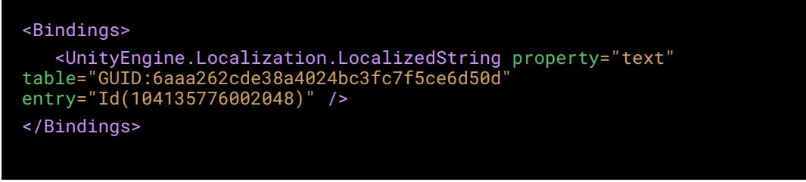

This snippet of UXML establishes a data binding that links the UI element's text property to an entry in the String or Asset Tables.

Every time you update the localization tables, the linked UI elements automatically reflect the latest localized content.

**Note:** While UI Builder simplifies the creation of data bindings, experienced users may also edit the UXML directly for greater control over the localized content.

## Using the Localizatizon API

The Game View Locale drop-down in the Editor is helpful for testing different languages, but it won't be available in a build of your application. To allow users to change languages in the final application, you'll need to create your own UI for Locale switching.

#### **Selecting a Locale**

If you have the two-letter identifier of your Locale, you can set the active Locale in the LocalizationSettings. Then, connect this action to your buttons using the clicked manipulator on each button or the RegisterCallback<ClickEvent> method.

<span id="page-102-0"></span>

The LocalizationDemo script in the sample project shows one implementation:

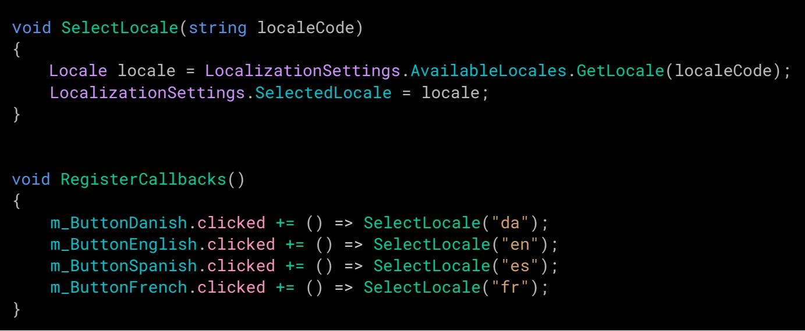

Each button can then change the locale to its indicated locale. Now when you press the button named English, French, Spanish, or Danish, the text within the UI changes at runtime.

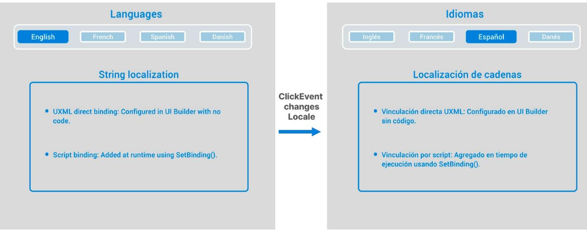

The buttons can change Locales.

### **Using SetBinding**

Using the UI Builder to set up data bindings is interactive and easy. Sometimes, however, you'll need to set up binding via a script at runtime. For example, you might create UI elements dynamically, or you might have bindings that rely on data only available during gameplay.

<span id="page-103-0"></span>

To set up a data binding in C#, use the SetBinding method on the visual element. Here's how to bind the text property of a Label to a LocalizedString entry in the StringTable:

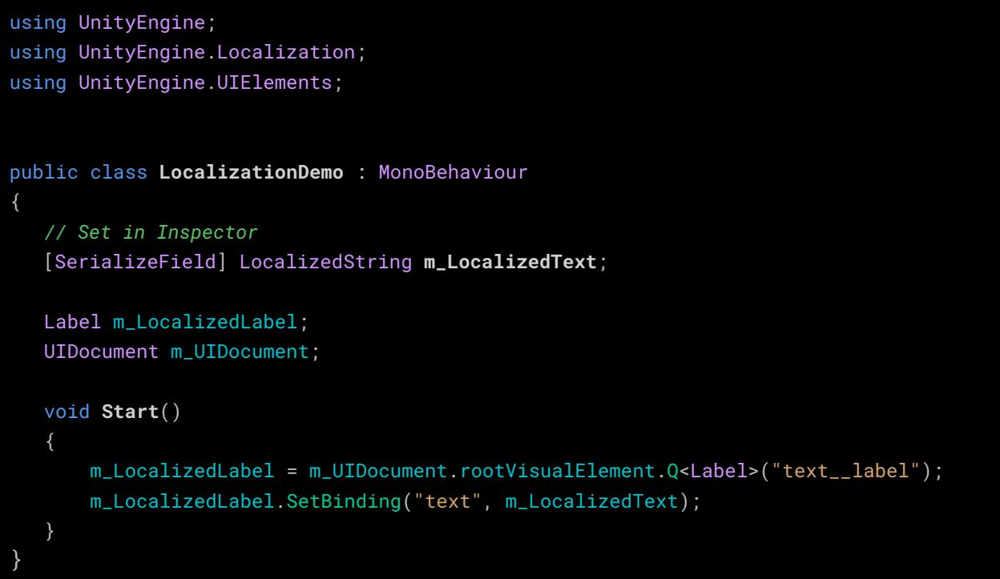

In this setup, m\_LocalizedText is assigned in the Inspector to an entry in DemoStringTable. This code links the text property of m\_LocalizedLabel to the specified LocalizedString, allowing it to update automatically when the Locale changes.

#### **Listening for Locale changes**

In some cases, you might need to take additional actions when the Locale changes, beyond updating localized strings. Listen for the [SelectedLocaleChanged](https://docs.unity3d.com/Packages/com.unity.localization@1.5/api/UnityEngine.Localization.Settings.LocalizationSettings.SelectedLocaleChanged.html?q=SelectedLocaleChanged) event in the LocalizationSettings API if you want to execute some logic every time the Locale is updated.

<span id="page-104-0"></span>

Here's an example:

```
using UnityEngine;
using UnityEngine.Localization;
using UnityEngine.Localization.Settings;
public class LocalizationExample: MonoBehaviour
{
 void OnEnable()
 {
 LocalizationSettings.SelectedLocaleChanged += OnLocaleChanged;
 }
 void OnDisable()
 {
 LocalizationSettings.SelectedLocaleChanged -= OnLocaleChanged;
 }
 void OnLocaleChanged(Locale newLocale)
 {
 // Perform actions when the Locale changes, like updating UI elements
 Debug.Log($"Locale changed to: {newLocale.Identifier.Code}");
 }
}
```
In this case, OnLocaleChanged is called each time the Locale changes, allowing you to update other elements or run custom logic. Use this event handler to adjust UI properties or styles, especially if translated text doesn't fit well within the current layout.

## Working with String Tables

Most of your localization work will involve [String Tables,](https://docs.unity3d.com/Packages/com.unity.localization@1.5/manual/StringTables.html) which handle all text-based translations for your UI and labels.

Open the Localization Tables window (**Window > Asset Management > Localization Tables**) and create or select a String Table Collection. From here, you can add new entries, define unique keys, and input translations for each Locale.

#### **Importing and exporting string data**

#### CSV files

You can populate a String Table by importing data from a CSV (comma-separated-value) file, allowing designers to set up text externally. To edit entries in plain text format, export the existing String Table as a CSV.

<span id="page-105-0"></span>

| .<br>Localization Tables        |                              |                                 |                               |                                  |                   |                               |
|---------------------------------|------------------------------|---------------------------------|-------------------------------|----------------------------------|-------------------|-------------------------------|
| Calization Tables               |                              |                                 |                               |                                  |                   |                               |
| + New Table Collection          | Q Search in table collection |                                 |                               |                                  | Import ▼ Export ▼ |                               |
| Current table (DemoStringTable) |                              |                                 |                               |                                  |                   | XLIFF into collection         |
| Selected collection             | DemoStringTable(StringTable) |                                 |                               |                                  | XLIFF file        |                               |
| Name                            |                              | DemoStringTable                 |                               |                                  |                   | XLIFF directory               |
| Preload                         | V                            | CSV                             |                               |                                  |                   |                               |
| Key                             |                              | {0}<br>Danish (da)              | {0}<br>English (en)           | {0}<br>French (fr)               | Spanish (es)      | CSV (Merge)                   |
| Text_LabelUXMLBinding           |                              | UXML direkte binding: Konfiç    | UXML direct binding: Configi  | Liaison directe UXML : Confi     |                   | Vinculación directa UXML: C   |
|                                 | -                            |                                 |                               |                                  |                   |                               |
| Text_LabelScriptBinding         |                              | Script binding: Tilføjet ved ru | Script binding: Added at run1 | Liaison par script : Ajouté à l' |                   | Vinculación por script: Agrec |
|                                 | -                            |                                 |                               |                                  |                   |                               |

Import or export CSV files.

After updating the file, import it back into Unity to automatically update entries based on their keys.

#### Google Sheets synchronization

To connect your project to the Google Sheets service, you need to use a [Sheets Service](https://docs.unity3d.com/Packages/com.unity.localization@1.5/api/UnityEditor.Localization.Plugins.Google.GoogleSheetsExtension.SheetsServiceProvider.html#UnityEditor_Localization_Plugins_Google_GoogleSheetsExtension_SheetsServiceProvider)  [Provider](https://docs.unity3d.com/Packages/com.unity.localization@1.5/api/UnityEditor.Localization.Plugins.Google.GoogleSheetsExtension.SheetsServiceProvider.html#UnityEditor_Localization_Plugins_Google_GoogleSheetsExtension_SheetsServiceProvider) asset. This asset manages authentication and allows you to create new sheets directly within the Editor.

#### To create it, navigate to **Assets > Create > Localization > Google Sheets Service**.

| a :                                                                                      | O Inspector                                                                                                                                                      |                                         | a :                      |
|------------------------------------------------------------------------------------------|------------------------------------------------------------------------------------------------------------------------------------------------------------------|-----------------------------------------|--------------------------|
| જી<br>ro<br>4 ★<br>P<br>@22                                                              | 1<br>Google Sheets Service (Sheets Service Provider)<br>0                                                                                                        |                                         | 0 =                      |
| Assets > Unity Technologies > QuizU - A UI Toolkit<br>Google Sheets Service              |                                                                                                                                                                  |                                         | Open                     |
| Localization<br>Localization<br>LocalizationDemo<br>LocalizationDemo<br>LocalizationDemo | Application Name<br>Authentication<br>OAuth 2.0 authorization allows reading and writing                                                                         | Actual I<br>None<br>✓ O Auth<br>API Key | Select                   |
| LocalizationDemo_Data<br>PreprocessedLocalizationDemo<br>StringLocalizationDemo          | Client Id<br>Client Secret                                                                                                                                       | Load Credentials                        | authentication<br>method |
| TextureLocalizationDemo                                                                  |                                                                                                                                                                  | Authorize                               | and add                  |
|                                                                                          | New Sheet Properties<br>Header Foreground Color<br>Header Background Color<br>Duplicate Key Color<br>Highlight Duplicate Keys<br>Freeze Title Row And Key Column | <<br>>                                  | credentials              |

Create a Google Sheets Service and authorize.


The Google Sheets Service has two authorization options: **OAuth** or **API Key**. Use OAuth if you need to access private sheets for reading and writing. Use an API Key if you only need to read from public sheets. For full read/write access, you'll need to request authorization from Google. For details, see the [Google Sheets documentation: Authorizing Requests](https://developers.google.com/sheets/api/guides/authorizing).

To link a String Table Collection to a Google Sheet, add a **Google Sheet Extension** to the collection's **Extensions** list. Select the String Table asset, then click the **Add (+)** button next to **Extensions** in the Inspector. You can add multiple extensions to a single String Table Collection, allowing you to assign different sheets to each Locale if needed.

To sync a String Table to a Google Sheet, connect it to a Sheets Service Provider asset. See [Sheets Service Provider](https://docs.unity3d.com/Packages/com.unity.localization@1.5/manual/Google-Sheets-Sheets-Service-Provider.html) for information on creating and configuring one.

| a :<br>2 2<br>@ ★ ◎22<br>Assets > Unity Technologies > QuizU - A UI Toolkit<br>1 DemoStringTable<br>fingTable Shared Data<br>"# DemoStringTable_da<br>DemoStringTable_en<br>DemoStringTable_es<br>1 DemoStringTable_fr                            | @ Inspector<br>Demo String Table (String Table Collection)<br>0:5<br>> Tables<br>Open in Table Editor<br>Group<br>String Table<br>Extensions<br>List is Empty<br>Select extension<br>and asset                                                                                                                   | a :<br>8 花 :<br>Open<br>+<br>Csv Extension<br>Google Sheets Extension |
|---------------------------------------------------------------------------------------------------------------------------------------------------------------------------------------------------------------------------------------------------|------------------------------------------------------------------------------------------------------------------------------------------------------------------------------------------------------------------------------------------------------------------------------------------------------------------|-----------------------------------------------------------------------|
| a :<br>દ્વા<br>184<br>P<br>C<br>★ ◎22<br>Assets > Unity Technologies > QuizU - A UI Toolkit<br>" DemoStringTable<br>Em DemoStringTable Shared Data<br>"# DemoStringTable_da<br>DemoStringTable_en<br>4 DemoStringTable_es<br>1 DemoStringTable_fr | @ Inspector<br>ਰਜ਼<br>Demo String Table (String Table Collection)<br>I Tables<br>Open in Table Editor<br>Group<br>String Table<br>Extensions                                                                                                                                                                     | a :<br>9 元 :<br>Open                                                  |
|                                                                                                                                                                                                                                                   | Google Sheets<br>Sheets Service Provider<br>Google Sheets Service (Sheets Service Provider)<br>Create New Spreadsheet<br>Spreadsheet Id<br>0<br>Sheet Id<br>DemoStringTable<br>Add Sheet<br>Mapped Columns<br>List is Empty<br>><br>Remove Missing Pulled Keys<br>Push Selected<br>Pull Selected<br>Push<br>Pull | 0<br>Open<br>Select Sheet<br>+<br>+                                   |

Add the Google Sheets Service to the StringTable's extensions.

Once set up, this synchronization allows designers or non-developers to make edits to your localization entries directly in Google Sheets.

<span id="page-107-0"></span>

#### **Using Smart Strings**

[Smart Strings](https://docs.unity3d.com/Packages/com.unity.localization@1.5/manual/Smart/SmartStrings.html) are a powerful alternative to using [String.Format](https://docs.microsoft.com/en-us/dotnet/api/system.string.format) when generating dynamic strings. They enable data-driven templates that support features like pluralization, conditional formatting, lists, and other language-specific rules. These features can simplify setting up localization.

To use Smart Strings, mark a string as smart in the Localization Tables window.

Open the Localization Tables window. Then, select **Smart Format** from the menu options (⁝). Confirm that the **{S}** icon appears next to the entry.

Alternatively, enable Smart Strings in the **Smart** field within the **Localized String Editor** in the Inspector.

| Localization Tables             |                              |                                        |                               |                                                                                                                                                                               |                                         |
|---------------------------------|------------------------------|----------------------------------------|-------------------------------|-------------------------------------------------------------------------------------------------------------------------------------------------------------------------------|-----------------------------------------|
| + New Table Collection          |                              |                                        | 9. Search in table collection |                                                                                                                                                                               | Import ▼ Export ▼                       |
| Current table (DemoStringTable) |                              |                                        |                               | Enable Smart String                                                                                                                                                           |                                         |
| Selected collection             | DemoStringTable(StringTable) |                                        |                               |                                                                                                                                                                               |                                         |
| Name                            | DemoStringTable              |                                        | in options                    |                                                                                                                                                                               |                                         |
| Preload                         |                              |                                        |                               |                                                                                                                                                                               |                                         |
|                                 | -                            | (S) :                                  | (S)                           | (S) :                                                                                                                                                                         | (S) :                                   |
| Welcome_Message                 |                              | Velkommen, {0}!                        | Welcome, {0}!                 | See Metadata                                                                                                                                                                  | [Bienvenido, {0}!                       |
|                                 |                              |                                        |                               | Wordwrap                                                                                                                                                                      |                                         |
|                                 |                              |                                        |                               | ✓ Smart String (English (en))                                                                                                                                                 |                                         |
|                                 | -                            | (S) :                                  | (S)                           | V Smart String (All)<br>(S)                                                                                                                                                   | (S) :                                   |
| Item_Count                      |                              |                                        |                               | Du har (Cpluralcé elementer)     You have (Cpuralione in y    Yous avez (Oplusalun article(] articles)    Tienes (Cpluralun articulos) er liculos) er lieulos) er lieulos) er |                                         |
|                                 |                              |                                        |                               |                                                                                                                                                                               |                                         |
|                                 |                              |                                        |                               |                                                                                                                                                                               |                                         |
|                                 | -                            | (S) :                                  | (S) :                         | (S)                                                                                                                                                                           | (S) :                                   |
| TimeBased_Greeting              |                              | God {0:choose(1 2 3):morgen eftermidda |                               | Good {0:choose(1 2 3):morning afternoor   Bon{0:choose(1 2 3):jour après-midi soir                                                                                            | Buenos {0:choose(1 2 3):días tardes noc |
|                                 |                              |                                        |                               |                                                                                                                                                                               |                                         |
|                                 | 0                            | (S) :                                  | (S) :                         | (S) :                                                                                                                                                                         | (S)                                     |

Enable Smart Strings in either the StringTable window or Inspector.

#### **Setting up a Smart String in your script**

To manage a SmartString from a script:

— **Set Up the Localized String with Placeholders:** A Smart String consists of literal text with placeholders in {} brackets, similar to [String.Format](https://docs.microsoft.com/en-us/dotnet/api/system.string.format) but with added flexibility. In your String Table, create an entry with placeholders, like "Welcome, {0}!". Here, {0} is a placeholder for runtime data.

<span id="page-108-0"></span>

— **Use a LocalizedString and Arguments:** In your script, create a LocalizedString for this entry and specify the runtime data using the Arguments property. For example, this snippet from the SmartStringDemo shows how to replace a single placeholder:

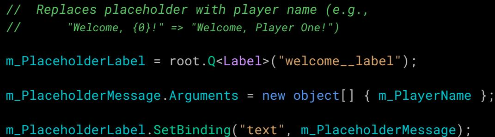

This binds the LocalizedString to the label's text property and inserts the player's name at runtime. The original entry of "Welcome, {0}!" might appear as "Welcome, Player One!" onscreen.

#### **Understanding placeholders**

Placeholders in Smart Strings are not limited to simple {0} substitutions. They can be more complex and are designed to handle advanced scenarios. In fact, a placeholder can consist of multiple parts, including:

- **Selector**: This determines which data to use (e.g., {player.name} selects the name property of a player object).
- **Formatter Name**: This defines the formatter to apply (e.g., plural for pluralization).
- **Formatter Options**: This customizes the formatter's behavior (e.g., specifying singular and plural forms).
- **Format:** This determines how the output is presented (e.g., converting a number to a plural word, formatting a date or time, or selecting a phrase based on input).

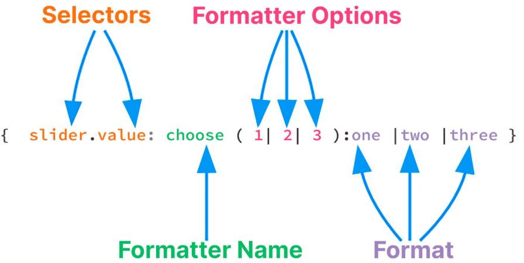

A placeholder can consist of several parts.


**[Selectors](https://docs.unity3d.com/Packages/com.unity.localization@1.5/manual/Smart/SmartStrings.html#selector)** are flexible and can retrieve data dynamically at runtime. They can query properties or fields of objects at runtime. For example, using the selector {gameObject.name} can retrieve the name property of a GameObject, while a selector of {slider.value} retrieves the value property of a slider.

**[Formatters](https://docs.unity3d.com/Packages/com.unity.localization@1.5/manual/Smart/SmartStrings.html#formatters)** convert the retrieved data into the final string format. Formatters allow you to format dates, times, lists, plural forms, or even apply conditional logic.

After retrieving data, **formatters** transform it into the final output. Each formatter defines its own options and format rules. The sample project includes a couple formatters:

#### — **Choose Formatter**:

{0:choose(1|2|3):morning|afternoon|evening|anytime} selects "morning," "afternoon," or "evening" based on input.

#### — **Plural Formatter**:

{0:plural:one item|{} items} adjusts text for singular or plural forms.

Modify the values in the Inspector and enter Play mode to see the resulting text.

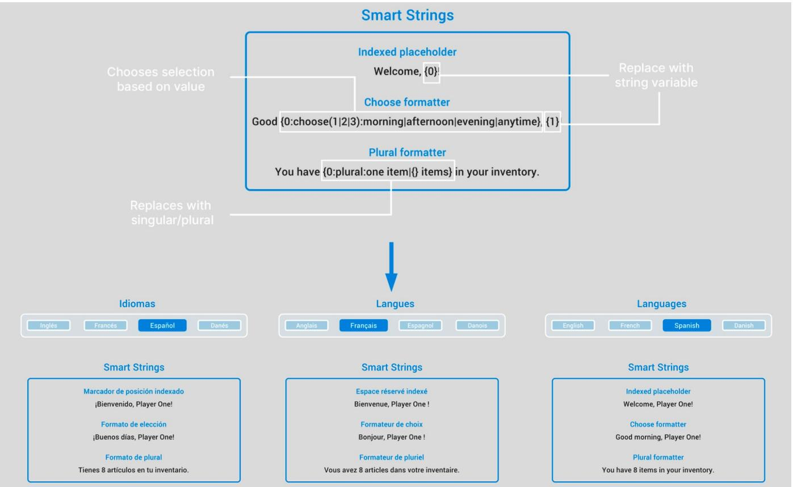

Smart Strings are an alternative to String.Format.

<span id="page-110-0"></span>

Smart Strings provide a number of built-in formatters that enhance localization, allowing you to adapt text based on game state or context:

- **[Choose Formatter](https://docs.unity3d.com/Packages/com.unity.localization@1.5/manual/Smart/Choose-Formatter.html)**: Allows you to apply conditional logic based on numeric input
- **[Plural Formatter](https://docs.unity3d.com/Packages/com.unity.localization@1.5/manual/Smart/Plural-Formatter.html)**: Automatically applies pluralization rules based on quantity
- **[Time Formatter](https://docs.unity3d.com/Packages/com.unity.localization@1.5/manual/Smart/Time-Formatter.html)**: Displays date and time
- **[Conditional Formatter](https://docs.unity3d.com/Packages/com.unity.localization@1.5/manual/Smart/Conditional-Formatter.html)**: For if/else-like logic
- **[List Formatter](https://docs.unity3d.com/Packages/com.unity.localization@1.5/manual/Smart/List-Formatter.html)**: Formats arrays or lists
- **[Is Match Formatter](https://docs.unity3d.com/Packages/com.unity.localization@1.5/manual/Smart/IsMatch-Formatter.html)**: For conditional text display based on regex patterns

You can also use the API to create a [custom formatter](https://docs.unity3d.com/Packages/com.unity.localization@1.5/manual/Smart/Creating-a-Custom-Formatter.html). For additional information about formatters, see the [Smart String documentation](https://docs.unity3d.com/Packages/com.unity.localization@1.5/manual/Smart/SmartStrings.html).

## String pre-processing

In some cases, directly binding UI elements to LocalizedString may not be convenient. For example, certain elements might need additional formatting or modification before displaying the localized text. If that's the case, you can pre-process the LocalizedString before it appears in the UI.

#### **GetLocalizedString**

The [GetLocalizedString](https://docs.unity3d.com/Packages/com.unity.localization@1.5/api/UnityEngine.Localization.LocalizedString.GetLocalizedString.html#UnityEngine_Localization_LocalizedString_GetLocalizedString) method can help here; it converts the LocalizedString into a standard string at runtime. This allows you to apply custom formatting, such as adding prefixes or combining strings, before exposing the processed string to the UI. Here's an example:

```
[SerializeField] int m_PlayerLevel = 1;
LocalizedString m_LevelMessage = new LocalizedString("My_Table", "My_Entry");
// A property that retrieves the localized string and replaces the placeholder 
{0} with the player's level
[CreateProperty] public string LevelMessage => 
m_LevelMessage.GetLocalizedString(m_PlayerLevel);
```
In this example, the LevelMessage property replaces the {0} placeholder in the Localized String with the player's current level. The [CreateProperty] attribute allows this property to be used with runtime data binding, making it easy to bind directly to UI elements.

For simple use cases, you can define properties like the above LevelMessage to handle formatting logic, eliminating the need for additional event handlers.

<span id="page-111-0"></span>

#### **Using the StringChanged event**

A LocalizedString's [StringChanged](https://docs.unity3d.com/Packages/com.unity.localization@1.5/api/UnityEngine.Localization.LocalizedString.StringChanged.html) event is useful for this kind of pre-processing. It triggers every time the LocalizedString updates (i.e. when the Locale changes), allowing you to modify the text before rendering it.

To use it, attach a handler to the StringChanged event. Here is a code snippet that creates a new LocalizedString from the My\_Table StringTable using the My\_Entry entry:

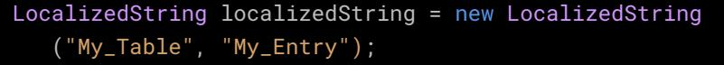

localizedString.StringChanged += OnLocalizedStringChanged;

Note how the OnLocalizedStringChanged event handler handles the conversion to a standard string automatically. Then, you can apply custom logic to modify the text before displaying it:

```
void OnLocalizedStringChanged(string value)
{
 // Example: Add a prefix based on certain conditions
 string processedString = $"[Prefix] {value}";
 // Update the UI element with the processed string
 m_TextLabel.text = processedString;
}
```
#### **Dynamic UI controls**

Of course, pre-processing LocalizedStrings isn't limited to basic text fields. It's especially useful when working with complex properties or UI structures where a Smart String alone can't handle the required logic or formatting.

For example, a DropdownField has a choices property consisting of a list of strings. Preprocessing can help localize this list of options dynamically, ensuring it reflects the active Locale.

Here, the PreprocessDemo script localizes the DropdownField choices, updating them whenever the player selects a new language. Again, the logic to rebuild the list runs in response to the StringChanged event.

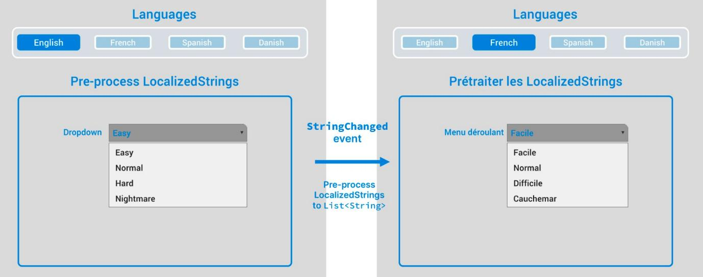

Pre-process a LocalizedString using the StringChanged event.

Here's an excerpt from the PreprocessDemo script that shows how this works:

```
[SerializeField] LocalizedString m_Choice1LocalizedString;
[SerializeField] LocalizedString m_Choice2LocalizedString;
[SerializeField] LocalizedString m_Choice3LocalizedString;
[SerializeField] LocalizedString m_Choice4LocalizedString;
public void Initialize(VisualElement root)
{
 m_DropdownField = root.Q<DropdownField>("dropdown__field");
 m_Choice1LocalizedString.StringChanged += UpdateDropdownChoices;
 m_Choice2LocalizedString.StringChanged += UpdateDropdownChoices;
 // … register other choices
 // Initial population 
 UpdateDropdownChoices(null);
}
```


When the StringChanged event triggers, the drop-down's options are rebuilt, and the current selection is preserved:

```
void UpdateDropdownChoices(string value)
{
 if (m_DropdownField == null)
 return;
 // Save the current selection
 int selection = m_DropdownField.index;
 // Remove previous choices
 m_DropdownField.choices.Clear();
 // Add current localized values
 m_DropdownField.choices.Add(m_Choice1LocalizedString.GetLocalizedString());
 m_DropdownField.choices.Add(m_Choice2LocalizedString.GetLocalizedString());

 // … Add other choices
 // Restore selected index and value
 m_DropdownField.index = selection;

 m_DropdownField.SetValueWithoutNotify(m_DropdownField.choices[selection]);
}
```
Using SetValueWithoutNotify updates the drop-down's display without triggering a ChangeEvent. This prevents recursive updates and preserves the user's selection when the drop-down options change.

In the sample project, the DropdownField dynamically updates its choices based on LocalizedString values. Each time a new Locale is selected, the updated language propagates to the dropdown options.

Pre-processing can then be an extra technique to help you create localized, context-aware UIs. While Smart Strings handle many localization tasks like placeholders and pluralization, some extra pre-processing can offer extra flexibility and formatting that Smart Strings alone can't handle.

<span id="page-114-0"></span>

## Localizing assets

Though strings weigh heavily in localization, you may need to localize assets in addition to text. For example, the sample project includes icons to stand in for the differently configured Locales.

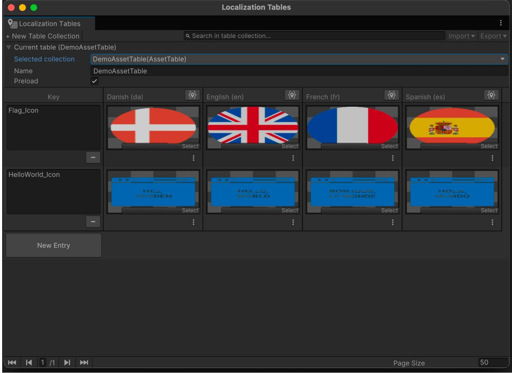

The flag and "Hello, world" icons represent each Locale.

#### **Setting up asset localization**

Asset localization works similarly to string localization. Just as you use String Tables for localized text, you use Asset Tables for localized assets. Both tables share a similar workflow, including adding entries and referencing them in your scripts or UXML files.

Localized assets can be bound to UI elements either through the UI Builder or C# scripting. For example, you can bind a visual element's style.backgroundImage property to a localized sprite or texture.


In the sample project:

- One element has its data binding defined in UXML via the UI Builder.
- Another element's binding is set up in a C# script.

Now, when selecting a Locale at runtime, the icons update along with the text labels, providing a quick visual indicator of the active Locale.

| Languages                                       | Sprog                                             |  |  |
|-------------------------------------------------|---------------------------------------------------|--|--|
| English<br>French Spanish Spanish Danish Danish |                                                   |  |  |
| Sprite/Texture                                  | Sprite/Tekstur                                    |  |  |
| .<br>HELLO,<br>WORLD                            | .<br>HEJ,<br>VERDEN                               |  |  |
| C# binding<br>UXML binding                      | UXML binding<br>C# binding                        |  |  |
| Idiomas                                         | Langues                                           |  |  |
|                                                 |                                                   |  |  |
|                                                 |                                                   |  |  |
| Español Danés<br>Inglés                         | Anglais Français Espagnol Espagnol Français<br>10 |  |  |
| Sprite/Textura                                  | Sprite/Texte                                      |  |  |
| .<br>想<br>HOLA,<br>MUNDO                        | .<br>BONJOUR,<br>LE MONDE                         |  |  |
| C# binding<br>UXML binding                      | UXML binding<br>C# binding                        |  |  |

The LocalizedTextures update with each Locale.

<span id="page-116-0"></span>

#### **Asset Tables versus String Tables**

The process of working with Asset Tables mirrors that of String Tables. Both allow you to define entries by Locale and retrieve them at runtime. Note these differences:

- **Event Handling**: Asset Tables use an AssetChanged event to notify changes in localized assets instead of the StringChanged event for strings.
- **Binding Methods**: Both string and asset bindings work with SetBinding, but the bound properties (e.g., text for strings vs. style.backgroundImage for textures) depend on the asset type.

This snippet shows how the demo example retrieves the LocalizedTexture from the Asset Table by name and then binds to the style.backgroundImage property:

```
m_LocalizedTexture = new LocalizedTexture()
{
 TableReference = "DemoAssetTable",
 TableEntryReference = "HelloWorld_Icon"
};
```
m\_IconElement = root.Q<VisualElement>("icon\_\_hello-world"); m\_IconElement.SetBinding("style.backgroundImage", m\_LocalizedTexture);

#### **Common localized assets in UI Toolkit**

Localized assets come in different forms. Here are a few that you might encounter when working with UI Toolkit:

- **Localized textures:** Ideal for icons, backgrounds, and other decorative visuals, these can be bound directly to visual element properties, such as style.backgroundImage.
- **Localized sprites:** These are less common but useful for custom components or spritebased visuals.
- **Localized fonts:** These allow for switching fonts to support specific scripts or typographic styles required by different languages.
- **Localized objects:** These are useful for referencing complex resources, such as prefabs or data-driven assets, that need to vary based on the Locale.

By leveraging these assets with Asset Tables, you can ensure that your UI dynamically adapts not only its text but also its visuals to align with the active Locale.

## <span id="page-117-0"></span>Localization in the Dragon Crashers sample

The *UI Toolkit Sample – Dragon Crashers* demo includes several localization techniques in action. In the Settings view, you can use the drop-down menu to select between one of the supported languages. When a new language is chosen, the LocalizationSettings system detects the change and updates the UI in real time.

|        |                                  |                    |                               | 5950 - 1 - 999 + |
|--------|----------------------------------|--------------------|-------------------------------|------------------|
|        | Configuración                    |                    |                               | 8                |
| 1      | Cuenta                           | Idioma             | Español                       | 网                |
|        | Restablecer nivel                |                    | Inglés                        | Nivel 1          |
| Inicio | Restablecer moneda               | Volumen<br>música  | Español<br>Francés            |                  |
|        | Nombre jugador                   | Volumen<br>efectos | Danés                         |                  |
|        | GUEST_123456                     | Contador fps       | Apagado                       | arida del Dragón |
|        | Casilla<br>Predeterminac<br>Tema | Tasa objetivo      | ● Máx<br>O 60 fps<br>O 30 fps | Tugar            |
|        |                                  | 21                 |                               |                  |

Select a Locale from the Language drop-down menu.

Here are a few things you can check as you explore the project on your own:

- **SettingsScreen Locale selection:** The Settings screen allows users to select a Locale via a drop-down menu. This UI listens for changes in LocalizationSettings to detect new Locale selections, updating in real-time as the drop-down changes.
- **Data binding techniques:** The UI features a combination of localization techniques. Static properties are bound directly in UI Builder and stored in the UXML.

Meanwhile, dynamically populated fields rely on runtime scripts for data binding. The SetBinding method connects text properties to LocalizedString objects, ensuring the UI reflects the selected Locale.


— **Pre-formatted LocalizedStrings in ScriptableObjects:** Some ScriptableObject assets contain pre-formatted LocalizedString properties. For example, in the Settings screen, the Theme and Language drop-down fields dynamically rebuild lists from localized values, translating the available choices.

Other elements like the RadioButtonGroup and custom SlideToggle also pre-process the LocalizedStrings by handling the StringChanged event.

Regardless of the localization technique – whether data binding through UXML or C# scripting – the UI responds in real-time to Locale changes.

Use the techniques in this sample project as inspiration for building localized interfaces in your own Unity projects. By combining data binding and UI Toolkit, you can create a flexible, multilingual UI that's ready to welcome players from around the world.

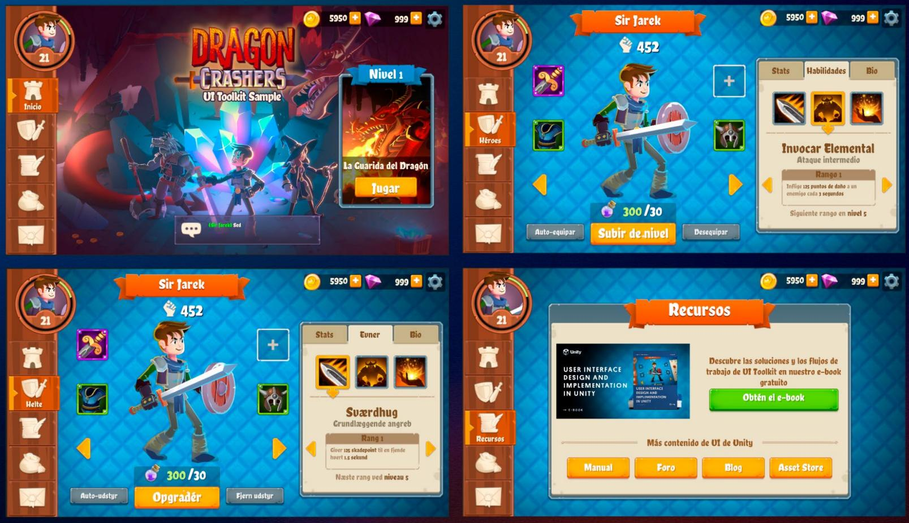

Explore *UI Toolkit Sample – Dragon Crashers* for more examples of localization.

## <span id="page-119-0"></span>Custom controls

UI Toolkit offers a standard set of elements for building interfaces, but you can also create custom controls tailored to your application's needs.

For instance, a custom health bar could change color based on health value, animating from green to yellow and red as health decreases. It could be repurposed across characters without extra setup – or even used to represent other stats, like mana or power. This encapsulated control would offer a clear visual upgrade to the slider from the UI Toolkit standard library.

Custom controls let you encapsulate functionality into standalone elements, making them reusable across different parts of your interface. Well-designed controls are abstract, selfcontained, and support code reuse, helping simplify project maintenance. When implementing custom controls, avoid using them with elements tied to specific components that lack standalone functionality (e.g., game menus).

## The UxmlElement attribute

To create a custom control, start by defining a new C# script that inherits from the [VisualElement](https://docs.unity3d.com/ScriptReference/UIElements.VisualElement.html) class – or a subclass that closely matches what you want to create. Want a button-like control? Just inherit from the [Button](https://docs.unity3d.com/ScriptReference/UIElements.Button.html) class.


To make your custom control available in UXML and the UI Builder, add the UxmlElement attribute to your class. Ensure that the custom element is defined as a public partial class:

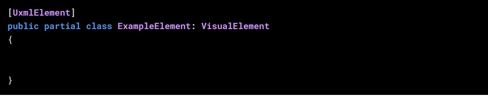

Your custom control will then appear in the Library section under the **Custom Controls (C#)** category in the UI Builder. You can then drag it into UI Builder's Hierarchy window.

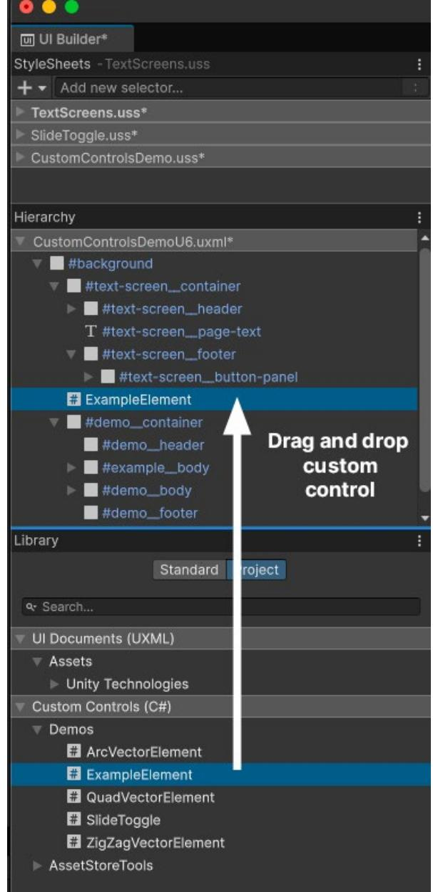

Custom controls appear in the UI Builder Library.

<span id="page-121-0"></span>Because visual elements aren't GameObjects, they don't have the usual lifecycle events like Awake, OnEnable, OnDisable, and OnDestroy. Instead, you initialize a custom control using its constructor.

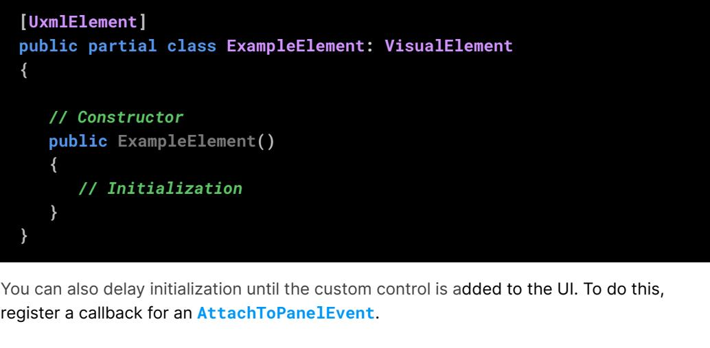

To detect that your custom control has been removed from the UI, use the **[DetachFromPanelEvent](https://docs.unity3d.com/ScriptReference/UIElements.DetachFromPanelEvent.html)** callback.

## The UxmlAttribute attribute

Adding the **UxmlAttribute** attribute to a property makes it appear in the UI Builder's Inspector window. This allows you to set initial values interactively. UxmlAttributes can be helpful when working with a designer, as changes in the Inspector don't require modifying code.

Apply the UxmlAttribute attribute to each property you want to expose. You can also customize attribute names with the **name** argument.

Selecting the control in the Hierarchy will display your custom attributes in the Inspector window, allowing you to configure them directly.

Decorator attributes can modify your custom attribute fields much like working with MonoBehaviours. Useful decorator attributes include TextArea, Tooltip, Range, Header, Min, Multiline, Space, and Delayed. For example, using the Range attribute adds a slider for selecting values within a range.

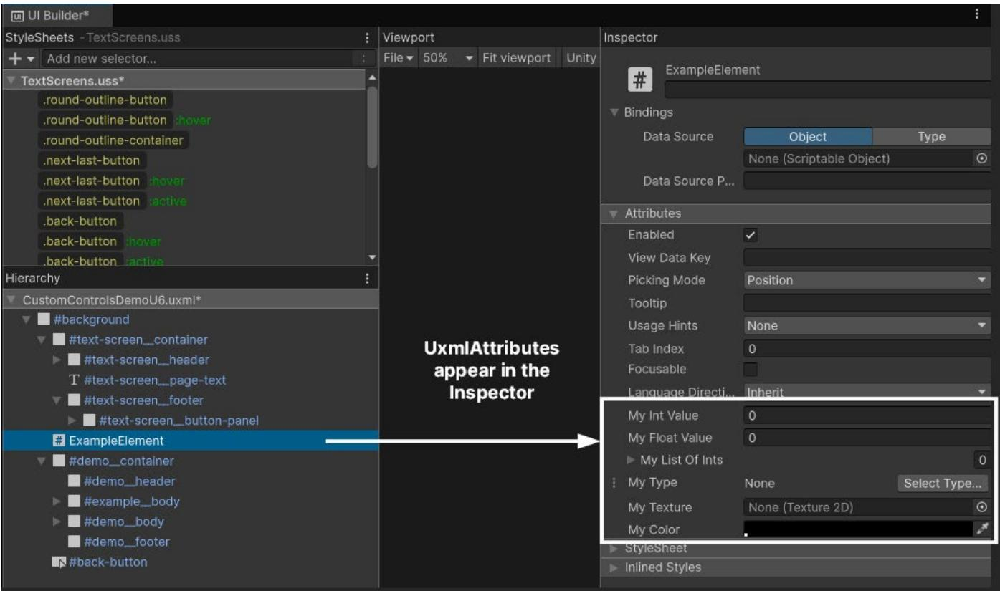

Custom attributes appear in the UI Builder's Inspector.

Here's a basic example of adding the UxmlElement attribute to a custom control, which includes two exposed properties using the UxmlAttribute attribute.

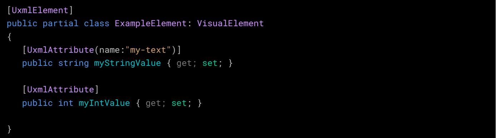

In this example, MyStringValue appears as **"My Text"** in the Inspector using the name parameter. Both MyStringValue and MyIntValue are editable in the Inspector whenever an instance of ExampleElement is selected in the Hierarchy.

<span id="page-123-0"></span>

Before Unity 6, creating custom controls required implementing **UxmlTraits** and **UxmlFactory** classes, which handled attribute registration and object instantiation for custom elements.

Unity 6 simplifies custom element creation by introducing UxmlElement and UxmlAttribute attributes. These directly expose custom controls and properties in UXML and the UI Builder. This new workflow reduces the amount of boilerplate code and makes it faster to customize UI elements.

## Example: A custom slide toggle control

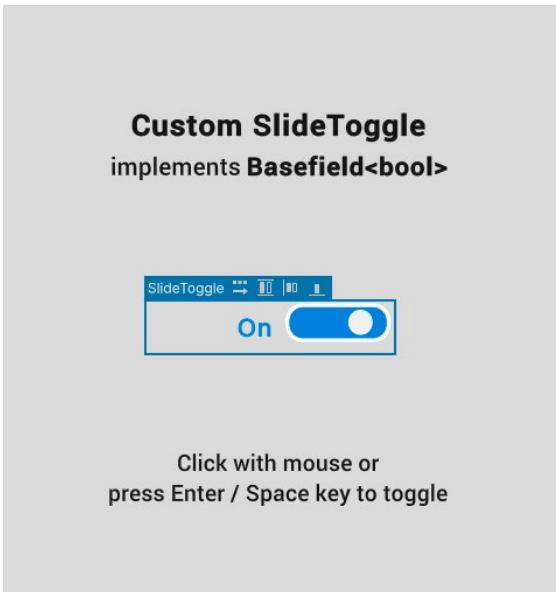

An example of a simple custom control could be a slide toggle, a switch-like element representing a boolean value.

This might offer a more engaging experience than a standard toggle. Adding extra visual feedback, such as an animated switch, changing color, and dynamic text, can result in a more intuitive UI.

The custom slide toggle control represents a boolean value.

#### **Defining the custom control**

In the QuizU project, you can find a simple implementation of this custom control in the CustomControlsDemo scene. Open the SlideToggle.cs script to see how it works (snippets shown below).

The slide toggle custom control inherits from the most suitable base class – BaseField<bool> in this case. The UxmlElement attribute exposes the control in UXML and the UI Builder, making it reusable.

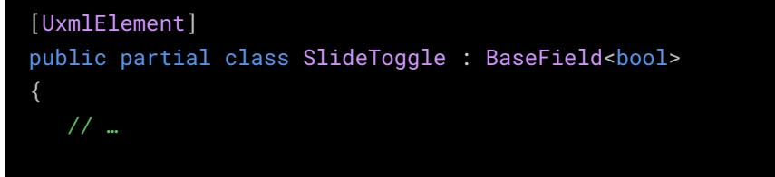


```
 [UxmlAttribute]
 public string EnabledText { get; set; } = "Enabled";
 [UxmlAttribute]
 public string DisabledText { get; set; } = "Disabled";
 [UxmlAttribute]
 public Color EnabledBackgroundColor { get; set; } = new Color(0f, 0.5f, 0.85f,1f);
 [UxmlAttribute]
 public Color DisabledBackgroundColor { get; set; } = Color.gray;
```
The visual structure consists of a background (m\_Input) and a knob (m\_Knob), with USS classes defining the appearance.

```
public SlideToggle(string label) : base(label, new VisualElement())
{
 AddToClassList(ussClassName);
 m_Input = this.Q(className: BaseField<bool>.inputUssClassName);
 m_Input.AddToClassList(inputUssClassName);
 m_Input.name = "input";
 m_Knob = new();
 m_Knob.AddToClassList(inputKnobUssClassName);
 m_Knob.name = "knob";
 m_Input.Add(m_Knob);

 labelElement.name = "label";
 labelElement.text = (value) ? "enabled" : "disabled";
```
Event handling is implemented to respond to clicks, key presses, and navigation events. This allows multiple ways to change its state.


```
// …
 RegisterCallback<ClickEvent>(evt => OnClick(evt));
 RegisterCallback<KeyDownEvent>(evt => OnKeydownEvent(evt));
 // …
}
static void OnClick(ClickEvent evt)
{
 var slideToggle = evt.currentTarget as SlideToggle;
 slideToggle.ToggleValue();
 evt.StopPropagation();
}
static void OnKeydownEvent(KeyDownEvent evt)
{
 var slideToggle = evt.currentTarget as SlideToggle;
 if (slideToggle.panel?.contextType == ContextType.Player)
 return;
 if (evt.keyCode == KeyCode.KeypadEnter || evt.keyCode == KeyCode.Return || evt.keyCode == 
KeyCode.Space)
 {
 slideToggle.ToggleValue();
 evt.StopPropagation();
 }
}
```
The label and background color update automatically as the user toggles the switch, providing visual feedback.

Here we use SetValueWithoutNotify to update the visual state of the toggle without triggering a ChangeEvent. Since this method is called internally when the value changes, the UI updates correctly without causing an infinite loop of updates.

```
public override void SetValueWithoutNotify(bool newValue)
{
 base.SetValueWithoutNotify(newValue);
 m_Input.EnableInClassList(inputCheckedUssClassName, newValue);

 m_Input.style.backgroundColor = newValue ? EnabledBackgroundColor : 
DisabledBackgroundColor;
 labelElement.text = (value) ? EnabledText : DisabledText;
}
```
<span id="page-126-0"></span>Explore the sample implementation in the **CustomControlsDemo** scene. Click the element with the mouse or press the Enter or Space key to toggle its active state. In this sample, the label and background color update dynamically as the user toggles the slide control, with a quick animation providing visual feedback.

Use the Inspector to set string labels and background colors that correspond to the enabled and disabled state.

|                | Attributes             |          |   |
|----------------|------------------------|----------|---|
|                | Enabled                | >        |   |
|                | View Data Key          |          |   |
|                | Picking Mode           | Position |   |
| Enabled text   | Tooltip                |          |   |
| and background | Usage Hints            | None     |   |
|                | Tab Index              | 0        |   |
| On             | Focusable              | >        |   |
|                | Language Direction     | Inherit  | 9 |
|                | Editor Binding Path    |          |   |
|                | Label                  | On       |   |
| Disabled text  | Value                  | >        |   |
|                | Enabled Text           | On       |   |
| and background | Disabled Text          | Off      |   |
| Off Off        | Enabled Background Co  |          |   |
|                | Disabled Background Co |          |   |
|                | StyleSheet<br>A        |          |   |
|                | Inlined Styles<br>A    |          |   |
|                |                        |          |   |
|                |                        |          |   |
|                |                        |          |   |

Customize the slide toggle text and colors.

#### **Using the slide toggle**

Once compiled, the slide toggle is now ready to integrate into any part of your UI. Use the custom SlideToggle class just like any other visual element. Here's an example implementation that uses the SlideToggle class to mute or unmute the sound:

| public class MuteAudioToggle : MonoBehaviour<br>{                                                                 |  |
|-------------------------------------------------------------------------------------------------------------------|--|
| [SerializeField] AudioSettingsSO m_AudioSettingsSO;<br>[SerializeField] UIDocument m_Document;                    |  |
| void OnEnable()<br>{                                                                                              |  |
| var root = m_Document.rootVisualElement;<br>SlideToggle slideToggle = root.Q<SlideToggle>("master-audio-toggle"); |  |


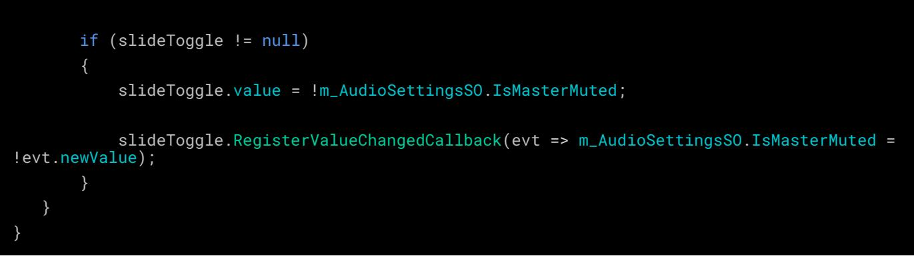

In this case, the SlideToggle is part of an existing UXML document. The MonoBehaviour locates it by name within the visual tree and then uses the RegisterValueChangedCallback method to link the toggle state to the audio settings.

Since SlideToggle is a standalone custom element, you can use it for any kind of toggle switch in your UI. For example in the *[Dragon Crashers](https://assetstore.unity.com/packages/essentials/tutorial-projects/dragon-crashers-ui-toolkit-sample-project-231178?srsltid=AfmBOoqA2Wc-O_SUJZitEq3RljmBSbtkpSkVqTb-DhG9G_XsLEnXagbe#reviews)* [UI Toolkit sample,](https://assetstore.unity.com/packages/essentials/tutorial-projects/dragon-crashers-ui-toolkit-sample-project-231178?srsltid=AfmBOoqA2Wc-O_SUJZitEq3RljmBSbtkpSkVqTb-DhG9G_XsLEnXagbe#reviews) a similar SlideToggle enables and disables the fps counter.

| Settings                             |                                                                |
|--------------------------------------|----------------------------------------------------------------|
| Account                              | C<br>বাং<br>English<br>Language                                |
| Reset Player Level                   |                                                                |
| Reset Player Currency                | Music<br>volume                                                |
| Player name                          | SEV<br>volume                                                  |
| GUEST 123456                         | Fps counter<br>SlideToggle enables<br>On<br>fps counter        |
| Checkbox example<br>Default<br>Theme | Max<br>0<br>Target frame<br>O<br>60 fps<br>rate<br>30 fps<br>O |
|                                      | 2<br>FDS: 466                                                  |

The stylized toggle from *UI Toolkit Sample – Dragon Crashers*

Customize the SlideToggle to fit your application's requirements – it's ideal for settings like visuals, sound, or gameplay options. Build it once, then reuse it wherever a custom switch can enhance the user experience.

For a full implementation, refer to the **SlideToggle.cs** script in the QuizU project.

## <span id="page-128-0"></span>Creating more custom controls

If there's a control that's not included in the standard UI Toolkit library, you can create your own. Here are just a few examples to get you thinking about how you can deploy custom controls in your own games:

- **Health bars/progress bars:** Game attributes like health, mana, power, etc. can vary widely based on gameplay, making them great candidates for custom controls. Expose UxmlAttributes like max value, current value, and status colors to add options for color gradients.
- **Rating stars:** This control functions like a segmented progress bar, representing an integer value (e.g. stars for completing a level). Start with a visual element with several child elements that can switch between filled and unfilled states. Expose an int with a max value in the Inspector and allow the user to customize the sprite images with UxmlAttributes.
- **Tab view control:** A tabbed interface is a common UI for switching between different views or sections within the same window. Implement this by creating a custom element with a row of tabs and a content area. Each tab can be a button-like visual element, with options to add or remove tabs dynamically.

Remember that in most cases, you can also trigger USS transitions to add visual flair with animations. With custom controls, your users can pinch, click, scroll, and toggle through your unique game UIs.

We can't wait to see what you make with them.

## <span id="page-129-0"></span>Optimizing performance

Building a sophisticated game UI often means managing a large hierarchy of onscreen elements. With hundreds of elements in play, this can cause technical challenges. Even subtle inefficiencies can build up into stutters or hitches at runtime – and those can negatively impact the player experience.

The good news is that most of these challenges can be addressed through some optimization. While Unity 6 brings significant UI Toolkit improvements for better out-of-thebox performance, a truly efficient user interface still takes some effort on the part of the developer.

Much of this work often comes down to eliminating unnecessary overhead and reducing draw calls. Let's explore some tips for optimizing UI Toolkit in Unity 6 to help you get the most out of it.

<span id="page-130-0"></span>

## Update mechanisms

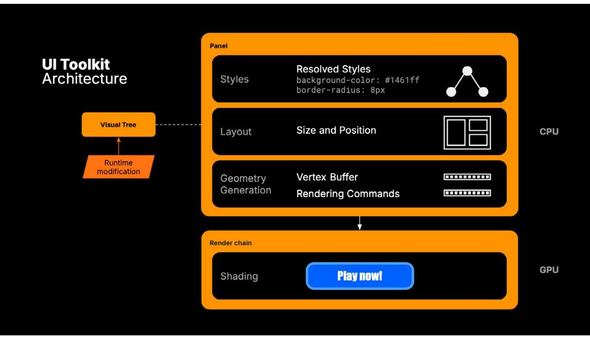

The visual tree includes several update mechanisms.

The visual tree contains several update mechanisms that respond to changes in styles, layout, or content at runtime. Any one of these update mechanisms can affect performance. The following table provides a summary of when they occur, and each one's impact on performance.

| Update mechanism           | Description                                                                                      | When it happens                                                                                                  | Performance impact                                                                                                    |
|----------------------------|--------------------------------------------------------------------------------------------------|------------------------------------------------------------------------------------------------------------------|-----------------------------------------------------------------------------------------------------------------------|
| Style resolution           | Determines the final<br>appearance of elements by<br>applying USS selectors and<br>styles        | Triggered when classes or<br>styles are changed, such<br>as adding a style class or<br>modifying a color         | Large or deeply nested<br>hierarchies make this process<br>expensive. Minimize frequent<br>changes.                   |
| Layout recalculation       | Adjusts the size and<br>position of elements to<br>fit correctly within the UI<br>hierarchy      | Triggered by changes to<br>element size, position, or<br>alignment, e.g., resizing a<br>panel or moving elements | Frequent layout updates can<br>be costly. Use transforms for<br>animations instead of altering<br>positions directly. |
| Vertex buffer<br>updates   | Updates geometric shapes<br>used to render UI elements,<br>like rectangles or rounded<br>corners | Triggered when an element's<br>geometry changes, such as<br>adding rounded corners or<br>modifying borders       | Updating vertex buffers is<br>resource-intensive. Avoid<br>frequent geometry changes.                                 |
| Rendering state<br>changes | Changes rendering states<br>like textures and blending<br>modes required to draw<br>elements     | Triggered by features like<br>masking or unique textures,<br>that disrupt batching                               | Excessive state changes increase<br>CPU overhead. Optimize by<br>batching and limiting unique<br>textures or masks.   |

The cost of these operations, of course, depends on how often and how extensively you modify UI elements.

## <span id="page-131-0"></span>Batching elements

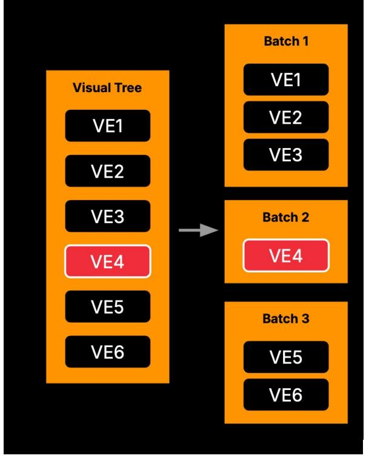

When rendering a user interface, every visual element requires instructions to be sent to the GPU. UI Toolkit optimizes these draw calls through batching. This groups visual elements with identical GPU requirements together so they can be processed together. Batching significantly reduces the communication overhead with the GPU, much like [draw call](https://docs.unity3d.com/Manual/DrawCallBatching.html)  [batching](https://docs.unity3d.com/Manual/DrawCallBatching.html) with GameObjects.

To batch elements efficiently they must share the same GPU state – the same shaders, textures, mesh data, and other GPU-specific parameters. For example, a sequence of text elements using the same font and style can be batched together. However, inserting an image between them requires different GPU settings. That forces a new batch.

Breaking batches reduces performance.

Every batch "break" like this introduces a small inefficiency. To maintain high performance, it's essential to structure your UI to minimize these breaks.

Since every batch may issue one or more draw calls to the GPU, fewer batches generally mean reduced overhead and better performance.

In the next sections, let's explore techniques to optimize your UI's batch count and achieve consistent performance.

## Vertex buffers

In UI Toolkit, vertex buffers store the geometry (vertices) needed to render your UI. When a UIDocument creates a Panel at runtime, it pre-allocates a single vertex buffer to handle the visual elements. Think of this buffer as a "heap allocator" for visual elements, dynamically allocating memory as elements are added to the UI.

If the UI exceeds the capacity of the vertex buffer, additional buffers are created. This can fragment batching, increase the number of draw calls, and ultimately reduce performance.

To address this, you can adjust the **Vertex Budget** in the Panel Settings to configure the initial size of the vertex buffer. The default value is 0, allowing Unity to determine the size automatically. However, for complex UIs, manually increasing this value can improve performance by reducing the number of draw calls.


Here's an example. This UI contains a lot of elements that can't fit within a single vertex buffer. The [Frame Debugger](https://docs.unity3d.com/Manual/FrameDebugger.html) shows that this results in two draw calls instead of one.


This UI requires more than one draw call.

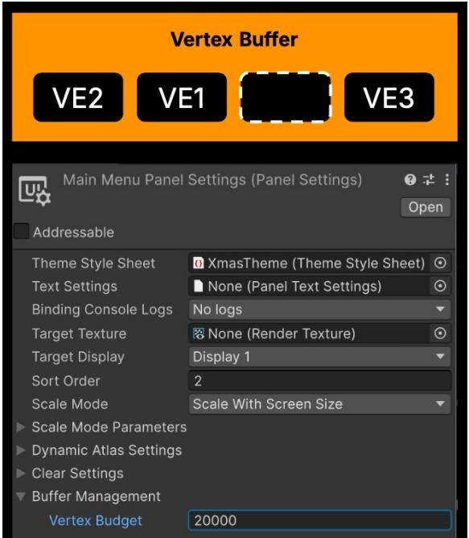

Increasing the Vertex Budget to a value to 20,000 vertices, for instance, may mean that the framebuffer can fit the UI elements into a single draw call. This makes our example UI more efficient by changing one setting.

Increasing the Vertex Budget may reduce draw calls.

<span id="page-133-0"></span>

| 000                                                                                                                                   | Frame Debugger                           |                 |                  |                                                         |                                                                 |                                                                                                                                                                               |
|---------------------------------------------------------------------------------------------------------------------------------------|------------------------------------------|-----------------|------------------|---------------------------------------------------------|-----------------------------------------------------------------|-------------------------------------------------------------------------------------------------------------------------------------------------------------------------------|
| Frame Debugger                                                                                                                        |                                          |                 |                  |                                                         |                                                                 | 3 Q Layers . Layout .                                                                                                                                                         |
| Editor<br>Disable                                                                                                                     |                                          | - 3             | 4                |                                                         | a : O Inspector     Console                                     | a :                                                                                                                                                                           |
|                                                                                                                                       | RT 0 ▼ Channels All R G B A Levels O     |                 | -29.1            |                                                         | ത                                                               | 1 - Vertex Budget (Panel Set) 9 = 3                                                                                                                                           |
| UniversalRenderPipeline.RenderSingleCamerali 3<br>▼ ScriptableRenderer.Execute: URP-Performan 3<br>Clear (color+depth+stencil)        | Event #3 Draw Mesh<br>T Output           |                 |                  | rtex Budget<br>era<br>cument                            | ច្រ<br>11<br>Addressable                                        | Open                                                                                                                                                                          |
| V DrawScreenSpaceUl<br>2<br>2<br>Y UGUI.Rendering.RenderOverlays<br>Clear (depth+stencil)<br>v UIR.DrawChain<br>1<br>V UIR.DrawRanges |                                          |                 |                  |                                                         | Text Settings<br>Binding Console Logs No logs<br>Target Texture | Theme Style Sheet default (Theme S O<br>None (Panel Text O<br>None (Render Te O                                                                                               |
| DrayMesh                                                                                                                              |                                          |                 |                  | a :                                                     | Target Display                                                  | Display 1                                                                                                                                                                     |
|                                                                                                                                       |                                          |                 |                  | 2 8 4 0 33                                              | Sort Order<br>Scale Mode                                        | 2<br>Scale With Screen S▼                                                                                                                                                     |
|                                                                                                                                       |                                          |                 |                  | Scene                                                   | Scale Mode Parameters                                           |                                                                                                                                                                               |
|                                                                                                                                       |                                          |                 |                  | UI                                                      |                                                                 | Screen Match Mod Match Width Or Hei™                                                                                                                                          |
|                                                                                                                                       |                                          |                 |                  | sour<br>artex Budget                                    | Reference Resolution 12E Y 722                                  |                                                                                                                                                                               |
|                                                                                                                                       |                                          |                 |                  | artex Budget                                            | V Screen Match Mode Parameters                                  |                                                                                                                                                                               |
|                                                                                                                                       |                                          |                 |                  | exture Slots - Solved<br>exture Slots                   | Match                                                           | -9.1<br>Width Height                                                                                                                                                          |
|                                                                                                                                       |                                          |                 |                  | Texture Slots 8                                         |                                                                 | Reference Sprite Pixels per Unit 100                                                                                                                                          |
|                                                                                                                                       |                                          |                 |                  | Texture Slots 9<br>Texture Slots 9 - Solved             | Dynamic Atlas Settings                                          |                                                                                                                                                                               |
|                                                                                                                                       |                                          |                 |                  | Mask Batching Case 1 Scer                               | Min Atlas Size                                                  | 10                                                                                                                                                                            |
|                                                                                                                                       |                                          |                 |                  | MaskBatchingCase2Sce                                    | Max Atlas Size                                                  | 10                                                                                                                                                                            |
|                                                                                                                                       |                                          |                 |                  | MaskBatchingCase3Sce<br>logGallery (Animation, Di       | Max Sub-Texture § 10                                            |                                                                                                                                                                               |
|                                                                                                                                       | v Details                                |                 |                  | ingCasesPanels                                          | Active Filters                                                  | None                                                                                                                                                                          |
|                                                                                                                                       | RenderTarget<br><No name>                |                 |                  | plates                                                  | Clear Settings<br>Clear Color                                   |                                                                                                                                                                               |
|                                                                                                                                       |                                          |                 |                  |                                                         | Color Clear Value                                               |                                                                                                                                                                               |
|                                                                                                                                       | Size<br>1064x598                         | ZClip           | True             | sphs                                                    | Clear Depth Stenc ✔                                             |                                                                                                                                                                               |
|                                                                                                                                       | B8GBR8A8_SRGB<br>Format<br>Color Actions | ZTest<br>ZWrite | LessEqual<br>Off | Pro                                                     | Buffer Management                                               |                                                                                                                                                                               |
|                                                                                                                                       |                                          |                 |                  | 110                                                     | Vertex Budget                                                   | 15000                                                                                                                                                                         |
|                                                                                                                                       |                                          |                 |                  | as U<br>UI Toolkit                                      |                                                                 |                                                                                                                                                                               |
|                                                                                                                                       |                                          |                 |                  | UnityDefaultRuntimeTheme                                |                                                                 |                                                                                                                                                                               |
|                                                                                                                                       |                                          |                 |                  | UniversalRenderPipelineGlobalSet<br>VolumeProfiles      | Asset Labels                                                    |                                                                                                                                                                               |
|                                                                                                                                       |                                          |                 |                  | > In Packages                                           |                                                                 |                                                                                                                                                                               |
|                                                                                                                                       |                                          |                 |                  | Assets/Scenes/UniteDemos/1 - Vertex Bi AssetBundle None |                                                                 | · None▼                                                                                                                                                                       |
|                                                                                                                                       |                                          |                 |                  |                                                         |                                                                 | * = = = = = = = = = = = = = = = = = = = = = = = = = = = = = = = = = = = = = = = = = = = = = = = = = = = = = = = = = = = = = = = = = = = = = = = = = = = = = = = = = = = = = = |

Adjusting the Vertex Budget restores the one draw call.

For complex UIs, manually increasing this value may improve performance by reducing draw calls, but be careful of over-allocating memory. Use the Frame Debugger and [Unity Profiler](https://docs.unity3d.com/Manual/Profiler.html) to find the best balance between memory usage and number of draw calls.

## Uber shader and eight-texture limit

UI Toolkit consolidates all UI rendering functionality into a single versatile "uber shader." Rather than rely on multiple shader variants, this shader uses [dynamic branching](https://docs.unity3d.com/6000.0/Documentation/Manual/shader-branching-introduction.html) to select the appropriate rendering path at runtime. This reduces CPU overhead by minimizing shader switches but does add some GPU cost due to the branching logic.

One feature that makes this shader powerful is its support for up to eight textures within the same batch. This allows elements with different textures to render in the same draw call. In the image (in the next page?) you can see a UI consisting of eight different textures:

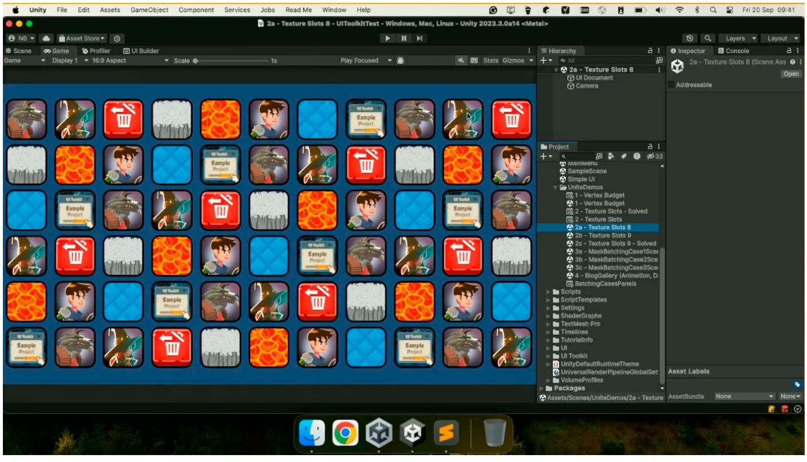

This example UI contains eight textures.

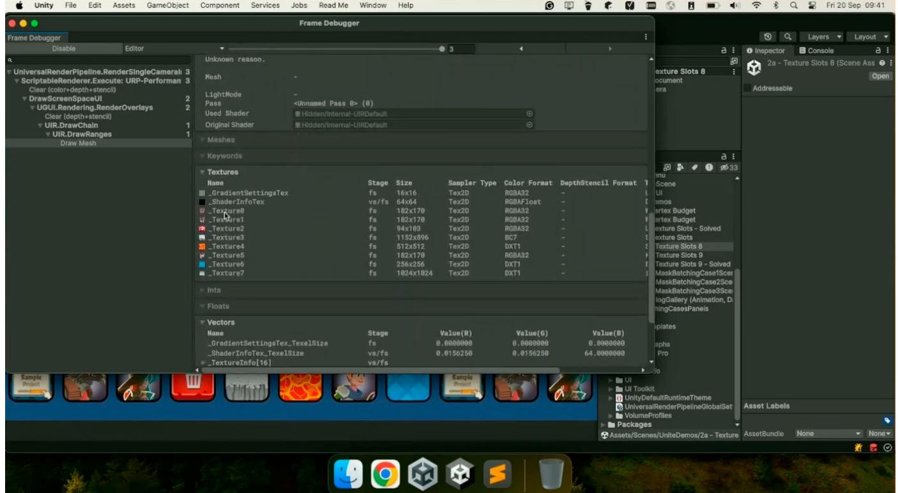

The "uber shader" renders as one draw call.

<span id="page-135-0"></span>

As shown in the Frame Debugger, Unity renders an example UI using one draw call for up to eight textures. However, exceeding the eight-texture limit forces the batching system to split into separate batches, increasing overhead.

Here's what happens if you exceed the eight-texture limit. The one draw call is now many more:

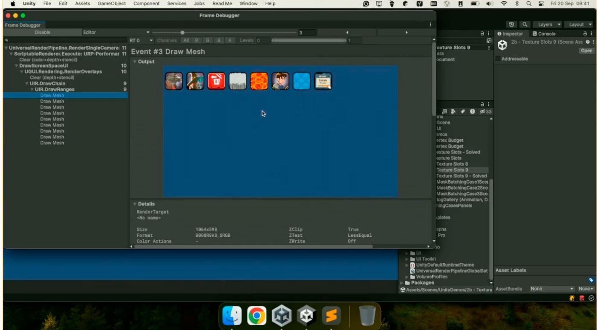

Too many textures break the batches.

To mitigate this limitation, UI Toolkit provides tools to optimize texture usage. For example, consolidating textures into atlases helps keep the number of textures within the supported limit, preserving batch efficiency and reducing draw calls.

## Dynamic texture atlases

Switching between multiple textures can force UI Toolkit to break batches, increasing draw calls and reducing performance. A common solution to this problem is texture **atlasing**, which combines smaller textures into a single larger texture.

If you're familiar with the [2D Sprite Atlas,](https://docs.unity3d.com/6000.0/Documentation/Manual/sprite/atlas/atlas-landing.html) you already know an effective way to improve performance. By packing multiple sprites into a sprite atlas, Unity treats them as a single texture, reducing batch breaks and draw calls. The 2D Sprite Atlas integrates seamlessly with UI Toolkit, making it a great choice for static or pre-defined content.

However, the 2D Sprite Atlas has limitations, such as the inability to handle runtime-generated textures. It also requires some setup and sprite layout ahead of time, which can be timeconsuming.


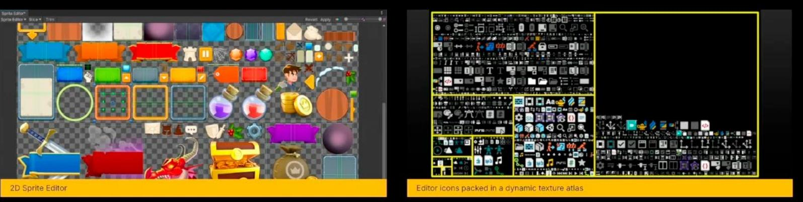

The Dragon Crashers sample uses a 2D Sprite Atlas.

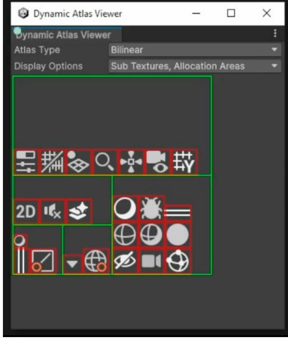

UI Toolkit's dynamic texture atlas effectively merges multiple images into one texture, reducing texture state changes. You can configure atlas settings in Panel Settings and visualize the atlas layout in the Dynamic Atlas Viewer (available in the UI Toolkit Debugger window).

Use the Dynamic Atlas Viewer in the Frame Debugger.

Note that if your UI undergoes extensive changes (such as adding and removing many textures over time), the atlas may become fragmented. In such cases, the [ResetDynamicAtlas](https://docs.unity3d.com/ScriptReference/UIElements.RuntimePanelUtils.ResetDynamicAtlas.html)  [API](https://docs.unity3d.com/ScriptReference/UIElements.RuntimePanelUtils.ResetDynamicAtlas.html) can restore the atlas to its initial state.

Remember that you can use the 2D Sprite Atlas and dynamic texture atlases side-by-side within UI Toolkit. Sprite Atlases are ideal for static, predefined content, while dynamic atlases excel in situations where UI content is runtime-driven.

<span id="page-137-0"></span>

## Masking

UI Toolkit uses the stencil buffer to create masks – areas that show or hide parts of UI elements. Since the stencil buffer is part of the GPU state, changing mask settings can force UI Toolkit to break batches.

Be aware that hierarchically layering masked elements adds complexity, as each nested depth requires the stencil buffer to track additional states. That increases the GPU workload.

UI Toolkit supports two types of masking:

- **Rectangular-based masking:** Rectangular masks use shader-based operations, preserving batch consistency without GPU state changes. This technique doesn't use the stencil buffer, so you can nest rectangular masks without depth limits.
- **Rounded Corners and Complex Masks (stencil buffer):** Rounded corners and other complex shapes require stencil buffer operations, potentially breaking batches at each masking level. This technique supports up to seven nested levels of masking.

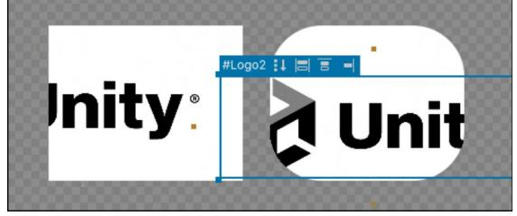

Rectangular versus rounded corners masks

To optimize performance for masked elements:

- Use rectangular masks when possible to avoid stencil operations.
- Minimize the nesting depth of masks. Keeping masks flat in the hierarchy ensures fewer stencil recalculations.
- When possible, use a single mask over a parent element instead of multiple masks over child elements.
- When multiple masking layers are unavoidable, apply the Mask Container usage hint to optimize stencil state setup. However, use this sparingly to prevent batch breaks.

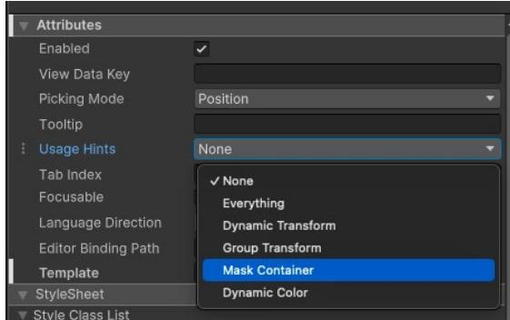

Use a Mask Container usage hint.

<span id="page-138-0"></span>

Finally, verify the impact of these optimizations using the Frame Debugger to ensure efficient rendering and batching.

Animations and transitions

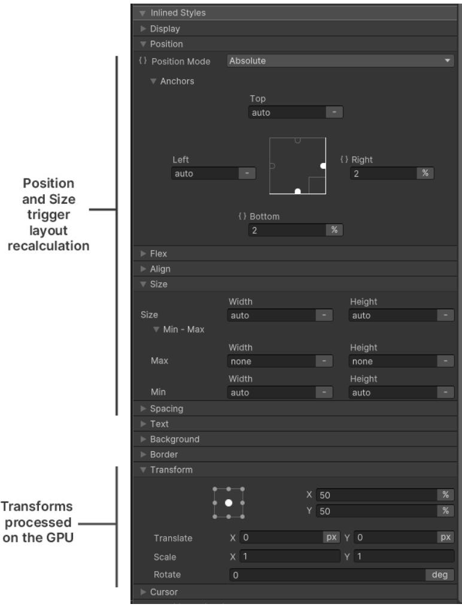

While UI Toolkit's USS transitions offer simple property animations, changing layout properties like size or position can trigger expensive layout recalculations. To optimize animations and reduce performance overhead, you can try several strategies.

First, prioritize transform-based animations over layout property changes. Instead of animating properties like width, height, top, or left, use translate, scale, or rotate transforms. These operations are processed directly on the GPU, avoiding the need for layout recalculations. That can result in smoother animations.

Animate transforms instead of layout properties.

You can also enable **[usage hints](https://docs.unity3d.com/6000.0/Documentation/ScriptReference/UIElements.VisualElement-usageHints.html)** for any visual element that needs to be animated.

The **DynamicTransform** hint instructs UI Toolkit to handle position and transform updates on the GPU, bypassing expensive vertex data recalculations.

For parent containers with multiple animated children, the **GroupTransform** hint can significantly reduce overhead. It applies a single transform to the parent, which the GPU efficiently propagates to all child elements, optimizing animations for large groups.

| Attributes                |                                     | A |  |
|---------------------------|-------------------------------------|---|--|
| Enabled                   | V                                   |   |  |
| View Data Key             |                                     |   |  |
| Picking Mode              | Position                            |   |  |
| Tooltip                   |                                     |   |  |
| <br>Usage Hints           | None                                |   |  |
| Tab Index                 | J None                              |   |  |
| Focusable                 | Everything                          |   |  |
| Language Direction        | Dynamic Transform                   |   |  |
| Editor Binding Path       | Group Transform                     |   |  |
| Text                      | Mask Container                      |   |  |
| Enable Rich Text          | Dynamic Color                       |   |  |
| Emoji Fallback Support    | V                                   |   |  |
| Parse Escape Sequen       |                                     |   |  |
| Selectable                |                                     |   |  |
| Double Click Selects      |                                     |   |  |
| Triple Click Selects Li ✔ |                                     |   |  |
| Display Tooltip When  ✔   |                                     |   |  |
| Icon Image                | 0<br>None (Texture 2D)<br>Texture ▼ |   |  |

Usage hints are available for each visual element.

Also, as a general rule, avoid switching classes for style changes in large hierarchies during animations. Class changes can trigger extensive style recalculations, especially in complex UI structures. Instead, update styles directly using inline property changes to minimize computational costs.

Finally, monitor animation performance using Unity's Frame Debugger. This tool allows you to verify that these optimizations are working as intended.

<span id="page-140-0"></span>

## Runtime data binding

Runtime data binding in Unity simplifies updating UI elements by ensuring they automatically reflect changes in the underlying data. This eliminates the need for manual updates, making UI development more efficient and maintainable.

Some techniques can optimize this process:

#### **Property bags and source generation**

A **property bag** is a companion object that enables efficient traversal and manipulation of a type's data. By default, Unity generates property bags using [reflection](https://docs.unity3d.com/6000.0/Documentation/Manual/dotnet-reflection-overhead.html) the first time a type is accessed. While this reflective approach is convenient, it introduces a small runtime overhead because it happens lazily – only when the property bag has not been registered yet.

To improve performance, you can enable [code generation](https://learn.microsoft.com/en-us/dotnet/csharp/roslyn-sdk/#source-generators) for property bags. Tag the type with [\[Unity.Properties.GeneratePropertyBag\]](https://docs.unity3d.com/6000.0/Documentation/ScriptReference/Unity.Properties.GeneratePropertyBagAttribute.html) and ensure the assembly is also tagged for code generation. Unity will then generate and register the property bag at compile time, eliminating the need for reflection during runtime. For more details, refer to the [Property bags](https://docs.unity3d.com/6000.0/Documentation/Manual/property-bags.html) documentation.

While the [GeneratePropertyBag](https://docs.unity3d.com/6000.0/Documentation/Manual/property-bags.html) attribute optimizes an entire type, adding the [CreateProperty](https://docs.unity3d.com/6000.0/Documentation/ScriptReference/Unity.Properties.CreatePropertyAttribute.html) attribute to individual properties allows Unity to generate binding code at compile time. This removes the need for runtime reflection to discover and connect properties, ensuring faster and more efficient data binding.

In many cases, using the [CreateProperty] alone is enough to optimize runtime data binding. However, if the type requires additional optimizations, like efficient serialization or frequent traversal of all its properties, combining [CreateProperty] with [GeneratePropertyBag] provides the best overall performance.

#### **Change Tracking**

Runtime data binding includes two interfaces that optimize how often the data bindings can update:

- [IDataSourceViewHashProvider:](https://docs.unity3d.com/ScriptReference/UIElements.IDataSourceViewHashProvider.html) This interface provides hash-based equality checks and ensures that the bindings are updated only when the data has changed meaningfully.
- [INotifyBindablePropertyChanged:](https://docs.unity3d.com/ScriptReference/UIElements.INotifyBindablePropertyChanged.html) This interface triggers updates only when specific property values change.

These interfaces are especially valuable for complex UIs, preventing unnecessary updates when data hasn't meaningfully changed.


This ScriptableObject shows a sample that implements these optimizations:

```
[CreateAssetMenu(fileName = "CarData", menuName = "Scriptable Objects/CarData"), 
GeneratePropertyBag]
public class CarData : ScriptableObject, INotifyBindablePropertyChanged, 
IDataSourceViewHashProvider
{
 private long _version;
 [SerializeField, DontCreateProperty] string _name;
 public event EventHandler<BindablePropertyChangedEventArgs> propertyChanged;
 [CreateProperty]
 public string Name
 {
 get => _name;
 set
 {
 _name = value;
 _version++;
 Notify();
 }
 }
 void Notify([CallerMemberName] string property = "")
 {
 propertyChanged?.Invoke(this,
 new BindablePropertyChangedEventArgs(property));
 }
 public long GetViewHashCode() => _version;
}
```
This example class uses [GeneratePropertyBag] to generate a property bag at compile time and [CreateProperty] to optimize runtime data binding for the Name property.

For change tracking, it implements INotifyBindablePropertyChanged. The Notify method triggers the propertyChanged event whenever Name is updated. This signals changes to the UI and informs any listeners.

The class also implements IDataSourceViewHashProvider. The GetViewHashCode method returns a versioned hash that increases each time Name changes, making it easy to detect updates.

## <span id="page-142-0"></span>Showing and hiding elements

When hiding UI elements, simply changing opacity or moving them off-screen isn't always the best for performance. Even when hidden, these elements still participate in layout calculations, style updates, and data binding operations, potentially impacting performance.

UI Toolkit has a few different ways to hide an element, each with its trade-offs. See this table for a summary.

| Method             | Bindings<br>update | Layout<br>update | Render<br>cost | Style<br>evaluation | Change<br>cost | Styles<br>memory | Meshes<br>memory |
|--------------------|--------------------|------------------|----------------|---------------------|----------------|------------------|------------------|
| Opacity: 0         | Yes                | Yes              | High           | Yes                 | LOW            | Yes              | Full             |
| Off-screen         | Yes                | Yes              | Medium         | Yes                 | LOW            | Yes              | Full             |
| Visibility: Hidden | Yes                | Yes              | Medium         | Yes                 | Medium         | Yes              | Stencil          |
| Display: None      | Yes                | No               | None           | No                  | Medium         | Yes              | Full             |
| Hierarchy removal  | No                 | No               | None           | No                  | High           | No               | None             |

Toggle elements using different methods.

When hiding UI elements, setting the opacity to 0 or moving them off-screen keeps them visible to the GPU and layout system, with medium to high render costs. These methods are useful for transitions but do not reduce memory or layout overhead.

Setting an element's visible property to false prevents rendering but keeps it as part of the layout. This is a compromise that temporarily hides the element while using stencil memory.

For more efficient performance, setting the style.display attribute to DisplayStyle.None stops rendering and layout updates entirely. However, this also involves a cost to recalculate the layout when toggling the element back on.

For elements that appear infrequently, like dialog boxes or settings panels, simply remove them from the hierarchy with RemoveFromHierarchy to reduce ongoing overhead. Just be aware that this incurs a higher performance spike when the element is re-added since the layout must be fully rebuilt.

Choose methods based on how frequently elements need to be toggled. Then, balance shortterm rendering needs with long-term performance.

## Overdraw

UI Toolkit renders elements with transparency, which can result in significant overdraw when elements overlap, as each pixel may be processed multiple times. This becomes especially costly with UI Toolkit's uber shader, which adds complexity to each layer of overlapping elements. Stacking multiple layers of transparent or semi-transparent elements can further impact performance.

<span id="page-143-0"></span>

Several strategies can help mitigate the performance impact of overdraw:

- Use style.display = DisplayStyle.None to hide elements completely instead of style.opacity = 0, which still renders them as transparent.
- Rather than stacking multiple elements on top of each other, remove or hide any elements that are completely obscured.
- When working with scrollable content, implement virtualization through ListViews. ListViews can efficiently render only the visible elements on-screen.
- You can also set style.overflow = Overflow.Hidden to clip content to specific areas, reducing unnecessary rendering outside visible bounds.

### Memory management

USS and UXML files reference fonts, textures, and other assets directly. Loading these files pulls all referenced assets into memory, potentially increasing memory usage. Here you can see the assets referenced from an example USS:

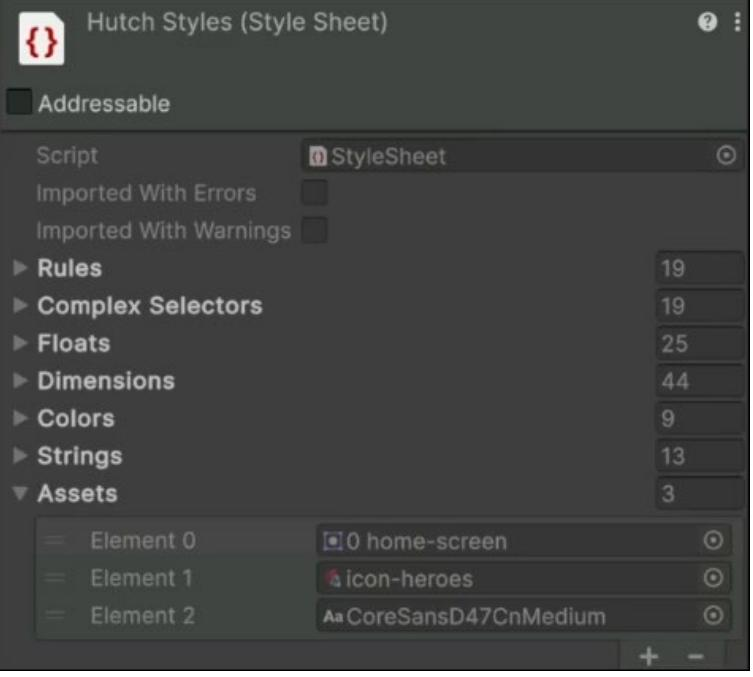

A USS references assets.

When these assets are imported, they immediately consume memory – even when not in use. This can lead to inefficient memory use if assets aren't managed properly.

<span id="page-144-0"></span>

To optimize asset usage, consider these strategies:

- **Use Asset Bundles or Addressables:** When possible, only load the UI documents and style sheets required for a particular scene or context. This can help keep memory consumption in check.
- **Unload assets when not needed:** If a UI element or document is no longer in use, remove it from the hierarchy using RemoveFromHierarchy. Then, unload it using Addressables.Release or AssetBundle.Unload(true) to free up memory for other operations.
- **Selective loading for complex UIs:** Break large UXML or USS files into smaller, modular templates (VisualTreeAssets) and load them dynamically as needed. Only loading resources for visible elements helps keep memory usage low.

### Profiling tools

Unity provides several tools to identify and resolve UI performance issues in your application.

The [Unity Profiler](https://docs.unity3d.com/Manual/Profiler.html), [UI Toolkit Debugger](https://docs.unity3d.com/6000.0/Documentation/Manual/UIE-ui-debugger.html), and [Frame Debugger](https://docs.unity3d.com/Manual/FrameDebugger.html) are essential for diagnosing performance issues. These tools help you analyze draw calls, batches, and expensive operations like layout recalculations, style updates, and vertex buffer changes.

For a more granular view of UI changes, use the [SetPanelChangeReceiver](https://docs.unity3d.com/6000.0/Documentation/ScriptReference/UIElements.PanelSettings.SetPanelChangeReceiver.html) method from the Panel Settings. This allows you to listen for changes to your UI and track their source. While limited to the Editor and development builds, it is useful for isolating specific UI behaviors that might be causing slowdowns.

Here's an example script that logs every change to the UI:

```
using UnityEngine;
using UnityEngine.UIElements;
public class PanelChangeReceiver : MonoBehaviour, IDebugPanelChangeReceiver
{
 [SerializeField] PanelSettings m_PanelSettings;
 void Awake()
 {
 m_PanelSettings.SetPanelChangeReceiver(this);
 }

 void OnDestroy()
 {
 m_PanelSettings.SetPanelChangeReceiver(null);
 }
```
<span id="page-145-0"></span> public void OnVisualElementChange(VisualElement element, VersionChangeType changeType) { Debug.Log(\$"{element.name} {changeType}"); } }

> Simply attach this to a GameObject and set the PanelSettings in the Inspector. The OnVisualElementChange method triggers whenever a visual element undergoes a change (e.g., layout, style, transform) and logs a console message. This can help you understand what aspect of the UI is currently being modified.

### Unity 6 performance enhancements

Unity 6 introduces a wide array of performance improvements to ensure a smooth and responsive experience in both the Editor and runtime environments:

- **Event dispatching:** Event dispatching rules have been simplified, making them easier to understand and twice as fast.
- **Mesh generation enhancements**: Key improvements include jobified geometry generation for classic element geometry and a transition of the vector API to a native implementation. Text generation is also now parallelized.
- **Custom Geometry API**: A new public API enables developers to generate custom geometry with the same level of performance, allowing for highly optimized UI components.
- **Deep Hierarchy Layout Performance**: Improved caching of layout computations significantly boosts performance in deep hierarchies, providing a smoother user experience.
- **Optimized TreeView for Large Datasets**: The TreeView control, previously inefficient with large datasets, has been enhanced with a new high-performance backend specifically for Entities.

#### **More performance optimization resources**

[Unite 2024: Getting the best performance with UI Toolkit](https://www.youtube.com/watch?v=bECmaYIvZJg&t=2131s)

[E-book: The ultimate guide to profiling Unity games](https://unity.com/resources/ultimate-guide-to-profiling-unity-games)

[E-book: Optimize your game performance for mobile, XR, and the web in Unity](https://unity.com/resources/mobile-xr-web-game-performance-optimization-unity-6)

[E-book: Optimize your game performance for consoles and PCs in Unity](https://unity.com/resources/console-pc-game-performance-optimization-unity-6)

## <span id="page-146-0"></span>Resources for advanced developers and artists

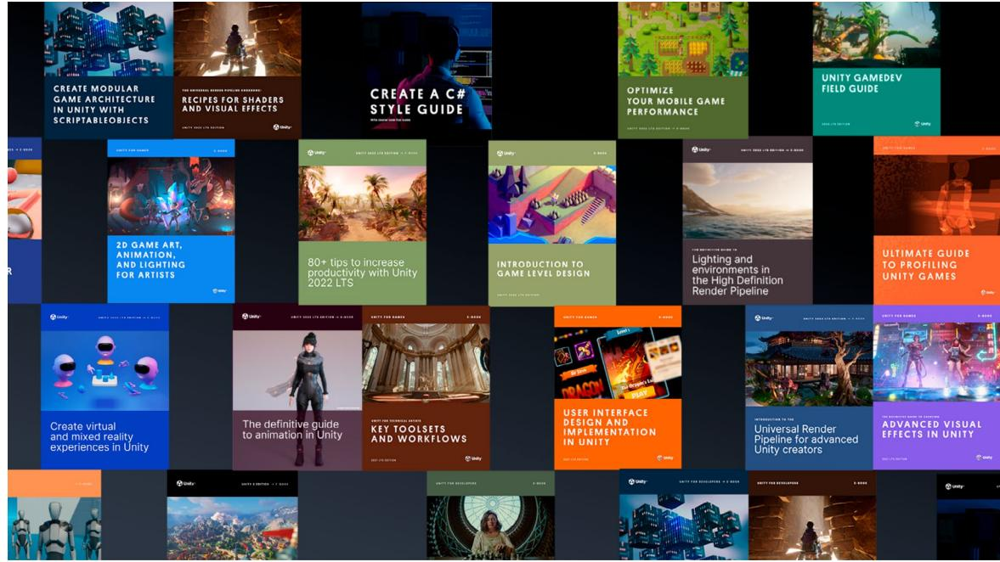

You can download many more e-books for advanced Unity developers and creators from [the](https://unity.com/how-to)  [Unity best practices hub.](https://unity.com/how-to) Choose from over 30 guides, created by industry experts and Unity engineers and technical artists, that provide best practices for developing efficiently with Unity's toolsets and systems.

You'll also find tips, best practices, and news on the [Unity Blog,](https://blogs.unity3d.com/?utm_source=demand-gen&utm_medium=pdf&utm_campaign=clean-code&utm_content=console-pc-performance-optimization-ebook) [UnityDiscussions,](https://forum.unity.com/) [Unity Learn,](https://learn.unity.com/) and at **#unitytips**.


[unity.com](https://unity.com/releases/lts)